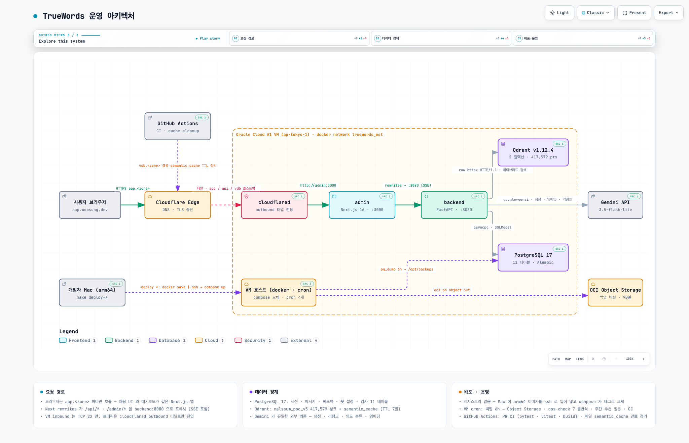
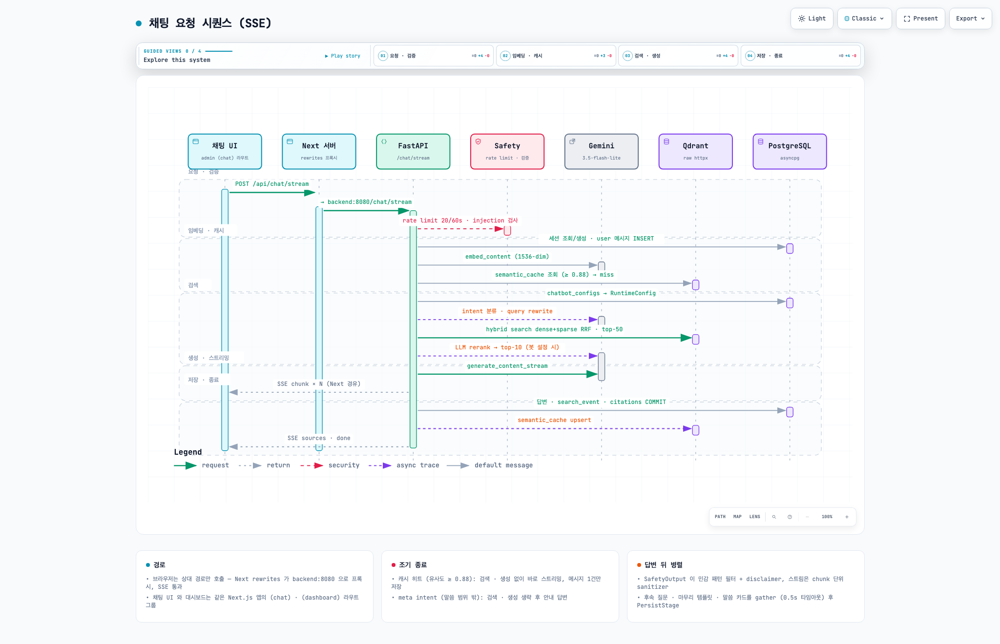
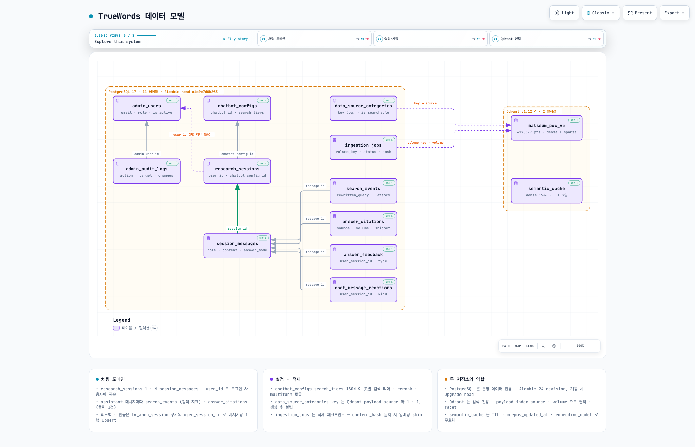
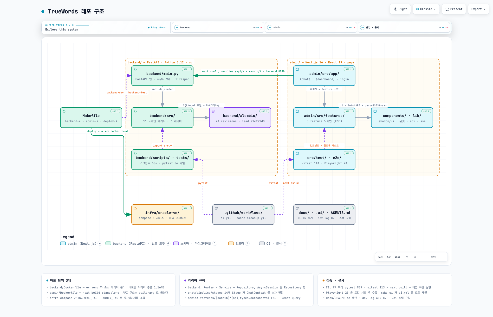

# TrueWords Platform

종교 텍스트 기반 RAG AI 챗봇 플랫폼. 사용자는 웹 채팅 화면에서 질문하고, 백엔드가 말씀 코퍼스(Qdrant 417,579 청크)를 하이브리드 검색해 Gemini 로 출처 달린 답변을 스트리밍한다. 운영 스택 전체가 Oracle Cloud ARM VM 한 대의 컨테이너 5개로 돈다.

> 다이어그램 4종은 `docs/04_architecture/diagrams/` 에 있다. PNG 는 README 용 정적 이미지이고, 같은 이름의 `.html` 을 브라우저로 열면 pan/zoom · 검색 · guided view 가 되는 인터랙티브 뷰어다. 원본은 `.json` 이며 [재생성 방법](./docs/04_architecture/diagrams/README.md)을 참조한다.

---

## 1. 시스템 아키텍처



- **브라우저는 `app.<zone>` 하나만 호출한다.** 채팅 UI 와 관리자 대시보드는 같은 Next.js 앱이고, 프론트의 모든 API 호출은 상대 경로다. Next 서버의 `rewrites` 가 `/api/*` · `/admin/*` 을 `http://backend:8080` 으로 프록시하므로 (SSE 포함) Cloudflare 왕복이 한 번이다.
- **VM inbound 는 TCP 22 만 열려 있다.** 트래픽은 `cloudflared` 컨테이너의 outbound 터널로만 들어온다. Cloudflare Tunnel 의 Public Hostname 은 `app` → admin:3000, `api` → backend:8080, `vdb` → qdrant:6333 세 개다.
- **외부 의존은 Gemini API 하나다.** `gemini-3.5-flash-lite` 가 생성 · 리랭크 · 의도 분류 · 쿼리 재작성을, `gemini-embedding-001` (1536-dim) 이 임베딩을 맡는다. sparse 벡터는 backend 안의 fastembed `Qdrant/bm25` 가 만든다.
- **배포는 레지스트리 없이** 로컬 Mac(arm64) 에서 이미지를 빌드해 `ssh` 로 밀어 넣고 compose 가 태그로 교체한다. push 자동 배포는 없다.

### api · web · admin 은 각각 어디에 있나

| 구성 | 위치 | 설명 |
|------|------|------|
| **API** | `backend/` | FastAPI 앱. 공개 라우터(채팅 · 봇 목록 · 원문 청크 · 반응)와 관리자 라우터(인증 · 사용자 · 봇 설정 · 데이터 적재 · 분석)를 `main.py` 가 등록한다. 컨테이너 `backend:8080`, 로컬 `:8000`. |
| **Web (채팅 UI)** | `admin/src/app/(chat)/` | 별도 앱이 아니다. Next.js 앱 안의 라우트 그룹으로 `/` (채팅) 와 `/history` (대화 기록) 를 제공한다. 로그인 필수, 관리자 아니어도 접근 가능. |
| **Admin (대시보드)** | `admin/src/app/(dashboard)/` | 대시보드 · 챗봇 · 데이터 소스 · 검색 분석 · 피드백 · 감사 로그 · 설정 7 메뉴. 관리자 계정만 접근 (`AuthGuard requireAdmin`). |
| **Mobile (Flutter)** | — | Phase 4 예정, 미착수. |

### 운영 인프라

| 항목 | 값 |
|------|----|
| 인스턴스 | Oracle Cloud `VM.Standard.A1.Flex` 2 OCPU / 12GB, ap-tokyo-1, Ubuntu 22.04 aarch64 (Always Free) |
| 컨테이너 | `cloudflared` · `admin` (Next 16 standalone, 768m) · `backend` (FastAPI, 3g) · `qdrant` (v1.12.4, 6g) · `postgres` (17-alpine, 1g) — 공용 네트워크 `truewords_net` |
| 볼륨 | `/opt/qdrant/{data,config,snapshots}` · `/opt/postgres/data` · `/opt/backups` |
| 백업 | `pg_dump` 6시간마다 → 로컬 14일 보관 + OCI Object Storage `truewords-backups` (90일 lifecycle) |
| 예약 작업 | VM cron: 백업 · `ops-check` 7 불변식(매일) · 추천 질문 갱신(주간) · 이미지 GC(주간). GitHub Actions: `semantic_cache` TTL 정리(매일 18:00 UTC) |
| 레거시 | `truewords-platform.vercel.app` 은 리다이렉트 전용 (307 → `app.woosung.dev`) |

운영 절차의 기준 문서는 [`infra/oracle-vm/README.md`](./infra/oracle-vm/README.md) 다.

---

## 2. 채팅 요청 흐름 (RAG 파이프라인)



`backend/src/chat/service.py` 의 `ChatService` 가 `chat/pipeline/stages/` 의 Stage 들을 순서대로 실행한다. 동기(`POST /chat`) 와 SSE 스트리밍(`POST /chat/stream`) 두 경로가 같은 체인을 쓴다.

| 순서 | Stage | 하는 일 |
|:---:|-------|--------|
| 1 | `InputValidation` | prompt injection 패턴 · 길이(1000자) 검사. rate limit 은 라우터 의존성 (20회/60초) |
| 2 | `Session` | 세션 생성/재사용, user 메시지 저장. 로그인 상태면 `user_id` 귀속 |
| 3 | `Embedding` | `gemini-embedding-001` RETRIEVAL_QUERY 1536-dim |
| 4 | `CacheCheck` | `semantic_cache` 유사도 ≥ 0.88 이면 즉시 반환 (mini-persist) |
| 5 | `RuntimeConfig` | `chatbot_configs` → system_prompt · 검색 모드 · 티어 · 토글 |
| 6 | `IntentClassifier` | factoid / conceptual / reasoning / meta 4-way. meta 는 검색 · 생성 생략 |
| 7 | `QueryRewrite` | 구어체 → 종교 용어 재작성 (LLM, 타임아웃 시 원문 유지) |
| 8 | `Search` | cascading / weighted 모드, dense + sparse RRF 하이브리드, top-50 |
| 9 | `Rerank` | Gemini LLM 리랭크 → top-10 (봇 설정으로 on/off) |
| 10 | `Generation` | 모드별 system_prompt 합성 · 멀티턴 이력 주입 · 출처 인라인 |
| 11 | `SafetyOutput` | 민감 패턴 필터 + disclaimer. 스트림은 `StreamingSanitizer` 가 chunk 단위로 수행 |
| 11′ | `SuggestedFollowups` · `ClosingTemplate` · 말씀 카드 | `asyncio.gather` 병렬, 0.5s 타임아웃, 실패 무시 |
| 12 | `Persist` | assistant 메시지 · `search_events` · `answer_citations` 커밋 + 캐시 upsert |

SSE 이벤트는 `chunk` (토큰) → `sources` (출처 · session_id · message_id · closing · followups) → `done` (disclaimer) 세 종류다. 프론트는 `admin/src/lib/sse.ts` 로 파싱한다.

---

## 3. 데이터 모델



역할 분리 원칙: **PostgreSQL 은 운영 데이터, Qdrant 는 검색 전용.** 두 저장소 사이에 FK 는 없고 `data_source_categories.key` ↔ payload `source`, `ingestion_jobs.volume_key` ↔ payload `volume` 이 값으로 이어진다.

### PostgreSQL 17 — 11 테이블 (Alembic head `a1c9e7d0b2f3`, 24 revisions)

| 도메인 | 테이블 | 모델 파일 |
|--------|--------|----------|
| 계정 · 감사 | `admin_users`, `admin_audit_logs` | `backend/src/admin/models.py` |
| 봇 설정 | `chatbot_configs` (`search_tiers` JSON 에 티어 · rerank · multiturn 토글) | `backend/src/chatbot/models.py` |
| 채팅 | `research_sessions` → `session_messages` → `search_events` · `answer_citations` · `answer_feedback` · `chat_message_reactions` | `backend/src/chat/models.py` |
| 데이터 소스 · 적재 | `data_source_categories`, `ingestion_jobs` (`content_hash` 로 재업로드 skip) | `backend/src/datasource/models.py`, `backend/src/pipeline/ingestion_models.py` |

- `research_sessions.user_id` 는 FK 제약 없는 논리 참조(`admin_users.id`)다. 대화 기록 목록의 조회 키.
- 피드백 · 반응은 비로그인 익명 쿠키 `tw_anon_session` 의 `user_session_id` 로 메시지당 1행 upsert 한다.
- 백엔드 컨테이너는 기동 시 `alembic upgrade head` 를 자동 적용한다 (`backend/Dockerfile` CMD).

### Qdrant v1.12.4 — 2 컬렉션

| 컬렉션 | 벡터 | payload index | 용도 |
|--------|------|---------------|------|
| `malssum_poc_v5` | dense 1536 cosine + sparse (bm25) | `source`, `volume` | 말씀 청크 417,579 points. 카테고리 필터 · 관리자 facet |
| `semantic_cache` | dense 1536 | `chatbot_id`, `created_at`, `corpus_updated_at`, `embedding_model` | 유사 질문 캐시. TTL 7일, 코퍼스 갱신 · 모델 변경 시 무효화 |

백엔드는 qdrant-client SDK 대신 raw httpx (HTTP/1.1) 클라이언트 `backend/src/qdrant/raw_client.py` 를 쓴다 (Cloudflare Tunnel 환경의 HTTP/2 hang 회피, [`docs/dev-log/47-qdrant-sdk-http2-permanent-fix.md`](./docs/dev-log/47-qdrant-sdk-http2-permanent-fix.md)).

---

## 4. 레포 구조



```
truewords-platform/
├── Makefile                  # 로컬 개발 · CI 동등 검사(make ci) · Oracle VM 배포/롤백 진입점
├── backend/                  # FastAPI — Python 3.12 · uv
│   ├── main.py               # 앱 엔트리. 라우터 9개 등록, lifespan (DB init · graceful shutdown)
│   ├── src/
│   │   ├── chat/             # /chat API · pipeline/stages 14 Stage RAG 체인 · 반응 API
│   │   ├── search/           # hybrid(RRF) · cascading · weighted · reranker · intent · query_rewriter
│   │   ├── cache/            # semantic_cache 조회/저장 · 컬렉션 초기화
│   │   ├── pipeline/         # 적재: extractor → chunker → embedder → ingestor · IngestionJob
│   │   ├── chatbot/          # 봇 설정 CRUD · RuntimeConfig · 추천 질문
│   │   ├── datasource/       # 카테고리 CRUD · Qdrant 관리 · 원문 청크 조회
│   │   ├── admin/            # 인증(JWT 쿠키) · 사용자 · 데이터 적재 워커 · 분석 API
│   │   ├── safety/           # 입력 검증 · rate limit · 출력 필터
│   │   ├── qdrant/           # raw httpx 클라이언트 · 필터/prefetch 빌더 · startup
│   │   ├── common/           # AsyncEngine · Gemini 클라이언트 · 미들웨어 · 예외 핸들러
│   │   ├── malssum/          # 답변 곁 말씀 카드
│   │   └── alembic_support/  # 마이그레이션 advisory lock · 배치 backfill
│   ├── alembic/              # 24 revisions
│   ├── scripts/              # 적재 · 평가(RAGAS) · 마이그레이션 · 운영 스크립트 60+
│   ├── tests/                # pytest 86 파일
│   ├── Dockerfile            # venv / 소스 레이어 분리, 기동 시 alembic upgrade head
│   └── docker-compose.yml    # 로컬 postgres + qdrant
├── admin/                    # Next.js 16 · React 19 · pnpm — 채팅 UI + 관리자 대시보드
│   ├── src/app/(chat)/       # /  채팅 · /history 대화 기록
│   ├── src/app/(dashboard)/  # 대시보드 · 챗봇 · 데이터 소스 · 분석 · 피드백 · 감사 로그 · 설정
│   ├── src/app/login, about, design-system
│   ├── src/features/         # auth · chat · chatbot · data-source · analytics (api.ts · types.ts · components/)
│   ├── src/components/       # ui (shadcn) · truewords (인용 카드 · 스트리밍 텍스트 · 피드백 버튼 …)
│   ├── src/lib/              # api.ts (fetchAPI · ApiError) · sse.ts · reactions-api.ts
│   ├── src/test/ · e2e/      # Vitest 113 · Playwright 23
│   ├── next.config.ts        # rewrites → backend · vercel.app 리다이렉트 · 200MB 업로드
│   └── Dockerfile            # standalone 이미지 (NEXT_PUBLIC_API_URL 은 build-arg)
├── infra/oracle-vm/          # docker-compose(5 컨테이너) · setup-vm · backup-db · restore-drill · ops-check · prune-images
├── .github/workflows/        # ci.yml (PR 테스트) · cache-cleanup.yml (매일)
├── docs/                     # 설계 문서 — 색인은 docs/README.md, 다이어그램은 04_architecture/diagrams/
├── reports/                  # 로컬 품질 baseline 산출물
└── .ai/ · AGENTS.md          # 스택별 코딩 규칙 · AI 작업 원칙
```

레이어 규칙: backend 는 Router → Service → Repository 로 나누고 `AsyncSession` 은 Repository 만 가진다. admin 은 `features/[domain]/{api,types,components}` FSD 구조이며 서버 상태는 React Query 다. 상세 규칙은 `.ai/stacks/fastapi/backend.md`, `.ai/rules/frontend.md`.

---

## 5. API 요약

| 영역 | 엔드포인트 | 인증 |
|------|-----------|------|
| 채팅 | `POST /chat` · `POST /chat/stream` (SSE) | 없음 (rate limit 20회/60초). 로그인 쿠키가 있으면 세션 귀속 |
| 대화 기록 | `GET /chat/sessions` · `GET /chat/sessions/{id}` | 로그인, 본인 세션만 |
| 피드백 · 반응 | `POST`/`DELETE /chat/feedback` · `POST /api/chat/messages/{id}/reaction` · `GET /api/chat/messages/{id}/reactions` | 익명 쿠키 `tw_anon_session` |
| 봇 목록 · 원문 | `GET /chatbots` · `GET /api/sources/chunks/{chunk_id}` | 없음 (청크는 봇 ACL) |
| 관리자 인증 | `POST /admin/auth/login` · `POST /admin/auth/logout` · `GET /admin/auth/me` | HttpOnly 쿠키 `admin_token` (JWT 24h, bcrypt) |
| 관리자 | `/admin/users` · `/admin/audit-logs` · `/admin/settings/config` · `/admin/chatbot-configs` · `/admin/data-sources/*` (upload · jobs · volumes · volume-tags · display-name) · `/admin/data-source-categories` · `/admin/analytics/*` | 관리자 게이트 (`require_admin_gate`, 시연 기간 한시) |
| 헬스 | `GET /health` | 없음 |

프론트는 `/api/chat*` · `/api/chatbots` · `/api/sources/*` · `/admin/*` 상대 경로로 호출하고 `admin/next.config.ts` 의 `rewrites` 가 백엔드 경로로 매핑한다. OpenAPI 문서는 로컬 `http://localhost:8000/docs`.

---

## 6. 기술 스택

| 레이어 | 기술 |
|--------|------|
| Frontend | Next.js 16.2 · React 19.2 · TypeScript 5 · Tailwind CSS 4 · shadcn/ui · TanStack Query 5 · recharts · react-markdown |
| Backend | FastAPI · Python 3.12 · uv · SQLModel + asyncpg · Alembic · google-genai · fastembed · kss · pymupdf · python-docx |
| Database | PostgreSQL 17 |
| Vector DB | Qdrant 1.12.4 (self-hosted) |
| AI | Gemini `gemini-3.5-flash-lite` (생성 · 리랭크 · 분류) · `gemini-embedding-001` (1536-dim) · fastembed `Qdrant/bm25` (sparse) |
| Infra | Oracle Cloud ARM VM · Docker Compose · Cloudflare Tunnel · OCI Object Storage (백업) |
| CI | GitHub Actions (pytest · vitest · build) · `make ci` 로컬 동등 검사 |
| Test | pytest 969 (86 파일) · Vitest 113 (14 파일) · Playwright 23 (2 spec) |
| Mobile | Flutter (Phase 4 예정) |

---

## 7. 로컬 개발 환경

### 사전 요구사항

- Docker & Docker Compose, [uv](https://docs.astral.sh/uv/), Node.js 22+ · pnpm 8

### 1) 환경변수

```bash
cp backend/.env.example backend/.env          # GEMINI_API_KEY 등 필수 값 채우기
echo 'NEXT_PUBLIC_API_URL=http://localhost:8000' > admin/.env.local
```

환경변수 목록은 `.ai/common/global.md` §4, 운영 값 템플릿은 `infra/oracle-vm/.env.example`.

### 2) 인프라 (PostgreSQL + Qdrant)

```bash
make infra-up        # backend/docker-compose.yml 의 postgres · qdrant 만 기동 (healthy 까지 대기)
```

### 3) 백엔드

```bash
cd backend
uv sync
uv run alembic upgrade head
uv run python scripts/create_admin.py         # 관리자 계정 (최초 1회)
uv run uvicorn main:app --reload --port 8000  # 또는 루트에서 make backend-dev
```

- API 문서 http://localhost:8000/docs · 헬스 http://localhost:8000/health
- 한 번에: `make backend-start` (infra-up → migrate → dev 서버)

### 4) Admin (채팅 UI + 대시보드)

```bash
cd admin
pnpm install
pnpm dev             # 또는 make admin-dev
```

- 채팅 http://localhost:3000 · 로그인 http://localhost:3000/login · 대시보드 http://localhost:3000/dashboard

### 5) 데이터 적재 (선택)

관리자 대시보드 **데이터 소스 → 업로드**(TXT · PDF · DOCX, 최대 200MB) 또는 `cd backend && uv run python scripts/ingest.py`. 적재는 extractor → chunker(Recursive 700/150) → embedder(dense + sparse) → Qdrant upsert 순이며 `ingestion_jobs` 에 체크포인트가 남아 재업로드 시 이어서 진행한다.

---

## 8. 테스트 · CI · 배포

```bash
make test-all        # admin vitest + backend pytest
make admin-e2e       # Playwright (로컬 시드 필요 — docs/guides/development-workflow.md 참조)
make ci              # .github/workflows/ci.yml 과 같은 명령을 같은 순서로
```

- **CI** (`ci.yml`): `main` · `dev/**` 대상 PR 마다 실행. `dorny/paths-filter` 로 `backend/` · `admin/` 변경된 쪽만 pytest / vitest + build 를 돈다.
- **배포**: push 자동 배포 없음. main 머지 후 명시적으로 실행한다.

```bash
make deploy-backend                  # arm64 빌드 → entrypoint 검증 → docker save | ssh | docker load → compose up --wait
make deploy-admin
make rollback-backend TAG=<이전 sha> # TAG 명시 필수
make oracle-logs · make ops-check    # compose 로그 · 운영 불변식 7건
```

배포 이미지는 커밋 sha 태그를 달고 VM 에 최신 3개가 보존된다. 상세: [`docs/06_devops/ci-cd-pipeline.md`](./docs/06_devops/ci-cd-pipeline.md).

---

## 9. 문서

| 문서 | 내용 |
|------|------|
| [`docs/README.md`](./docs/README.md) | 전체 설계 문서 색인 (요구사항 · 도메인 · 아키텍처 · 인프라 · ADR) |
| [`docs/04_architecture/diagrams/`](./docs/04_architecture/diagrams/README.md) | 이 README 의 다이어그램 4종 — 원본 JSON · 인터랙티브 HTML · 재생성 절차 |
| [`infra/oracle-vm/README.md`](./infra/oracle-vm/README.md) | 운영 기준 문서 — compose · 배포 · 롤백 · 백업 · 복구 · 트러블슈팅 |
| [`.ai/project/rag-pipeline.md`](./.ai/project/rag-pipeline.md) | RAG 파이프라인 코딩 규칙 (현재 흐름 vs 청사진) |
| [`AGENTS.md`](./AGENTS.md) | AI 에이전트 작업 원칙 · 현재 컨텍스트 |

---

## Git Convention

| 접두사 | 용도 |
|--------|------|
| `feat:` | 새로운 기능 추가 |
| `fix:` | 버그 수정 |
| `refactor:` | 코드 리팩토링 |
| `docs:` | 문서 수정 |
| `chore:` | 빌드, 설정 수정 |
| `test:` | 테스트 추가/수정 |

main 에 직접 push 하지 않는다. `{type}/{짧은-설명}` 브랜치 → PR → merge. 큰 작업은 `dev/<name>` 통합 브랜치를 거친다 ([가이드](./docs/guides/integration-branch-workflow.md)).
