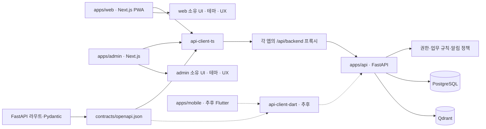
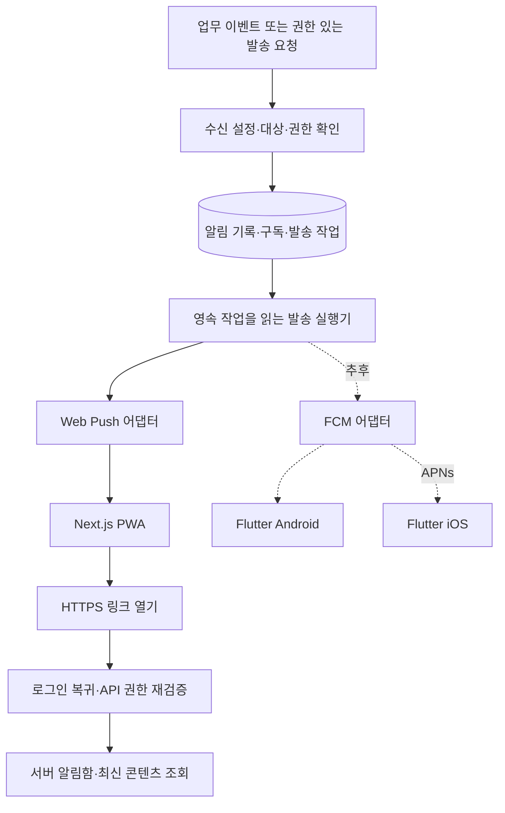

# PWA 우선·Flutter 확장을 위한 모노레포 전환 설계

- 문서 ID: `ARCH-MONO-001`
- 작성일: 2026-09-05
- 상태: **2안 UI 분리 구현·로컬 검증 완료 — 커밋·푸시 승인** (2026-09-05). PR #221의 새 HEAD 원격 검증은 별도이며 이전 `896a7ae`의 CI 결과와 이번 변경의 검증 증거를 구분한다.
- 분석 기준: `main`의 `59e3a59`. 운영 서버 접속·배포·실기기 검증은 수행하지 않았다.
- 실행 계획: [단계별 이전·검증 계획](../plans/completed/2026-09-05-monorepo-migration.md)
- 후속 결정: [APP-UI-001](../plans/active/2026-09-05-app-owned-ui.md). 최초 `ui-web` 선택을 대체하고 API SDK·ESLint·TypeScript 설정 3개 패키지만 유지한다. 기존 검증 결과는 당시 기록이며 후속 변경의 검증 증거로 재사용하지 않는다.

## 1. 결정한 방향과 이번 문서의 범위

사용자 요청의 방향은 **Next.js 사용자 웹/PWA와 admin을 독립 앱으로 분리하고, FastAPI의 제품 API를 함께 사용하는 것**이다. Flutter는 도입을 결정한 뒤 세 번째 클라이언트로 추가한다. 재사용 대상은 업무 규칙·API 계약·계정 및 권한 정책·알림 정책이다. React UI·테마·화면 UX는 web/admin이 각각 소유하며 동일한 디자인을 강제하지 않는다.

`apps`는 배포 단위, `packages`는 실제 공유 코드, `contracts`는 언어 간 계약이다. 기본 도구는 Turborepo + pnpm + uv이며 Flutter 착수 후 Pub workspace를 추가한다. Turbo는 각 언어의 명령을 실행하고 작업 순서·캐시를 관리한다. Python/Dart 의존성 해석은 uv/Pub가 맡는다. [공식 Turborepo 안내](https://turborepo.dev/docs/guides/multi-language)

현재 코드를 목표 구조로 옮기는 작업과 신규 PWA 제품 기능을 만드는 작업을 구분한다. 폴더 이동을 완료했다고 일반 사용자 인증·알림·PWA 제품이 완성된 것으로 판정하지 않는다.

### 기존 PWA 기획과의 관계

[S0 제품 방향](../research/2026-08-30-pwa-app-direction.md)은 main에 있다. S1 PRD는 별도 `docs/ffwpu-pwa-session-1` 브랜치의 `3123cfe`에서 확인했으며 상태가 **사용자 검토 대기**다. 이 브랜치의 `docs/01_requirements/17-ffwpu-pwa-prd.md`와 14세션 로드맵을 main에 병합된 문서로 취급하지 않는다.

이 요청은 플랫폼 구조의 방향을 갱신한다. S1의 제품 기능·화면·일정·사용자 동의 및 기존 기록 이전 정책까지 승인한 것으로 해석하지 않는다. S1 후속 문서 작성 시 이 설계를 참조하고, 구현 시점에는 병합된 최신 PRD를 다시 확인한다.

S0는 제품 방향 승인과 디자인 시스템 승인을 구분한다. 신규 PWA 디자인은 채택 프로토타입·승인 PRD·사용자 선택 이후의 후속 작업이다. 현재 [웹 UI/UX](../specs/web/ui-ux.md)와 [관리자 UI/UX](../specs/admin/ui-ux.md)는 구현 기준·소유권만 기록한다. 과거 디자인 조사와 기존 `/design-system` 화면을 양 앱 공통 디자인 승인으로 간주하지 않는다.

### NOT in scope

1. Flutter 앱·Dart SDK·모바일 CI의 즉시 생성: Flutter 착수 시 추가한다.
2. PWA 전체 화면 재설계와 모든 제품 기능 구현: 승인 PRD의 별도 작업으로 진행한다.
3. RAG 검색·청킹·프롬프트 변경: 기존 결과를 보존하며 위치와 import만 이전한다.
4. 인증 제공자 변경·기존 사용자 데이터 자동 이관: 사용자 선택과 별도 이관 설계가 필요하다.
5. Kafka·알림 마이크로서비스·오프라인 쓰기 동기화: 현재 요구를 넘어서는 기반을 미리 만들지 않는다.

## 2. What already exists — 이전 기준 commit에서 확인한 사실

아래 경로·상태는 **분리 전 `59e3a59` 기준선**이다. 현재 작업 위치는 `apps/web`, `apps/admin`, `apps/api`이며, 이전 과정의 실제 검증 증거는 실행 계획 §5에 기록한다. 이 표의 과거 경로는 변경 이력을 설명하기 위해 유지한다.

| 영역 | 확인한 구현 | 전환 시 의미 |
|---|---|---|
| 앱 | `admin/package.json`의 Next.js 16.2.2, React 19.2.4. `src/app/(chat)`와 `(dashboard)` 공존 | 독립 `web` 앱을 실제로 추출해야 한다. 폴더 이름 변경만으로 분리되지 않는다. |
| API | `backend/main.py`, `backend/src/{chat,chatbot,admin,datasource,search,pipeline,cache,safety}` | 이미 도메인별 코드가 있다. 우선 재사용하고 내부 재편은 별도 단계로 수행한다. |
| 브라우저 경로 | `admin/next.config.ts`에서 `/api/chat` → `/chat`, `/admin/*` → `/admin/*` 등 rewrite | 생성 SDK가 FastAPI 경로를 호출하도록 새 공통 프록시 규칙을 정해야 한다. |
| 인증 | `admin/src/features/auth/api.ts`는 `/admin/auth/*` 사용. `(chat)/layout.tsx`도 `AuthGuard` 적용 | 현재 사용자 화면의 로그인은 소비자 전용 인증이 아니다. |
| 서버 권한 | `backend/src/chat/dependencies.py`에서 `admin_token`을 재사용. `/chat`·`/chat/stream`은 익명 가능, 기록 API는 로그인 필요 | 화면 접근 제한과 API 권한을 따로 검증해야 한다. |

| 영역 | 확인한 구현 | 전환 시 의미 |
|---|---|---|
| 기록 귀속 | `backend/src/chat/models.py`의 `ResearchSession.user_id`는 AdminUser 귀속을 전제한 nullable UUID | 신규 일반 사용자 ID로 자동 재해석하면 안 된다. |
| 스트림 | `backend/src/chat/router.py`의 `/chat/stream`은 `response_model=None`, 실제 응답은 `text/event-stream` | 일반 OpenAPI 생성만으로 이벤트 payload 계약까지 생기지 않는다. |
| 클라이언트 | `admin/src/features/chatbot/chat-api.ts` 수기 DTO, `admin/src/lib/sse.ts` 파서, `lib/api.ts` 오류/401 처리 | 생성 DTO와 앱 이동·로그인 UX의 경계를 나눠야 한다. |
| 테스트 | `backend/tests`, `admin/src/test`, `admin/e2e`. Playwright는 단일 앱과 `../backend`를 실행 | 앱 분리 후 두 웹 서버와 API를 함께 검증할 구성이 필요하다. |
| 운영 | ARM VM, 5개 Compose 서비스, app → admin:3000. Makefile이 로컬 이미지를 전송하여 수동 교체 | web 서비스·별도 이미지·배포/롤백 명령을 추가하고 기존 명령의 경로도 수정한다. |

루트 pnpm workspace·Turbo 설정·공유 SDK·PWA manifest/SW는 해당 구현 경로에서 확인되지 않았다. 기존 문서의 테스트 수치는 과거 실행 기록이며, 이번 검토에서 테스트를 재실행한 결과가 아니다.

## 3. 목표 폴더 구조

아래는 **전환 완료 목표**다. `[추후]`와 `[선택]`은 지금 생성하지 않는다. 상세 설정 파일을 전부 나열하는 트리는 아니다.

```text
repo/
├── apps/
│   ├── web/                         # 사용자 Next.js, PWA 기능은 M5
│   │   ├── src/app/manifest.ts      # [M5] 이번 구조 이전에서 생성하지 않음
│   │   ├── src/app/globals.css     # 사용자 웹 전용 테마
│   │   ├── src/components/ui/      # 사용자 웹 소유 primitive
│   │   ├── src/features/
│   │   ├── src/lib/{api,auth,push}/
│   │   ├── public/sw.js            # [M5] 이번 구조 이전에서 생성하지 않음
│   │   └── AGENTS.md
│   ├── admin/                       # 관리자 Next.js
│   │   ├── src/{app,features,lib}/
│   │   ├── src/components/ui/      # 관리자 소유 primitive
│   │   ├── src/app/globals.css     # 관리자 전용 테마
│   │   └── AGENTS.md
│   ├── api/                         # 공통 제품 API
│   │   ├── app/
│   │   │   ├── main.py
│   │   │   ├── core/
│   │   │   └── modules/
│   │   │       ├── admin/
│   │   │       ├── chat/
│   │   │       ├── chatbot/
│   │   │       ├── datasource/
│   │   │       ├── identity/        # 일반 사용자 인증 단계에서 추가
│   │   │       └── notifications/   # 알림 단계에서 추가
│   │   ├── tests/
│   │   ├── alembic/
│   │   ├── scripts/export_openapi.py
│   │   ├── pyproject.toml
│   │   ├── uv.lock
│   │   ├── package.json             # uv 명령 실행용
│   │   └── AGENTS.md
│   └── mobile/                      # [추후] Flutter, 상세 구조는 착수 때 확정
├── packages/
│   ├── api-client-ts/
│   │   └── src/{generated,transport}/
│   ├── api-client-dart/             # [추후]
│   ├── eslint-config/
│   └── typescript-config/
├── contracts/
│   ├── openapi.json                 # 생성 산출물, 직접 편집 금지
│   └── fixtures/                    # 합성 JSON + SSE 회귀 입력
├── docs/
│   ├── README.md
│   ├── prd/
│   ├── specs/{domain,api,web,admin}/
│   ├── architecture/
│   ├── adr/
│   ├── plans/{active,completed}/
│   ├── runbooks/
│   ├── research/
│   ├── archive/
│   └── TODO.md
├── tooling/{codegen,checks}/
├── tests/e2e/
├── infra/
├── .github/workflows/
│   ├── ci.yml                      # 변경 감지·최종 판정 (PR + main push + 수동)
│   ├── ci-web.yml                  # web/admin 검사: 앱별 job
│   ├── ci-api.yml
│   ├── ci-contracts.yml
│   ├── ci-e2e.yml                  # 격리 compose 위 두 앱 + API 통합 E2E
│   └── cache-cleanup.yml           # 일일 semantic_cache TTL 정리 (운영 cron 성격)
├── AGENTS.md
├── Makefile
├── package.json
├── pnpm-workspace.yaml
├── pnpm-lock.yaml
└── turbo.json
```

Flutter 착수 시 루트 `pubspec.yaml`·`pubspec.lock`, `apps/mobile`, `packages/api-client-dart`, `ci-mobile.yml`을 함께 추가한다. Pub workspace는 Dart 패키지들의 의존성 해석과 lockfile을 공유한다. [Pub 공식 문서](https://dart.dev/tools/pub/workspaces)

사용자 예시의 Flutter `ui/data` 책임 분리는 유지하되, 실제 내부 배치는 기존 `.ai/stacks/flutter/mobile.md`의 Feature-First + Riverpod + Repository 규칙과 착수 시 정렬한다. 두 구조를 동시에 강제하지 않는다. 별도 domain/use-case 계층은 복잡성이 필요할 때만 검토한다. [Flutter 공식 권고](https://docs.flutter.dev/app-architecture/recommendations)

## 4. 공유와 의존성 경계



### 앱별 UI와 공유 API·설정

**승인된 2안은 UI를 앱별로 소유하는 것이다.** 각 앱의 `src/components/ui`, `src/app/globals.css`, `src/lib/utils.ts`에 primitive·테마·표시 유틸을 둔다. 양쪽에서 쓰던 버튼·입력 등도 앱별로 보존하며 값·코드가 현재 같다는 이유로 공통 UI·토큰 패키지를 미리 만들지 않는다. 채팅 화면·관리자 데이터 관리·AuthGuard·React Query provider 역시 앱이 소유한다. 이번 이동은 기존 모양·동작을 보존하며 리디자인은 별도 승인한다.

web → admin 내부 import, admin → web 내부 import와 다른 앱 CSS 참조를 금지한다. Tailwind v4는 앱 로컬 소스를 기준으로 검사하며 CSS 토큰·폰트·Portal 테마·키보드 동작을 앱별로 검증한다. React/Next 버전 업그레이드는 구조 이전과 별도 변경으로 둔다.

공유 패키지는 `api-client-ts`, `eslint-config`, `typescript-config` 3개를 유지하고 공개 export로만 참조한다. SDK는 실제 양 앱 소비자를 같은 계약에 연결하며 설정 패키지는 공통 검사 기준을 제공한다. UI 소유권 분리를 이유로 DTO·HTTP 처리·생성 검사나 TypeScript/ESLint 기준을 앱별로 복제하지 않는다. 공유 패키지는 앱을 import하지 않는다.

`api-client-ts/src/generated`는 생성기 전용이다. `transport`에는 HTTP·오류 변환·스트림 처리만 둔다. 현재 `lib/api.ts`의 `window.location.href = "/login"` 같은 화면 이동은 앱의 인증 계층으로 옮긴다. 오류의 HTTP status·request_id를 보존하고 204·비JSON·네트워크 실패를 별도로 처리한다.

기존 쿠키 인증 요청에는 `credentials: include`와 상태 변경 메서드의 `X-Requested-With: XMLHttpRequest`를 보존한다. 서버 `verify_csrf`가 이 헤더를 요구하므로 OpenAPI 생성 성공만으로 관리자 쓰기 요청의 호환성이 보장되지 않는다. multipart 요청은 브라우저가 boundary를 설정하도록 JSON Content-Type을 강제하지 않는다.

### 백엔드 내부 이전

첫 이동은 `backend/` → `apps/api/`이며 `main.py`와 `src/`를 그대로 유지한다. 다음 구조 전환 단계에서 `main.py` → `app/main.py`, 기존 도메인 → `app/modules/`, 공용 설정·DB·오류 처리 → `app/core/`로 이동한다. 기존 `search/pipeline/cache/safety/qdrant/malssum` 책임도 보존하며 새로운 identity/notifications와 임의로 합치지 않는다.

로컬 `backend/docker-compose.yml`은 project name과 실제 볼륨 이름을 고정하지 않는다. `[가정]` 외부 override가 없다면 디렉터리 이름 변경으로 Compose project가 달라져 빈 DB·Qdrant 볼륨을 선택할 수 있다. 이전 전 실제 project·볼륨을 읽기 전용으로 식별하고 동일 리소스를 사용하는지 확인한다. 여러 worktree의 격리된 테스트 환경에는 별도 project/포트를 사용한다. [Docker project name 공식 문서](https://docs.docker.com/compose/how-tos/project-name/)

이 단계는 import·Uvicorn 진입점·Alembic 모델 import·scripts·JSON 데이터 상대 경로를 함께 변경한다. 라우트 URL·응답 payload·DB 테이블·Alembic revision은 위치 변경만으로 바꾸지 않는다. Router/Service/Repository와 DI 조립 경계도 유지한다.

## 5. API 계약: REST와 SSE를 함께 다룬다

### 계약 생성 흐름

```text
FastAPI 라우트·Pydantic 모델
  → 테스트 설정으로 app.openapi() export
  → contracts/openapi.json
  → 고정 버전 생성기
  → packages/api-client-ts/src/generated
  → web/admin 타입 검사·빌드·소비자 테스트
```

OpenAPI export는 DB·Qdrant·Gemini에 접속하지 않고 lifespan·백그라운드 작업을 실행하지 않아야 한다. import 시 생성되는 설정·클라이언트도 안전한 테스트 설정으로 구성한다. 실제 import 부작용은 계약 작업의 첫 검증 항목이며, 필요하면 최소한의 앱 조립 분리를 한다.

TS 생성기는 Hey API를 우선 검증한다. 채택 조건은 실제 스키마의 OpenAPI 버전, nullable/누락, enum, UUID·날짜, multipart 업로드, 오류 모델을 처리하는 것이다. FastAPI 공식 문서도 OpenAPI 3.1을 지원하는 생성기를 요구한다. [FastAPI SDK 생성](https://fastapi.tiangolo.com/advanced/generate-clients/)

### 이 저장소의 URL 차이 해결

`[제안]` 각 Next 앱에 `/api/backend/:path*` → FastAPI `/:path*` 프록시를 두고, SDK의 브라우저 base URL을 `/api/backend`로 통일한다. 예를 들어 SDK `/chat`은 브라우저 `/api/backend/chat`으로, SDK `/api/sources/chunks/...`는 `/api/backend/api/sources/chunks/...`로 전달한다. 중복처럼 보이는 `/api`를 임의로 제거하지 않는다.

기존 `/api/chat`·`/api/chat/messages`·`/api/chatbots`·`/api/sources`·`/admin/*`는 이전 클라이언트가 사용하는 동안 호환 alias로 유지한다. 정적 `/api/chat/messages`가 일반 `/api/chat/*`보다 먼저 적용되는 순서를 테스트한다. SSR 호출은 서버 전용 내부 API 주소를 사용한다. FastAPI의 공개 경로를 브라우저 편의에 맞춰 일괄 변경하지 않는다.

### SSE는 별도의 소비자 계약이 필요하다

현재 `/chat/stream`은 `response_model=None`이다. 이벤트 이름·payload, 완료와 중도 종료의 구분을 API 코드의 모델과 명세에 정의하고 `contracts/fixtures`에 개인정보 없는 합성 스트림을 둔다. SDK 생성 성공만으로 SSE 호환성을 판정하지 않는다.

| 계약 요소 | 요구 검증 |
|---|---|
| chunk/sources/done 및 실제 오류 이벤트 | 서버의 실제 이벤트 집합을 조사해 fixture와 모델에 대응 |
| 네트워크 조각 | UTF-8 문자가 바이트 경계에서 나뉨, CRLF, 여러 data 줄, 여러 이벤트가 한 청크에 옴 |
| 중단 | AbortSignal, done 이전 연결 종료, 부분 답변 처리, 정상 종료 표시 오인 방지 |
| 서버/프록시 | 스트림 버퍼링·시간 제한, HTTP 오류와 스트림 내부 오류 구분 |
| 구버전 | 모르는 이벤트/추가 필드 정책, 기존 기록·응답 fixture 소비 |

계약 검사에는 재생성 후 diff 없음뿐 아니라 PR base 대비 파괴적 변경 검사도 포함한다. 필드 제거·타입 변경·required 추가·enum 변경·operationId 변경을 검토한다. 인증·쿠키·권한·SSE 동작은 스키마 diff 밖의 통합 테스트로 보완한다. 모바일 출시 후 구버전 지원 기간과 폐기 통지 정책을 확정한다.

## 6. 인증: 기존 데모와 제품 계정을 구분한다

일반 사용자는 `identity`의 계정·세션으로 인증하고, 관리자 권한은 FastAPI가 검사한다. 웹과 미래 Flutter는 같은 제품 계정을 사용한다. 관리자 계정과 소비자 계정의 자동 병합은 이 설계의 전제가 아니다.

| 단계 | 동작 | 완료 판정 |
|---|---|---|
| 구조 이전 | 기존 데모 로그인·admin_token과 기록 API를 보존 | 기존 사용자/관리자 접근·로그아웃·기록 귀속 회귀 없음 |
| 제품 인증 | 일반 사용자·세션·동의·철회 모델 추가, admin과 자격 정보·권한 분리 | 소비자 토큰으로 관리자 기능 접근 불가, 타인 기록 접근 불가 |
| 기존 기록 이전 | `[확인 필요]` 데모 계정·기록을 신규 제품 계정으로 이전할지 결정 | 명시적 ID 매핑·소유권 확인·중복 및 롤백 검증 후 별도 실행 |
| Flutter 추가 | 네이티브 세션·보호 저장소·기기 철회 흐름 구현 | 웹 쿠키 복사 없이 로그인·갱신·로그아웃·철회 통과 |

웹은 앱 origin별 HttpOnly/Secure 쿠키와 상태 변경 요청의 Origin·CSRF 검증을 설계한다. 서브도메인 간 광범위한 Domain 쿠키로 관리자 세션을 공유하지 않는다. CORS는 허용 origin을 명시하며 인증을 대신하지 않는다. 현 코드의 `SameSite=None` 설정은 구조 이전 중 임의로 바꾸지 않고 제품 인증 작업에서 재검토한다.

`[확인 필요]` 일반 사용자 로그인 방식은 이메일/비밀번호·메일 링크·OAuth 등 중 아직 확정하지 않았다. OAuth/OIDC를 채택하는 경우 네이티브 앱은 외부 브라우저와 Authorization Code + PKCE를 사용한다. [RFC 8252](https://www.rfc-editor.org/rfc/rfc8252.html)

## 7. PWA와 알림 경계

PWA 설치·권한 요청·SW 등록·알림 클릭은 `apps/web` 책임이다. 수신자·설정·구독 소유권·알림 기록·발송 시도는 FastAPI 책임이다. `apps/admin`에는 PWA service worker를 등록하지 않는다.



### 구독·기록·발송

사용자 한 명은 여러 설치/기기를 가진다. 각 설치의 Web Push endpoint·keys를 별도 구독으로 저장하고, 미래 FCM token은 다른 채널 자격 정보로 구분한다. 설치 식별자는 인증 수단이 아니며 구독 등록 시 서버가 인증된 사용자와 결합한다.

알림함의 읽음 상태와 채널별 전송 시도 상태는 분리한다. 발송 서버의 성공 응답을 기기의 표시·열람 완료로 기록하지 않는다. 중립형 잠금 화면 문구와 최소 식별자/허용된 같은 origin의 HTTPS 링크를 사용한다. 푸시가 누락돼도 서버 알림함에서 확인할 수 있어야 한다.

로그아웃·계정 교체·구독 철회·만료 endpoint에는 연결 해제와 발송 제외를 적용한다. 이미 외부 push 서비스에 전달한 메시지를 서버에서 회수할 수 있다고 약속하지 않는다. 만료 404/410, 일시 실패 재시도·TTL, 중복 실행 방지는 알림 구현의 인수 조건이다.

`[제안]` 발송 보존이 필요한 알림은 Postgres의 영속 작업/outbox를 알림 기록과 같은 트랜잭션으로 남긴다. 동일 API 코드베이스의 실행기가 claim·중복 방지·제한된 재시도를 담당한다. 별도 프로세스/컨테이너 또는 예약 실행 중 어느 방식인지는 알림 구현 계획에서 확정한다. API 메모리 작업만으로 전달 보장을 약속하지 않는다.

### 설치·SW 수명주기

iOS/iPadOS Web Push는 16.4 이상에서 홈 화면에 추가한 웹 앱과 사용자 동작에 따른 권한 요청이 전제다. 기능 탐지와 설치 안내, 거부·해제 상태를 구분한다. 자동화 브라우저 성공과 실제 iPhone 푸시 성공은 서로 다른 증거다. [WebKit 공식 안내](https://webkit.org/blog/13878/web-push-for-web-apps-on-ios-and-ipados/)

manifest와 SW는 Next.js 웹 앱에 추가한다. 초기 오프라인 범위는 셸/안내이며 개인 기록·질문·답변·토큰·관리자/API 응답을 SW 캐시에 넣지 않는다. 공개 본문 캐시는 PRD의 허용 범위 확정 후 별도 적용한다. 업데이트 중 열린 채팅, 이전 탭, 로그아웃/계정 변경, SW 제거·복구도 검증한다. [Next.js PWA 가이드](https://nextjs.org/docs/app/guides/progressive-web-apps)

FCM 도입은 Flutter 단계의 선택이다. iOS FCM에도 APNs와 플랫폼 capability 설정이 필요하다. [Firebase 공식 문서](https://firebase.google.com/docs/cloud-messaging/flutter/get-started)

## 8. CI·배포·성능

### CI 범위와 캐시

| 변경 | 필수 검증 |
|---|---|
| web/admin | 해당 앱 타입·lint·단위·빌드, 라우팅·권한 E2E |
| API | pytest, OpenAPI export·계약 차이, 관련 소비자 검증 |
| SDK/계약 | 재생성 일치, 파괴적 변경 검사, web/admin 소비자 테스트, 추후 Dart 파싱 |
| 공통 설정·lockfile·tooling·CI | 의존 앱과 공유 태스크까지 검증 확대 |
| Flutter `[추후]` | analyze·단위/위젯/통합, 대상 플랫폼 빌드·서명·출시 검증 |

현재 `ci.yml`은 워크플로 전체를 경로로 스킵하지 않고 job별로 조건을 적용한다. 이 원칙을 유지해 required check이 pending에 남지 않도록 항상 실행되는 최종 집계 job을 둔다. 개별 CI 파일은 재사용 workflow로 분리할 수 있다. 실패·취소된 필수 job이 집계에서 성공으로 바뀌지 않도록 검증한다.

새 코드와 검사 연결은 같은 단계에서 추가한다. 최초 M1~M4의 단계별 검사 기록은 이전 실행 계획에 보존한다. 후속 APP-UI-001은 앱 로컬 UI·CSS·설정·이미지·경계 검사를 같은 변경에서 갱신하고, 양 앱을 재검증한다. UI 변경은 소유 앱에서 검증하며 공통 SDK/설정 변경은 양쪽 소비자로 검증을 확대한다.

Turbo에 export → codegen → 소비자 검사 순서를 명시한다. 입력에는 API 모델·스키마·생성기 설정과 버전·각 lockfile·공유 소스·빌드 환경변수를 넣는다. `.next/cache`·비밀정보는 공유 산출물에서 제외한다. DB 통합 테스트·배포·서명·마이그레이션은 결과 캐시를 사용하지 않는다. 기존 schema 파일만 hash하여 API 변경이 codegen 캐시를 재사용하는 실수를 막는다.

### 독립 이미지와 운영 전환

`apps/api`로 이름을 옮겨도 Compose 서비스명 `backend`와 기존 이미지명은 유지할 수 있다. 코드 위치 변경과 운영 DNS 이름 변경은 별개다. web은 새 이미지와 `WEB_TAG`·배포/롤백 명령을 갖고, admin/API 태그를 강제로 함께 올리지 않는다.

운영 서비스 추가 시 `ops-check.sh`의 고정 서비스 목록과 정상 개수, `prune-images.sh`의 이미지 저장소 목록도 함께 갱신한다. web 중단을 정상으로 판정하지 않는지, 이미지 정리 dry-run에서 실행 중 이미지와 보존 대상 롤백 태그가 남는지 검증한다.

Next Docker 빌드는 workspace 루트를 context로 사용하여 필요한 manifest·lockfile·공유 패키지를 포함한다. 루트 `.dockerignore`로 비밀파일·venv·node_modules·비관련 대형 자료를 제외한다. `outputFileTracingRoot`와 standalone 내부 `apps/<name>/server.js`·정적 자산의 실제 위치를 확인한다. 기존 `/app/server.js` 가정을 그대로 복사하지 않는다. [Next.js output 문서](https://nextjs.org/docs/app/api-reference/config/next-config-js/output)

`[제안]` 운영 web은 기존 `app.woosung.dev`를 유지하고 admin은 별도 hostname으로 옮긴다. 기존 `/dashboard` 등 관리자 링크는 새 admin origin으로 임시 redirect한다. web/admin 각각 자기 origin의 프록시를 사용하고, 운영 hostname·쿠키 범위·로그인 복귀 URL은 전환 전에 확정한다. Cloudflare 원격 관리형 라우팅은 저장소 Compose 수정만으로 바뀌지 않는다.

기존 5개 컨테이너 memory limit 합은 문서상 11.25GiB/12GiB다. web 프로세스와 추후 발송 실행기를 추가할 때 실제 상주 메모리와 동시 요청을 측정하여 여유를 다시 계산한다. 독립 배포는 독립 장애 도메인을 의미하지 않으며 Oracle 단일 VM의 장애 지점은 남는다. 서버 수·인프라 요금 절감을 이번 구조만으로 보장하지 않는다.

## 9. 문서 폴더 이전 원칙

| 기존 | 목표 | 처리 |
|---|---|---|
| `00_project`, `01_requirements` | `prd`, `specs` | 제품 정의와 기능 명세를 내용별로 배치, 기존 REQ/SCR ID 보존 |
| `02_domain`, `03_api` | `specs/domain`, `specs/api` | API 계약 원본은 계속 코드, 문서는 동작 설명 |
| `04_architecture` | `architecture` | 다이어그램 JSON/HTML/PNG와 내부 링크를 함께 이전 |
| `05_env`, `06_devops`, `07_infra`, `guides` | `runbooks` | 설계 결정은 architecture/adr, 실행 절차는 runbooks로 구분 |
| `dev-log`, `superpowers`, `research`, `insights`, `archive` | `adr`, `plans`, `research`, `archive` | ADR·실행 계획·조사·과거 기록을 내용별로 분류하고 이력 보존 |

문서 이동은 독립 단계로 수행한다. 파일별 이전 manifest를 만들고 이름 충돌·참조 링크·앵커·상태를 검사한다. 이전 문서가 과거 실행을 설명할 때 그 당시 코드 경로를 무조건 현재 경로로 치환하지 않는다. 외부에서 인용되는 진입 문서는 필요 시 짧은 이전 안내를 남긴다.

최초 설계 초안은 기존 문서 체계에 작성했고, M4에서 이 문서를 `docs/architecture/`로 이전했다. 루트와 앱별 AGENTS의 경로·검증 명령·생성 코드 수정 금지·플랫폼 범위도 갱신했다. 이후 변경에서도 함께 유지하며 ignored 상태의 개인 `.ai` 규칙만을 팀 공통 지침의 유일한 원본으로 삼지 않는다.

## 10. 구현 전 결정할 항목

| ID | 항목 | 제안 / 결정 시점 |
|---|---|---|
| `DEC-MONO-001` | 이 문서의 단계별 구조 전환을 실행할지 | 먼저 구조 이전·웹 분리·계약을 진행하고 PWA 기능은 승인 제품 계획에 연결 |
| `DEC-MONO-002` | web/admin 운영 hostname 및 기존 링크 전환 | **확정(2026-09-06)**: web 은 기존 `app.woosung.dev` 유지, admin 은 `truewords-admin.woosung.dev`(zone 공유로 프로젝트 접두어). 컷오버 실행은 별도 승인 |
| `DEC-MONO-003` | 일반 사용자 로그인 방식·기존 데모 계정/기록 처리 | 기존 데이터 자동 이전 없음, identity 구현 전 결정 |
| `DEC-MONO-004` | Flutter 착수 시점·SDK/인증 호환성 | 착수 전 Dart 생성/파싱·네이티브 로그인·딥링크·푸시 검증 |

최초 설계 단계의 완료 기준은 현재/목표 상태·단계별 작업·검증·롤백·미결 결정을 문서로 제공하는 것이었다. 이후 M1~M4와 후속 2안 UI 분리의 구현·로컬 검증을 완료했다. 새 로컬 변경은 커밋·푸시 승인 및 PR 반영을 기다리며 원격 HEAD `896a7ae`의 CI와 별도로 검증해야 한다. 앱별 UI/UX 명세는 신규 디자인 승인이 아니며 PWA 실기기 검증·Flutter·운영 배포는 이번 완료 범위에 포함하지 않는다.
