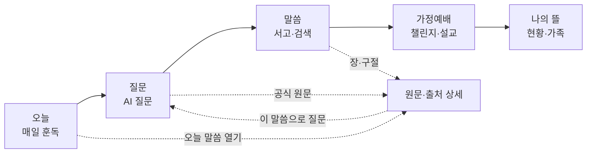

# PRD-FFWPU-PWA-001 v2 — 훈독 (가안): 가정연합 식구와 가정을 위한 매일 말씀 PWA

- 문서 ID: `PRD-FFWPU-PWA-001`
- 버전: v2 (2026-09-09). v1(2026-09-07, PR #261)은 출처 우선·3탭 구조였고 사용자가 디자인 완성도 부족으로 close했다. v2는 초원AI의 일일 루틴 구조를 벤치마킹하되 가정연합 식으로 현지화한 5탭 구조로 재작성했다.
- 상태: 사용자 검토 대기. 승인 전 `apps/web` 코드는 변경하지 않는다.
- 제품명: **훈독** `[가안]`. 후보 비교는 §7.3.
- 프로토타입: [2안 비교 HTML](prototypes/2026-09-09-hundok-directions.html), 디자인 비교 문서 [DES-PWA-002](2026-09-09-hundok-design-directions.md)

---

## 0. 문서 기준

### 0.1 표기

- 확인된 사실은 그대로 쓴다. 추론은 `[가정]`, 사용자 결정이 필요한 항목은 `[확인 필요]`, 목표 수치 제안은 `[제안]`으로 표기한다.
- 화면·요구사항·결정 ID는 v1을 잇는다. `REQ-PWA-001~015`는 유지하고 v2 신규 요구는 `REQ-PWA-016~022`로 추가한다. 화면은 5탭 기준 `SCR-PWA-101~107`로 새로 번호를 매기고, v1의 `SCR-PWA-001~009`는 대응표(§3.3)로만 남긴다.

### 0.2 근거 문서

| 문서 | 이 PRD에서 쓰는 것 |
|---|---|
| [초원AI 벤치마크](../research/2026-08-30-chowon-ai-benchmark.md) | 5탭 정보구조, 일일 루틴, 강점·약점, 복제 금지 목록 |
| [PWA 제품 방향·세션 로드맵](../research/2026-08-30-pwa-app-direction.md) | S0 승인 결정(대상 FFWPU·독립 베타·현 구성원 우선), 알림·오프라인 제약 |
| [PWA·Flutter 모노레포 설계](../architecture/2026-09-05-pwa-flutter-monorepo.md) | M5(identity·SW·알림) 책임 경계, `apps/web` 소유권 |
| 2026-09-09 사용자 메모 + 초원AI 실제 화면 23장 | 메모 5항목(AI 질문 북마크·가정예배 챌린지·말씀/기도/묵상·설교 섭외·나의 초원식 개인 페이지)과 컨셉(맞춤 기간 훈독·말씀 검색·9월 기획 완료) |

### 0.3 v1에서 승계한 것과 바꾼 것

| 항목 | v1 (PR #261) | v2 (이 문서) | 근거 |
|---|---|---|---|
| 정보구조 | 3탭(오늘·찾기·서재), 출처 우선 | **5탭**(오늘·질문·말씀·가정예배·나의 뜰) | 사용자 결정 `DEC-PWA-014` |
| 연속일·챌린지 | 금지 | **허용**. 개인 연속일, 가정·교회·소그룹 단위 챌린지 | `DEC-PWA-014` |
| 달란트형 화폐·점수·출석·GPS·전도 실적 | 금지 | **계속 금지** | S0 §2 비범위, 초원 약점(유료화 반발·감시성) |
| AI 설명과 공식 원문의 분리(권위 층) | P0 | **유지** P0 | v1 `REQ-PWA-012` |
| 질문 기본 비공개·무기억·삭제 | P0 | **유지** P0 | v1 `REQ-PWA-008` |
| 독립 운영 베타 고지 | P0 | **유지** P0 | `DEC-PWA-005` |
| 시각 언어 | 회백·코발트 / 슬레이트·테라코타 / 다크·앰버 3안 | 2안으로 압축: **A 새벽**(라이트, 웜 스톤+테라코타) / **B 등불**(다크, 딥 포레스트+앰버) | [DES-PWA-002](2026-09-09-hundok-design-directions.md) |

---

## 1. 식구님이 겪는 문제

### 1.1 관찰된 문제

가정연합 현 구성원과 그 가정이 말씀 생활을 이어가려 할 때 다음이 반복된다. 1~3은 v1과 같고, 4~6은 이번 메모와 초원 벤치마크에서 새로 정리했다.

1. **흩어진 말씀.** 원리강론·말씀선집·천성경·평화경이 출판물·사이트·판본별로 흩어져 있어 발화자·연도·판본·문맥을 한 번에 확인하기 어렵다.
2. **어려운 용어.** 고유 용어와 시대별 표현이 낯설어 짧은 검색으로는 의미와 관련 원문이 연결되지 않는다. 2세·다문화 가정에서 특히 크다.
3. **AI 오인.** 생성형 AI 설명과 공식 원문이 섞이면 사용자가 AI 요약을 공식 해석으로 오해한다. 초원AI가 "주님AI"에서 개명한 이유와 같다.
4. **끊기는 루틴.** 오늘 읽을 분량을 고르는 일이 매번 새 결정이라 며칠 지나면 멈춘다. 초원은 매일 QT·연속일·주간 스트립으로 이 문제를 풀었고, 우리에게는 같은 장치가 없다.
5. **혼자 하는 훈독.** 가정예배(훈독회)는 가정 단위 실천인데, 가족이 같은 말씀을 읽고 있는지, 이번 주 예배를 드렸는지 서로 보이지 않는다. 교회·소그룹 단위로 함께 도전할 틀도 없다.
6. **질문이 남지 않는다.** 궁금한 것을 물어도 답변이 흘러가 버린다. 좋은 질문을 저장하고, 그 질문에 연결된 말씀에서 다음 질문으로 이어가는 흐름이 없다.

### 1.2 한 문장 가치제안

> **매일 3분 훈독에서 시작해, 궁금한 것은 출처 있는 말씀으로 돌아가 확인하고, 가정과 함께 예배까지 이어지는 가정연합 식구를 위한 말씀 PWA.**

AI 답변은 목적지가 아니라 원문으로 돌아가는 연결부다. 이 원칙은 v1에서 그대로 승계한다.

### 1.3 대상 사용자

| 우선순위 | 사용자 | 이 앱에서 하는 일 |
|---|---|---|
| 1순위 | 가정연합 현 구성원(30~60대)과 그 가정 | 아침 훈독, 저녁 가정예배 준비, 가족 참여 확인 |
| 2순위 | 축복가정 2세·청년 | 정체성·용어 질문, 북마크 질문에서 관련 말씀으로 이어 읽기 |
| 3순위 | 교회장·청년부 리더 | 교회·소그룹 단위 가정예배 챌린지 개설, 5분 설교 등록·신청 접수 |
| 비사용자 | 공식 교리 판정을 요구하는 사람, 출석·헌금 관리를 원하는 운영자, 615권 대량 수집 목적 | 비범위 (§5) |

### 1.4 JTBD

| ID | 상황 | 하고 싶은 일 | 성공 |
|---|---|---|---|
| `JTBD-PWA-001` | 아침에 앱을 열었을 때 | 3분 안에 오늘 말씀·기도·묵상 한 줄을 끝낸다 | 연속일이 이어지고 가족에게 완료가 보인다 |
| `JTBD-PWA-002` | 신앙·가족·용어 질문이 생겼을 때 | 출처 있는 짧은 답을 보고 원문으로 간다 | AI 설명과 공식 원문을 구분하고 질문을 저장한다 |
| `JTBD-PWA-003` | 기억나는 문구·주제로 말씀을 찾을 때 | 서고에서 책·장·구절을 찾거나 검색한다 | 판본·출처를 확인하고 이어 읽기를 예약한다 |
| `JTBD-PWA-004` | 이번 주 가정예배를 준비할 때 | 순서·말씀·나눔 질문을 받아 그대로 진행한다 | 가정·교회 챌린지에 참여가 기록된다 |
| `JTBD-PWA-005` | 내 훈독 생활을 돌아볼 때 | 연속일·달력·가족 현황을 본다 | 대표 말씀을 등록하고 다음 기간 훈독을 만든다 |
| `JTBD-PWA-006` | 특정 기간에 맞춰 읽고 싶을 때 | 40일·100일 등 나만의 훈독 기간을 만든다 | 진행률이 보이고 가족과 함께 진행한다 |

---

## 2. 해결 원리: 초원에서 배운 것, 가정연합식으로 바꾼 것

| 초원AI에서 확인한 것 | 훈독에서 그대로 쓰는 것 | 가정연합식으로 바꾸는 것 |
|---|---|---|
| 하단 5탭(매일 QT·AI 질문·성경·5분 설교·나의 초원) | 5탭 구조, 중앙 탭 강조 없음 | 탭 이름을 **오늘·질문·말씀·가정예배·나의 뜰**로. "교회"가 아니라 **가정**이 4번째 탭이다 |
| 매일 QT 카드 3종(묵상·기도·말씀 읽기) + 요일 스트립 + 연속일 | 루틴 3종 체크, 주간 스트립, 연속일 | 루틴을 **말씀 읽기·기도·묵상 남기기**로, B안은 **가정예배 준비·말씀·감사 나누기** |
| AI 질문의 추천·북마크·내 질문 3탭 | 3탭 그대로 | 답변 카드에 **AI 설명 / 공식 원문** 두 층을 시각적으로 분리. "이 말씀으로 이어서 질문" 액션 추가 |
| 성경 서고(구약·신약, 가나다순) + AI 검색 힌트 | 서고 그리드, 한 글자 약칭 원형 | 원리강론 장 / 말씀선집 권 / 천성경·평화경으로 구성. 판본·검수일 표기 |
| 성경통독 챌린지(365일, 참여 인원) | 기간 훈독 카드, 진행률, 참여 아바타 | **나만의 훈독 기간 만들기**(사용자 메모 "맞춤형 말씀 특정 기간") |
| 5분 설교 / 전국 교회 | 5분 설교·전체 설교 목록 | **교회장 섭외·신청** 탭 추가. 공개 교회 지도·추천 리뷰는 비범위 |
| 나의 초원(연속일·최대·누적, 월 달력, 대표 성경구절) | 3 지표, 달력, 대표 말씀 | **우리 가정** 섹션(가족 구성원 오늘 완료 여부). 달란트·씨앗·나무 없음 |
| 달란트 보상, 유료 멤버십, 선물권 | 쓰지 않음 | 보상은 **연속일·챌린지 완료 배지**까지. 화폐·구독 가격은 비범위 |

**왜 5탭인가.** v1은 초원의 5탭을 "선택 부담"으로 보고 3탭을 택했다. 이번 메모는 초원의 일일 루틴·챌린지·개인 페이지를 핵심으로 지목했고, 이 셋은 각각 진입점이 필요하다. 대신 각 탭의 첫 화면은 한 가지 행동(오늘 마치기 / 질문하기 / 이어 읽기 / 예배 시작 / 내 현황)으로 좁힌다.

---

## 3. 정보구조와 화면

### 3.1 5탭

### 3.2 화면 목록

| ID | 화면 | 탭 | 핵심 행동 1개 | 로그인 | 프로토타입 |
|---|---|---|---|---|---|
| `SCR-PWA-101` | 오늘 훈독 | 오늘 | 루틴 3종 완료 → 오늘 마치기 | 공개 콘텐츠는 비로그인, 완료 기록은 로그인 | A/B home |
| `SCR-PWA-102` | 질문 | 질문 | 질문하기, 북마크, 이어서 질문 | 답변은 비로그인(무기억), 저장은 로그인 | A/B ask |
| `SCR-PWA-103` | 말씀 서고 | 말씀 | 이어 읽기, 검색, 기간 훈독 만들기 | 비로그인 | A/B library |
| `SCR-PWA-104` | 가정예배 | 가정예배 | 오늘 저녁 순서로 시작 | 챌린지 참여는 로그인 | A/B worship |
| `SCR-PWA-105` | 나의 뜰 | 나의 뜰 | 대표 말씀 등록, 가족 초대 | 로그인 | A/B garden |
| `SCR-PWA-106` | 원문·출처 상세 | (말씀 하위) | 북마크·노트·오디오·공유, 이 말씀으로 질문 | 비로그인 | A/B source |
| `SCR-PWA-107` | 설정·알림·베타 고지 | (나의 뜰 하위) | 알림 시간, 무기억, 삭제, 로그아웃 | 로그인 | S3에서 작성 |

### 3.3 v1 화면과의 대응

| v1 | v2 | 비고 |
|---|---|---|
| `SCR-PWA-001` 오늘 | `101` | 루틴 3종·연속일 추가 |
| `002` 찾기, `003` 검색 결과 | `103` | 서고 중심, 검색은 상단 바 |
| `004` 질문·답변 | `102` | 추천·북마크·내 질문 3탭 |
| `005` 원문·출처 상세 | `106` | 동일 |
| `006` 용어 상세 | `106` 내 시트 `[가정]` | S3에서 별도 화면 여부 결정 |
| `007` 내 서재/실천 | `105` + `103` | 북마크·노트는 원문 상세 액션바, 현황은 나의 뜰 |
| `008` 설치·알림, `009` 로그인·동의 | `107` | 통합 |

---

## 4. 기능 요구사항

우선순위: `P0` 제한 베타 필수, `P1` 베타 중 추가, `P2` 이후.

### 4.1 승계 요구사항 (v1 `REQ-PWA-001~015`)

아래는 v1 정의를 그대로 따른다. 본문은 v1(브랜치 `docs/ffwpu-pwa-prd-design-directions`)을 참조하고, 이 문서에서는 v2 변경점만 적는다.

| ID | 제목 | P | v2 변경 |
|---|---|---|---|
| `REQ-PWA-001` | 독립 베타 정체성 | P0 | 나의 뜰 하단, 설정, 공유 카드에 고지 |
| `REQ-PWA-002` | 오늘의 말씀 | P0 | `REQ-PWA-016` 루틴에 흡수 |
| `REQ-PWA-003` | 통합 검색 | P0 | 말씀 탭 상단 검색 바. 키워드·구절·맥락·목차 힌트는 초원 방식 채택 |
| `REQ-PWA-004` | 출처 있는 질문 | P0 | `REQ-PWA-017` 북마크·이어가기 추가 |
| `REQ-PWA-005` | 원문과 출처 상세 | P0 | 액션바(오디오·북마크·노트·공유) |
| `REQ-PWA-006` | 용어 탐색 | P1 | P0→P1. 서고·검색이 먼저 |
| `REQ-PWA-007` | 내 서재 | P1 | 나의 뜰·원문 액션바로 분산 |
| `REQ-PWA-008` | 일반 사용자 인증·동의·무기억 | P0 | 가족 초대 수락 시 동의 재확인 |
| `REQ-PWA-009` | 설치와 제한 오프라인 | P1 | 변경 없음 |
| `REQ-PWA-010` | 중립형 알림과 알림함 | P1 | 알림 종류: 아침 훈독, 저녁 기도/가정예배, 가족 완료 |
| `REQ-PWA-011` | 콘텐츠 권리 원장과 철회 | P0 | 설교 영상도 원장 대상 |
| `REQ-PWA-012` | 권위 층·판본 충돌·근거 부족 중단 | P0 | 변경 없음 |
| `REQ-PWA-013` | 오류·빈 결과·오프라인·권한 상태 | P0 | 가족 0명, 챌린지 0건 빈 상태 추가 |
| `REQ-PWA-014` | 접근성·반응형 | P0 | 본문 최소 16px, B안 말씀 19px, 터치 44pt |
| `REQ-PWA-015` | 개인정보 보호형 측정 | P0 | 가족 관계·완료 여부는 집계만 수집 |

### 4.2 v2 신규 요구사항

#### `REQ-PWA-016` 매일 훈독 루틴 (`P0`) — 메모 4항목 "말씀 / 기도 / 묵상"

오늘 탭은 루틴 3종과 연속일로 구성한다.

- `AC-016-01`: 루틴 3종(말씀 읽기·기도하기·묵상 남기기)이 각각 3분 이내로 끝나는 분량으로 제공된다. B안은 저녁형(가정예배 준비·말씀 읽기·감사 나누기)이다.
- `AC-016-02`: 3종 완료 시 그날이 완료로 기록되고 연속일이 +1 된다. 하루 1회 이상 완료가 기준이며 시간대는 사용자 로컬이다.
- `AC-016-03`: 주간 스트립(월~일)과 연속일은 로그인 사용자에게만 표시된다. 비로그인은 오늘 말씀만 읽을 수 있다.
- `AC-016-04`: 연속일이 끊겨도 벌점·경고 문구를 쓰지 않는다. "다시 시작하기"만 제공한다.
- `AC-016-05`: 묵상 한 줄은 기본 비공개다. 가족 공유는 사용자가 항목별로 켠다.

#### `REQ-PWA-017` 질문 북마크와 이어가기 (`P0`) — 메모 2항목

- `AC-017-01`: 질문 탭은 추천 / 북마크 / 내 질문 3탭이다. 추천은 "이번 주 식구들이 많이 물은 질문"으로 운영자가 큐레이션한다(자동 공개 아님).
- `AC-017-02`: 답변 카드는 AI 설명(점선 테두리, `AI 설명` 배지)과 공식 원문(실선, `공식 원문 N` 배지)을 분리해 보여준다. 공식 원문은 최소 1건, 없으면 "확인할 수 없음"으로 중단한다(`REQ-PWA-012`).
- `AC-017-03`: 사용자는 질문을 북마크하고, 답변에 연결된 공식 원문에서 "이 말씀으로 이어서 질문"으로 다음 질문을 만들 수 있다. 이어진 질문은 원문 ID를 문맥으로 갖는다.
- `AC-017-04`: 내 질문은 기본 비공개이며 개별 삭제·전체 삭제·무기억 모드를 제공한다.

#### `REQ-PWA-018` 말씀 서고와 맞춤 기간 훈독 (`P0`) — 컨셉 "맞춤형 말씀 특정 기간" + "말씀 검색"

- `AC-018-01`: 서고는 원리강론(장 단위) / 말씀선집(권 단위) / 천성경 / 평화경으로 구성한다. 실제 목록은 권리 원장(`REQ-PWA-011`)에서 `allowed`인 것만 노출한다. `[확인 필요]` 초기 정본 범위는 `DEC-PWA-002`.
- `AC-018-02`: 사용자는 기간(예 40일·100일)과 범위(책·장)를 골라 "나만의 훈독 기간"을 만들고, 가족을 초대할 수 있다. 진행률은 완료한 단위 수 / 전체 단위 수다.
- `AC-018-03`: 검색은 키워드·구절·맥락·목차 네 가지 예시 힌트를 빈 상태에서 보여준다.
- `AC-018-04`: 이어 읽기는 마지막 읽은 위치를 기기·계정 간 동기화한다(로그인 시).

#### `REQ-PWA-019` 가정예배와 단위 챌린지 (`P0`) — 메모 3항목 "가정예배 챌린지"

- `AC-019-01`: 주간 가정예배 순서(성가·말씀 훈독·나눔 질문·가정 기도)를 운영자가 발행한다. `[확인 필요]` 발행 주체와 검수 흐름은 `DEC-PWA-003`.
- `AC-019-02`: "오늘 저녁 순서로 시작"은 순서를 한 화면씩 진행하는 모드다. 완료 시 가정 단위로 기록된다.
- `AC-019-03`: 챌린지는 가정·교회·소그룹 세 단위로 만들 수 있고, 참여 인원과 진행률만 공개된다. 개인별 미완료는 그룹 리더에게도 보이지 않는다.
- `AC-019-04`: 챌린지 완료 보상은 배지·기록으로 한정한다. 화폐·포인트·순위표는 없다.

#### `REQ-PWA-020` 설교와 교회장 섭외·신청 (`P1`) — 메모 3항목 부가

- `AC-020-01`: 5분 설교 / 전체 설교 목록은 교회장·소속 교회·길이·본문 말씀을 표시한다. 영상 호스팅은 외부(YouTube 등) 임베드다 `[가정]`.
- `AC-020-02`: "교회장 신청" 탭에서 사용자는 특정 교회장의 5분 설교를 요청하거나, 교회장은 등록 신청을 낼 수 있다. 신청은 운영자 검토 후 게시된다.
- `AC-020-03`: 초원의 전국 교회 지도·추천 리뷰는 만들지 않는다.

#### `REQ-PWA-021` 나의 뜰 (`P0`) — 메모 5항목 "나의 초원"

- `AC-021-01`: 현재 연속일·최장 연속일·누적 훈독일 3지표와 월 달력을 표시한다.
- `AC-021-02`: 대표 말씀 1건을 등록해 프로필에 표시한다. 공식 원문 링크만 허용한다.
- `AC-021-03`: "우리 가정" 섹션은 가족 구성원의 오늘 완료 여부만 표시한다. 초대는 코드 방식이며 수락 시 상대에게도 동의 화면이 나온다.
- `AC-021-04`: 가족 관계·완료 여부는 서버에 최소 보관하고, 가족 탈퇴 시 즉시 상호 표시가 사라진다.

#### `REQ-PWA-022` 알림 종류 (`P1`)

- `AC-022-01`: 알림은 아침 훈독 / 저녁 기도(또는 가정예배) / 가족 완료 세 종류이고 각각 시간과 on/off를 둔다. 잠금 화면 문구는 중립형이다(`DEC-PWA-008`).

### 4.3 실패·빈 상태

| 상황 | 화면 | 표시 |
|---|---|---|
| 가족 0명 | 나의 뜰·오늘 | "가족을 초대하면 오늘 완료가 서로 보여요" + 초대 |
| 챌린지 0건 | 가정예배 | 이번 주 순서만 표시, 챌린지 만들기 |
| 공식 원문 0건 | 질문 | "확인할 수 없음", 서고 검색 제안 |
| 오프라인 | 전 화면 | 셸·안내만. 개인 기록·답변 캐시 금지 |
| 권리 철회 | 서고·원문 | 항목 숨김, 북마크는 "더 이상 제공되지 않음" |

---

## 5. 신뢰·비범위

### 5.1 승계 원칙 (v1 §4)

O1~O5/R 공식성 등급, 콘텐츠 권리 원장 최소 필드, 권위 층 4종(AI 설명·공식 원문·공식 해설·내 메모), 판본 충돌·근거 부족 중단, 개인정보 보존·삭제·무기억 정책은 v1 §4를 그대로 따른다.

### 5.2 비범위 (제한 베타)

- 달란트형 화폐, 포인트, 순위표, 유료 멤버십·선물권
- 출석 체크, GPS, 전도 실적, 신앙 점수
- 공개 커뮤니티·댓글·DM, 전국 교회 지도·추천 리뷰
- 축복 매칭, 헌금·결제
- 615권 전체 공개, 전체 오프라인 다운로드
- 네이티브 앱(Flutter는 별도 결정)

---

## 6. KPI와 게이트

### 6.1 북극성 `[제안]`

**주간 훈독 완료 가정 비율**: 주간 활성 가정(구성원 1명 이상 로그인) 중 같은 주에 구성원 1명 이상이 루틴 3종을 3일 이상 완료한 가정의 비율. 목표 40%.

### 6.2 진단 지표 `[제안]`

| 지표 | 계산 | 목표 |
|---|---|---|
| 첫 가치 도달 시간 | 첫 세션 시작부터 오늘 마치기 완료까지 중앙값 | 3분 이하 |
| 답변 출처 확인률 | `answer_viewed` 중 `source_opened` 발생 비율 | 40% 이상 |
| 질문 이어가기율 | 북마크 질문 중 "이어서 질문" 발생 비율 | 20% 이상 |
| 가정예배 완료율 | 주간 순서 발행 대비 가정 단위 완료 | 30% 이상 |
| 7일 재방문(개인) | 첫 완료 코호트의 D7 완료 | 35% 이상 |

### 6.3 가드레일

- 근거 안전: 평가셋 인용 정확도·근거 부족 중단 재현율 각 95% 이상, 치명적 무근거 주장 0건
- 개인정보: 민감 Push payload 0건, 교차 사용자(가족 포함) 노출 0건, 삭제 SLA 100%
- 연속일 압박: "연속일 때문에 부담된다" 인터뷰 응답 20% 초과 시 연속일 표시를 옵션으로 전환

### 6.4 G0~G5

v1 §5.3과 같다. G0(제품·정체성)은 이 PRD와 디자인 방향 선택(`DEC-PWA-015`) 승인으로 닫힌다.

---

## 7. 결정과 미결

### 7.1 Decision Log

| ID | 일자 | 상태 | 내용 |
|---|---|---|---|
| `DEC-PWA-004~010` | 2026-08-31 | 승인 | S0 결정(대상 FFWPU, 독립 베타, 현 구성원 우선, 소규모 정본, 중립 알림, PWA+기존 RAG, 소비자 인증 분리) |
| `DEC-PWA-011` | 2026-08-31 | `[확인 필요]` | 세션 수 16 vs 14. v2도 16 기준 |
| `DEC-PWA-012` | 2026-09-07 | 종료 | v1 PR #261 close. 브랜치 보존 |
| `DEC-PWA-013` | 2026-09-07 | 폐기 | v1 방향 3안 선택은 v2 2안으로 대체 |
| `DEC-PWA-014` | 2026-09-09 | **승인** | 초원식 5탭 + 개인 연속일·가정/교회/소그룹 챌린지 허용. S0 비범위 중 "연속일·챌린지"만 해제하고 화폐·점수·출석·GPS는 유지 |
| `DEC-PWA-015` | 2026-09-09 | `[확인 필요]` | 디자인 방향 A 새벽 / B 등불 / A 골격 + B 가정예배 화면 결합. 추천은 [DES-PWA-002 §5](2026-09-09-hundok-design-directions.md#5-추천) |
| `DEC-PWA-016` | 2026-09-09 | `[확인 필요]` | 제품명 "훈독" 확정 여부 (§7.3) |
| `DEC-PWA-001~003` | 미정 | `[확인 필요]` | 법적 운영 주체, 초기 정본과 권리, 검수·철회 책임자 |

### 7.2 이번 검토에서 답이 필요한 것

1. `DEC-PWA-015` 디자인 방향 (A / B / 결합)
2. `DEC-PWA-016` 제품명
3. `REQ-PWA-019` 가정예배 순서 발행 주체 (본부 부서 / 교회장 / 운영자 임시)
4. `REQ-PWA-020` 설교 영상 호스팅 방식 (외부 임베드 `[가정]`)
5. 4번째 탭 이름: "가정예배" vs "훈독회" vs "가정" `[확인 필요]`

### 7.3 제품명 후보 `[가안]`

| 후보 | 장점 | 단점 |
|---|---|---|
| **훈독** (가안) | 가정연합 고유 용어, 행동을 그대로 가리킴, 두 글자 | 외부인에게 낯섦, 방향 C 루틴명과 혼동 이력 |
| 아침훈독 | 루틴 시간대가 이름에 있음 | B안(저녁 중심)과 충돌 |
| 뜰 | 나의 뜰 탭과 일치, 부드러움 | 말씀 앱임이 드러나지 않음 |
| 말씀뜰 | 말씀 + 뜰 결합 | 발음이 어색할 수 있음 |
| 참말씀 | 기존 TrueWords와 연결 | 공식 앱으로 오인 위험 |

---

## 8. 검증과 다음 단계

- 이 PRD와 [DES-PWA-002](2026-09-09-hundok-design-directions.md)를 사용자가 검토하고 §7.2의 5개에 답한다.
- 승인 후 S3(디자인 시스템 `docs/specs/web/`)에 진입한다. 그전까지 `apps/web`은 바꾸지 않는다.
- 프로토타입 검증 방법: `docs/prd/prototypes/`에서 `python3 -m http.server`로 서빙 후 `2026-09-09-hundok-directions.html?dir=both` 를 연다. 스크린샷은 [screenshots/2026-09-09/](prototypes/screenshots/2026-09-09/)에 있다.
