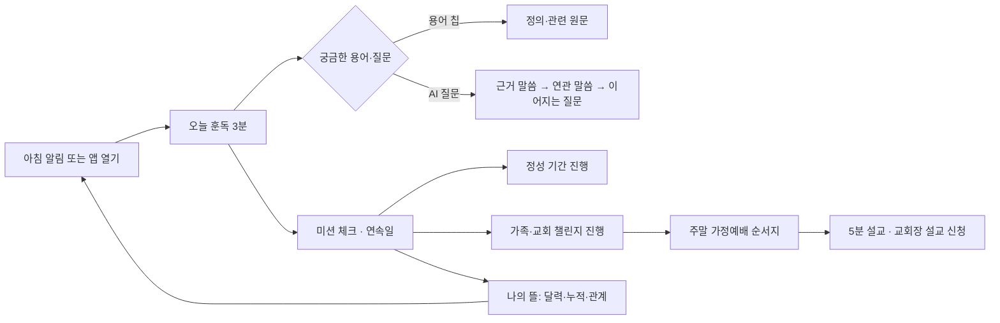

# 훈독(가안) 앱 PRD v2 — 가정연합 식구를 위한 말씀·훈독·가정예배 PWA

- 문서 ID: `PRD-FFWPU-PWA-001` (v2)
- 최초 작성: 2026-08-31 (PR #218 초안) · v1 재작성: 2026-09-07 (PR #261, close) · **v2 전면 재작성: 2026-09-10**
- 상태: **사용자 검토 대기** (PRD v2 + 디자인 2안 클릭형 프로토타입을 한 PR로 검토)
- 제품 단계: 독립 운영·비공식 제한 베타 준비. 9월 중 기획 완료 목표
- 앱 이름: **훈독** (가안, `DEC-PWA-016` 확정 전)
- 함께 볼 문서: [디자인 2안 비교](2026-09-10-hundok-design-directions.md), 프로토타입 [A 아침 햇살](prototypes/2026-09-10-hundok-a.html) · [B 저녁 등불](prototypes/2026-09-10-hundok-b.html)

## 0. 문서 기준

### 0.1 표기

- 별도 라벨이 없는 문장은 사용자 승인 전제 또는 저장소 문서에서 확인한 사실이다.
- `[가정]`: 사용자 검증이나 후속 조사로 확인해야 하는 제품 가설이다.
- `[확인 필요]`: 외부 책임자 또는 사용자의 결정 없이는 확정할 수 없는 항목이다.
- `[제안]`: 이번 PRD에서 검토·승인을 요청하는 수치나 정책안이다.

### 0.2 v1에서 v2로 바뀐 것

| 항목 | v1 (2026-09-07, PR #261) | v2 (이 문서) | 근거 |
|---|---|---|---|
| 포지셔닝 | 출처 중심 말씀 서고. 초원식 루틴·공동체 복제 금지 | **초원식 생활 루틴 전면 + 가정연합 현지화**. 출처·권위 층 규칙은 유지 | 2026-09-09 사용자 결정 (`DEC-PWA-014`) |
| 정보구조 | 3탭 | **5탭** (오늘 훈독 · AI 질문 · 말씀 · 가정예배 · 나의 뜰) | `DEC-PWA-015` |
| 습관 장치 | 연속 기록·미션·보상 없음 | 데일리 미션·연속일·누적일·정성 기간·가족/교회 챌린지 **포함**. 달란트형 화폐·랭킹은 `[확인 필요]` | §6 |
| 공동체 | MVP 비범위 | 가족·교회·소그룹 단위 챌린지, 친구·가족 관계, 5분 설교, 교회장 설교 섭외·신청 **포함**. 공개 댓글·DM·피드는 계속 비범위 | §5 F4·F5 |
| 프로토타입 | 3안 비교 보드 1 HTML | **2안 × 클릭 가능한 단일 PWA 목업** (iPhone 프레임, 16화면, 실재감 있는 예시 콘텐츠) | 사용자 피드백: "완성도·콘텐츠·디자인 불만족" |
| 문서 구조 | 요구사항 중심 | **식구의 문제 → 해결 → 기능** 순서. 초원 벤치마크 → 현지화 매핑표 신설 | 사용자 요청 |

### 0.3 근거 문서

- [`2026-08-30-pwa-app-direction.md`](../research/2026-08-30-pwa-app-direction.md) — S0 제품 방향, 승인 전제, 16개 세션 로드맵. §1.1 포지셔닝과 §2 비범위 중 게이미피케이션·공동체 항목은 v2에서 `DEC-PWA-014`로 대체된다.
- [`2026-08-30-chowon-ai-benchmark.md`](../research/2026-08-30-chowon-ai-benchmark.md) — 초원AI 공개 화면·구조·수익화·리스크. v2는 여기에 2026-09-09 실기기 스크린샷 23장(앱 v2.22 이후) 관찰을 더했다.
- [`05-rag-pipeline.md`](../architecture/05-rag-pipeline.md), [`07-multi-chatbot-version.md`](../architecture/07-multi-chatbot-version.md), [`09-security-countermeasures.md`](../architecture/09-security-countermeasures.md)
- [`06-terminology-dictionary-structure.md`](../specs/domain/06-terminology-dictionary-structure.md)
- [`ui-ux.md`](../specs/web/ui-ux.md) — 현재 `apps/web` 화면 소유권. 이 PRD의 디자인은 현재 화면을 잇지 않는다.

### 0.4 기존 제품과의 관계

| 구분 | 현재 `apps/web` (시연용 사용자 웹) | 훈독 앱 (이 PRD) |
|---|---|---|
| 사용자 | 관리자 계정을 재사용하는 시연·체험단 | AdminUser와 분리된 일반 사용자 + 비로그인 공개 범위 |
| 첫 화면 | 챗봇 선택 후 질문 | 오늘 훈독 (인사 문장 · 데일리 미션 3종 · 정성 기간 · 우리 교회 참여 현황) |
| 출처 | 답변 뒤 인용 카드·원문 모달 | 모든 말씀 카드 첫 줄에 화자·연도·저작물·판본·공식성 |
| 콘텐츠 | 적재된 615권 전체 | 기능별 권리가 승인된 정본만 (`REQ-PWA-011`) |
| 재사용 | 스트리밍 채팅, 문단 인용, 원문 보기, 대화 기록, 하이브리드 검색, 가드레일, 멀티턴 | 위 자산 위에 미션·정성·챌린지·설교·관계·알림 도메인을 추가 |

---

## 1. 식구님의 어떤 문제를 풀려는가

### 1.1 한 문장 가치 제안

> **매일 아침 3분 훈독으로 시작해, 궁금한 것은 출처 있는 말씀으로 확인하고, 주말엔 가족과 함께 가정예배까지 이어지는 가정연합 식구의 신앙 생활 동반자.**

AI가 신앙의 답을 대신하는 앱이 아니다. 말씀을 **매일 읽게** 하고, 질문을 **원문으로 되돌려** 보내고, 개인의 훈독을 **가정과 교회의 실천**으로 연결하는 앱이다.

### 1.2 다섯 가지 문제와 해결 기능

| # | 식구가 겪는 문제 | 지금 벌어지는 일 | 훈독 앱의 해결 | 기능 |
|---|---|---|---|---|
| P1 | **훈독 습관이 끊긴다** | 훈독회는 주 1회 모임 중심이라 개인 매일 훈독은 의지에 맡겨진다. 한 번 빠지면 돌아올 계기가 없다 | 아침에 3분짜리 "오늘 훈독"을 열면 끝. 요일 스트립·연속일·미션 체크로 돌아올 이유를 만든다. 알림은 첫 가치 뒤 사용자가 켠다 | F1, F7 |
| P2 | **말씀이 흩어져 있어 찾기 어렵다** | 말씀선집·천성경·참어머님 말씀 모음·주간 설교가 책·PDF·사이트·카톡에 흩어져 있다. 발화자·연도·판본을 확인하기 어렵다 | 통합 서고와 검색(키워드·구절·맥락·목차). 결과마다 화자·연도·저작물·판본·공식성을 첫 줄에 표시 | F3 |
| P3 | **궁금한 걸 물어볼 곳이 마땅치 않다** | 교리·생활 고민을 교회장께 매번 묻기 부담스럽다. 인터넷 검색은 출처가 없거나 왜곡됐다 | 출처 있는 AI 질문. 답변은 근거 말씀을 인용하고, 연관 말씀 → 이어지는 질문으로 탐구가 이어진다. 근거가 없으면 멈춘다 | F2 |
| P4 | **가정예배 준비가 부담스럽다** | 매주 가정예배 순서·말씀·기도 제목을 정하는 일이 한 사람에게 몰린다. 가족·식구 간 함께한다는 감각이 약하다 | 이번 주 가정예배 순서지(말씀·찬양·기도·나눔 질문) 자동 제안. 가족·교회·소그룹 단위 챌린지로 함께 읽는 감각. 5분 설교와 교회장 설교 섭외·신청 | F4 |
| P5 | **청년·2세·다문화 가정에게 용어가 벽이다** | 축복·정성·탕감·실체 등 고유 용어와 시대별 표현을 짧은 설명 없이 만난다. AI 요약을 공식 해석으로 오인할 위험 | 본문 안 용어 칩 → 복수 정의·관련 원문. AI 설명·공식 원문·공식 해설·내 메모를 라벨과 형태로 분리 | F2, F3 |

성장의 문제도 하나 더 다룬다. **P6 나의 신앙 생활이 어디쯤인지 보이지 않는다** → "나의 뜰"에서 미션 달력·누적일·정성 진행·가족·친구 관계를 한 화면에 보여 준다 (F5). 점수로 사람을 줄 세우지 않는다.

### 1.3 대상 사용자와 비사용자

| 구분 | 사용자 | 핵심 필요 |
|---|---|---|
| 1순위 | 가정연합 현 구성원(축복가정)과 그 가정 | 매일 훈독, 가정예배 준비, 말씀 출처, 가족과 함께 |
| 후속 | 청년·2세대·다문화 가정 | 용어 설명, 판본·번역 차이, 짧고 따뜻한 진입 |
| 후속 | 교회장·교구 담당자 | 우리 교회 챌린지 개설, 설교 등록·섭외 응답, 참여 현황 |
| 후속 | 입문자 | 가입 압박 없는 공개 범위 탐색 |

비사용자: FFWPU의 공식 입장·교리 판정을 요구하는 사용자, 출석·헌금·전도 실적을 관리하려는 운영자, 권리 미확인 615권 전체를 내려받으려는 사용자, `[확인 필요]` 보호자 동의가 필요한 아동 단독 사용자.

### 1.4 JTBD

| ID | 상황 | 과업 | 기대 결과 |
|---|---|---|---|
| `JTBD-PWA-001` | 아침에 하루를 시작할 때 | 3분 안에 오늘 훈독을 마친다 | 미션이 체크되고 연속일이 이어진다 |
| `JTBD-PWA-002` | 기억나는 문구·주제·연도로 말씀을 찾을 때 | 통합 검색으로 후보를 좁힌다 | 판본과 원문 출처를 확인한다 |
| `JTBD-PWA-003` | 신앙·가족 관련 질문이 생겼을 때 | 출처 있는 AI 답변을 본다 | 근거 말씀으로 이동하고 이어지는 질문으로 탐구한다 |
| `JTBD-PWA-004` | 낯선 용어를 만났을 때 | 정의와 관련 원문을 연다 | 시대·판본별 의미 차이를 이해한다 |
| `JTBD-PWA-005` | 주말 가정예배를 준비할 때 | 이번 주 순서지를 받고 가족에게 공유한다 | 준비 시간이 10분 이내로 준다 |
| `JTBD-PWA-006` | 특별한 기간(정성)을 세울 때 | 7·21·40일 정성을 만들고 매일 맞춤 말씀을 받는다 | 기간 동안 빠짐없이 훈독한다 |
| `JTBD-PWA-007` | 우리 교회·가족과 함께 읽고 싶을 때 | 챌린지에 참여하거나 개설한다 | 참여 인원·진행률을 보며 서로 격려한다 |
| `JTBD-PWA-008` | 우리 교회 설교를 다시 듣고 싶을 때 | 5분 설교·전체 설교를 찾는다 | 교회장께 설교 섭외를 신청할 수 있다 |

---

## 2. 초원AI에서 무엇을 배우고 무엇을 바꾸는가

초원AI(chowon.in)는 성경 읽기·오디오·AI 질문·매일 QT·통독·5분 설교·전국 교회·나의 초원을 하나로 묶은 한국 기독교 생활 플랫폼이다. 2026-09-09 실기기 스크린샷 23장을 기준으로 화면 단위 대응을 정리했다.

### 2.1 하단 5탭 대응

| 초원AI 탭 | 훈독 탭 `[제안]` | 그대로 배우는 것 | 가정연합식으로 바꾸는 것 |
|---|---|---|---|
| 매일 QT | **오늘 훈독** | 인사 문장 → 요일 스트립·연속일 → 미션 카드 3개(묵상·기도·읽기) → "우리 교회 N명 참여 중" → 내 통독 카드. 화면 한 장에 오늘 할 일이 다 보이는 구조 | 미션을 **훈독하기·기도하기·말씀 읽기**로. "내 성경통독" 자리에 **정성 기간**(7·21·40일) 카드. 달란트(+5) 보상 배지는 두지 않고 체크·연속일로만 |
| AI 질문 | **AI 질문** | 추천 / 북마크 / 내 질문 3탭, 질문 카드 목록, 우하단 "+ 질문하기", 내 질문의 날짜·비공개 표시·삭제 | 답변 화면에 **근거 말씀 카드(화자·연도·저작물·판본·공식성)** 와 **연관 말씀 → 이어지는 질문** 루프 추가. AI 설명과 공식 원문을 라벨·형태로 분리. 저장/무기억 선택 |
| 성경 | **말씀** | 상단 바로가기(해설·오디오·통독·구절 검색·전체 메뉴), 본문/AI 해설 요약/노트 3탭, 형광펜 4색·노트·북마크·공유, 오디오 플레이어(역본·배속), 구약/신약·가나다순 목차 | 목차를 **저작물 서고**(말씀선집·천성경·참어머님 말씀 모음·평화경·자서전 등 예시)로. 본문 안 **용어 칩**. 판본 나란히 보기. AI 해설 요약은 "AI 설명 · 공식 해설 아님" 라벨 |
| 5분 설교 / 전국 교회 | **가정예배** | 설교자 아바타 행, 인기 설교 썸네일·조회수, "NEW" 배지, 전국 교회 지도·우리 교회·멤버·추천 교회·추천 글 | 첫 화면을 **이번 주 가정예배 순서지**로. 그 아래 **가족/교회/소그룹 챌린지**, **5분 설교 · 전체 설교**, **교회장 설교 섭외·신청**. 전국 교회 지도·추천 글은 비범위(교회 목록은 소속 선택에만 사용) |
| 나의 초원 | **나의 뜰** `[제안]` | 프로필·대표 성경구절, "주님과 함께한 시간"(현재 연속일·최대 연속일·누적일), 월 달력 체크, 설정(알림 시간·인기 질문·공지) | **대표 말씀**, 미션 달력, 정성 진행, **가족 관계**(부모·자녀·배우자 초대)와 **친구**, 알림 설정(중립 문구·조용한 시간). 멤버십·선물권·초대 코드 보상은 비범위 |

### 2.2 서브 화면 대응

| 초원AI 화면 (스크린샷 관찰) | 훈독 대응 화면 | 바꾼 이유 |
|---|---|---|
| 성경 홈: "달란트 30원" 잔액 | 없음 | 화폐형 보상은 신앙 생활을 거래로 만들 위험. `[확인 필요]` 도입 여부는 §6 |
| 묵상하기 카드 "+5 달란트", "128명" | 훈독하기 카드 "우리 교회 N명 함께" | 보상 대신 함께 읽는 사람 수로 동기 |
| 성경통독 "당근의 도전! 365일 성경통독 0.3%, 186일 후 종료" | 정성 기간 "21일 새벽 정성 D-14, 7/21" + 챌린지 진행률 | 통독 대신 가정연합 실천 단위인 정성·챌린지 |
| 본문 탭 형광펜 4색 | 형광펜 3색 + 노트 | 색상 수를 줄이고 노트 우선 |
| AI 해설 요약 "모두 보기(잠금)" | AI 설명은 잠금 없이 공개, 단 라벨 분리 | 베타는 유료 잠금 없음 (`DEC-PWA-018`) |
| 노트 4 탭 (사용자·날짜·구절·본문) | 내 노트 (동일 구조) | 그대로 |
| 검색: 최근 검색어 + 키워드/구절/맥락/목차 예시 칩 | 동일 4분류 + 가정연합 예시("탕감복귀", "참사랑은 직단거리", "천일국 시대") | 그대로, 예시만 현지화 |
| 오디오: 역본·배속·반복 | 오디오: 판본·배속·반복 (TTS 우선 `[가정]`) | 그대로 |
| 5분 설교: 설교자 행·인기 설교·교회 바로가기 | 5분 설교: 교회장 행·이번 주 설교·전체 설교 | 그대로, "교회장께 설교 요청" 추가 |
| 전국 교회: 지도·인증·멤버 116·추천 글 | 소속 교회 선택(온보딩)·우리 교회 챌린지 | 지도·추천은 운영 책임 확정 전 비범위 |
| 설정: 멤버십·선물권·친구 초대 코드·알림 4종 | 설정: 알림(훈독·기도·가정예배·공지)·가족 초대·데이터 삭제 | 결제·보상형 초대 제외 |
| 나의 초원: 대표 성경구절·연속일·달력 | 나의 뜰: 대표 말씀·연속일·누적일·달력·정성·가족·친구 | 관계를 전면에 |

### 2.3 복제하지 않는 것 (유지)

초원의 팔레트(탄·브라운·새싹 초록)와 카드 배치, 달란트 잔액·보상 배지, 유료 잠금, 전국 교회 지도·추천 글, 멤버십·선물권. 정확도 한 숫자로 신뢰를 표현하는 방식.

---

## 3. 정보구조와 화면 목록

### 3.1 하단 5탭 `[제안]`

```
오늘 훈독 · AI 질문 · 말씀 · 가정예배 · 나의 뜰
```

가운데 탭은 초원처럼 돌출형 "말씀"으로 두어 앱의 중심이 말씀임을 시각화한다. 탭 명칭은 사용자 선택 대상이다 (`DEC-PWA-015`): "나의 뜰" 대안은 "나의 정원", "나의 훈독", "내 정성".

### 3.2 화면 목록

| ID | 화면 | 탭 | 담당 과업 | 접근 |
|---|---|---|---|---|
| `SCR-PWA-001` | 온보딩·베타 고지·소속 교회 선택 | 진입 | 독립 베타 고지, 로그인, 교회·가족 연결 | 공개 |
| `SCR-PWA-002` | 오늘 훈독 (홈) | 오늘 | `JTBD-001` 인사·요일·연속일·미션 3종·정성 카드·우리 교회 참여 | 공개 콘텐츠는 비로그인 |
| `SCR-PWA-003` | 훈독하기 (미션 실행) | 오늘 | 오늘 말씀 본문·출처·용어 칩·완료 | 비로그인 읽기, 완료 기록은 로그인 |
| `SCR-PWA-004` | 정성 기간 만들기 (시트) | 오늘 | `JTBD-006` 7·21·40일 선택, 주제, 시작일 | 로그인 |
| `SCR-PWA-005` | AI 질문 목록 (추천/북마크/내 질문) | AI 질문 | `JTBD-003` 탐색·북마크·내 기록 | 추천은 비로그인 |
| `SCR-PWA-006` | 질문·답변 상세 | AI 질문 | AI 설명·근거 말씀·연관 말씀·이어지는 질문·저장/무기억 | 비로그인(무기억) |
| `SCR-PWA-007` | 말씀 서고 (저작물 목록) | 말씀 | `JTBD-002` 저작물·권·최근 읽기 | 비로그인 |
| `SCR-PWA-008` | 말씀 검색 | 말씀 | 키워드·구절·맥락·목차 검색, 0건 안내 | 비로그인 |
| `SCR-PWA-009` | 원문 뷰 (본문/AI 설명/노트) | 말씀 | 형광펜·노트·북마크·오디오·판본 나란히·용어 칩 | 비로그인 읽기, 기록은 로그인 |
| `SCR-PWA-010` | 가정예배 홈 (이번 주 순서지·챌린지) | 가정예배 | `JTBD-005` 순서지, 공유, 챌린지 목록 | 로그인 |
| `SCR-PWA-011` | 챌린지 상세 | 가정예배 | `JTBD-007` 참여·진행률·참여자·응원 | 로그인 |
| `SCR-PWA-012` | 5분 설교 · 전체 설교 | 가정예배 | `JTBD-008` 교회장 행, 이번 주, 인기 | 비로그인 |
| `SCR-PWA-013` | 설교 섭외·신청 폼 | 가정예배 | 교회장 선택·주제·희망일·형식(5분/전체) | 로그인 |
| `SCR-PWA-014` | 나의 뜰 | 나의 뜰 | 프로필·대표 말씀·연속일·누적일·달력·정성·가족·친구 | 로그인 |
| `SCR-PWA-015` | 알림·설치 설정 | 나의 뜰 | 알림 4종·시간·조용한 시간·문구 수준·설치 안내 | 로그인 |
| `SCR-PWA-016` | 가족·친구 관계 | 나의 뜰 | 가족 초대·관계 표시·친구 목록·공개 범위 | 로그인 |

두 프로토타입은 16화면을 모두 담는다. 화면별 대응은 [디자인 문서 §5](2026-09-10-hundok-design-directions.md#5-화면-대응표)에 있다.

---

## 4. 핵심 사용자 루프



AI 답변은 루프의 목적지가 아니라 원문으로 돌아가는 연결부다. 습관 장치(미션·연속일·정성·챌린지)는 "함께 읽는다"는 감각을 만들되 점수로 사람을 줄 세우지 않는다.

---

## 5. 기능 상세

각 기능은 목적 → 화면 흐름 → 수용 기준(AC) → 초원 대비 차이 순서다. 우선순위 `P0`는 제한 베타 진입 필수, `P1`은 베타 전 완료, `P2`는 베타 데이터로 재조정.

### F1. 오늘 훈독 (`REQ-PWA-016`, `P0`)

**목적.** 매일 3분 안에 훈독을 마치고 돌아올 이유를 만든다 (P1).

**화면 흐름.** 홈 상단에 시간대별 인사 문장(예: "밤이 깊을수록 새벽은 가까워요") → 요일 스트립(오늘 강조) + 연속일 → 미션 카드 3개 **훈독하기 · 기도하기 · 말씀 읽기** (각각 완료 체크) → 정성 기간 카드(진행 중이면 D-day·진행률, 없으면 "정성 시작하기") → "우리 교회 N명 함께 훈독 중". 훈독하기를 누르면 오늘 말씀 본문(예상 읽기 시간, 화자·연도·저작물·판본·공식성) → 용어 칩 → 한 줄 성찰(선택) → 완료.

- `AC-016-01`: 오늘 콘텐츠는 예상 읽기 시간과 출처 메타데이터 6항목(화자·날짜·저작물·판본·공식성·검수 상태)을 표시한다.
- `AC-016-02`: 미션 3종은 각각 독립 체크되며, 하루 1회만 기록된다. 로그인 전에는 읽기만 가능하고 체크는 로그인 후 소급 기록된다.
- `AC-016-03`: 연속일은 사용자 시간대 자정 기준으로 계산하고, 주 1회 "쉬어가기"로 끊김을 면제할 수 있다 `[제안]`.
- `AC-016-04`: 오늘 콘텐츠가 없거나 철회됐으면 대체 콘텐츠를 생성하지 않고 상태와 다음 행동(서고·검색)을 표시한다.
- `AC-016-05`: 편성 주체·주기·대체 정책을 S3 진입 조건에 포함한다 (`RSK-PWA-008`).

**초원 대비.** 카드 구조·요일 스트립·연속일은 같다. 달란트 보상 배지 없음. 통독 카드 자리에 정성 기간.

### F2. AI 질문 (`REQ-PWA-004` 승계 + `REQ-PWA-017`, `P0`)

**목적.** 묻기 어려운 질문을 출처 있는 말씀으로 답하고, 답에서 끝나지 않고 탐구가 이어지게 한다 (P3, P5).

**화면 흐름.** 목록: **추천 · 북마크 · 내 질문** 3탭 + 검색 + 우하단 "질문하기". 추천은 운영 큐레이션 + 인기 질문(익명 집계), 북마크는 내가 저장한 질문, 내 질문은 날짜·공개 여부·삭제. 상세: 질문 → AI 설명(점선 배경, "AI 설명 · 공식 해설 아님") → **근거 말씀 카드**(굵은 왼쪽 선, 화자·연도·저작물·판본·공식성, 원문 열기) → **연관 말씀** 2~3건 → **이어지는 질문** 칩 3개(탭하면 새 질문으로 이어짐) → 하단 저장/무기억 토글·북마크·공유.

- `AC-017-01`: 답변의 핵심 주장마다 하나 이상의 근거 말씀 카드가 연결되고, 카드는 실제 근거 문단을 연다.
- `AC-017-02`: 연관 말씀은 근거 말씀과 같은 주제·용어로 검색한 결과이며, AI가 생성한 문장이 아니다.
- `AC-017-03`: 이어지는 질문은 현재 답변과 근거 말씀 맥락에서 제안하며, 사용자가 탭하기 전에는 실행하지 않는다. 멀티턴은 기존 세션 구조를 재사용한다.
- `AC-017-04`: 근거 부족·판본 충돌 시 "확인할 수 없음"으로 끝내고 원문 검색·교회장 문의 경로를 제공한다.
- `AC-017-05`: 질문은 `[제안]` 기본 저장이며, 저장하지 않을 질문은 전송 전 "무기억으로 묻기"를 선택한다. (v1의 기본 무기억을 뒤집는다. 초원의 내 질문 기록이 재방문 가치를 만든다는 관찰 `[가정]`.)
- `AC-017-06`: 의료·법률·위기·교리 판정 요청은 제품 권한의 한계를 알리고 공식·전문 경로를 안내한다.

**초원 대비.** 3탭 구조 동일. 근거 카드·연관 말씀·이어지는 질문 루프가 추가. AI 해설 잠금 없음.

### F3. 말씀 (`REQ-PWA-003`·`005`·`006` 승계, `P0`)

**목적.** 흩어진 말씀을 한 서고에서 찾고, 출처·판본·용어를 확인하며 읽는다 (P2, P5).

**화면 흐름.** 서고: 상단 바로가기(용어 사전·오디오·정성·검색) → 이어 읽기 카드 → 저작물 목록(예시: 말씀선집, 천성경, 참어머님 말씀 모음, 평화경, 평화를 사랑하는 세계인으로) → 저작물 안 권·장 목차. 검색: 최근 검색어 + 키워드/구절/맥락/목차 예시 칩 → 결과(일치 문맥·출처·판본·공식성). 원문 뷰: **본문 · AI 설명 · 노트** 3탭, 형광펜 3색·노트·북마크·공유, 하단 오디오·목차·모든 북마크·모든 노트·설정, 판본 나란히 토글, 본문 안 용어 칩.

- `AC-003-*`, `AC-005-*`, `AC-006-*`는 v1 정의를 승계한다. 요지: 필터 확인·해제, 0건 시 제안(가짜 결과 없음), 권리 없는 콘텐츠 비노출, 미확인 메타데이터는 "확인되지 않음", 공유 링크는 서버에서 철회 상태 재확인, 용어 정의는 출처·시대·판본·검수 표시와 복수 정의 병기.
- `AC-018-01`: 형광펜·노트·북마크는 로그인 사용자 본인만 보며 기본 비공개다.
- `AC-018-02`: 오디오는 판본·배속·반복을 지원하며 `[가정]` 초기는 TTS, 권리 승인 낭독본이 있으면 교체한다.

**초원 대비.** 3탭·형광펜·노트·오디오·검색 4분류는 동일. 목차가 성경 66권이 아니라 저작물 서고. 용어 칩과 판본 나란히 보기 추가.

### F4. 가정예배 (`REQ-PWA-019`, `P0`) · 챌린지 (`REQ-PWA-020`, `P1`) · 설교 (`REQ-PWA-021`, `P1`)

**목적.** 가정예배 준비 부담을 줄이고, 개인 훈독을 가족·교회의 함께하는 실천으로 연결한다 (P4).

**화면 흐름.** 가정예배 홈 상단에 **이번 주 가정예배 순서지**(경배·찬양·말씀 본문·나눔 질문 2개·기도 제목·축도) → 가족에게 공유 / 순서지 편집 → **챌린지** 섹션(우리 가족 21일 훈독, 부산 교회 40일 정성, 청년부 소그룹 등: 진행률·참여 인원·D-day) → **5분 설교** 섹션(교회장 아바타 행 · 이번 주 설교 카드 · 인기 설교) → **전체 설교** 링크 → "교회장께 설교 요청". 챌린지 상세: 목표·기간·참여자·오늘 완료 여부·응원 한마디(사전 정의 문구 3종). 설교 신청 폼: 교회장 선택·형식(5분/전체)·주제·희망일·메모.

- `AC-019-01`: 순서지는 오늘 훈독 편성과 같은 권리 원장을 통과한 말씀만 사용하고 출처 메타데이터를 표시한다.
- `AC-019-02`: 순서지 공유는 가족 그룹 안에서만 이루어지며 외부 링크는 `[확인 필요]` 공유 카드 권리 확정 후.
- `AC-020-01`: 챌린지 단위는 가족·교회·소그룹이며 개설자는 교회장 또는 성인 가족 구성원이다. 공개 챌린지는 비범위.
- `AC-020-02`: 진행률·참여 인원은 표시하되 개인 순위·랭킹은 두지 않는다 (`DEC-PWA-019` 확정 전).
- `AC-020-03`: 응원은 사전 정의 문구만 허용해 자유 댓글·DM을 열지 않는다.
- `AC-021-01`: 설교 콘텐츠는 게시 주체(교회)·설교자·날짜를 표시하고 O5 지역 콘텐츠로 분류한다.
- `AC-021-02`: 설교 섭외·신청은 신청자·교회장·운영자에게만 보이며 응답 상태(접수·확정·거절)를 알림함으로 전달한다. `[확인 필요]` 운영 주체와 교회장 동의 절차.
- `AC-021-03`: 설교 영상·음성 호스팅은 `[확인 필요]` 외부 링크(YouTube 등) 우선, 자체 호스팅은 비범위.

**초원 대비.** 5분 설교·교회 연결은 배운다. 첫 화면이 설교가 아니라 가정예배 순서지. 전국 교회 지도·추천 글은 없다. 챌린지는 그룹 통독·랭킹이 아니라 가족·교회 단위 정성.

### F5. 나의 뜰 (`REQ-PWA-007` 승계 + `REQ-PWA-022`, `P1`)

**목적.** 나의 신앙 생활이 어디쯤인지 보이게 하고, 가족·친구와 연결한다 (P6).

**화면 흐름.** 프로필(닉네임·소속 교회·대표 말씀) → "말씀과 함께한 시간"(현재 연속일·최대 연속일·누적일) → 월 달력(미션 완료일 체크) → 진행 중 정성 → **가족**(배우자·자녀·부모 초대, 관계 표시, 각자의 오늘 완료 여부는 `[제안]` 가족 동의 시만) → **친구** → 설정(알림·설치·데이터 삭제·로그아웃).

- `AC-022-01`: 가족 관계는 양쪽 동의로 성립하고, 상대의 활동 표시 범위를 각자 설정한다. 기본은 "오늘 완료 여부만".
- `AC-022-02`: 친구는 초대 링크·코드로 추가하며 보상 없는 초대다.
- `AC-022-03`: `[확인 필요]` 아동(14세 미만) 계정은 보호자 가족 연결이 있어야 활성화된다.
- `AC-007-*` 승계: 본인만 조회, 항목·계정 삭제, 철회 콘텐츠 메모 보존 선택, 세션 만료 시 비노출.

**초원 대비.** 연속일·달력·대표 구절은 동일. 가족·친구 관계가 전면. 멤버십·선물권 없음.

### F6. 정성 기간 맞춤 말씀 (`REQ-PWA-023`, `P1`)

**목적.** 가정연합의 실천 단위인 정성(7·21·40일)을 앱이 지원하고 기간 동안 매일 맞춤 말씀을 편성한다 (`JTBD-006`).

**화면 흐름.** 정성 만들기 시트: 기간(7·21·40일) → 주제(감사·가정·자녀·건강·뜻·자유 입력) → 시작일·알림 시각 → 만들기. 진행 중에는 오늘 훈독 카드가 정성 말씀으로 바뀌고 D-day·진행률을 보여 준다. 완료 시 달력에 표시.

- `AC-023-01`: 맞춤 편성은 주제 태그와 권리 허용 정본 안에서 검색한 말씀으로 구성하며 AI가 말씀을 생성하지 않는다.
- `AC-023-02`: 하루를 놓쳐도 정성은 끊기지 않고 "밀린 날"로 표시하며, 사용자가 이어서 읽을지 다시 시작할지 고른다.
- `AC-023-03`: 정성 주제·기간은 본인만 보며 가족 챌린지로 확장할 때만 공유한다.

**초원 대비.** 초원의 통독 플랜(목표 범위·진행률)을 정성 기간으로 바꿨다.

### F7. 알림·설치 (`REQ-PWA-009`·`010` 승계, `P1`)

S0 원칙 유지. 알림은 첫 훈독 완료 뒤에만 제안하고, 잠금 화면 기본 문구는 중립형("오늘의 읽을거리가 준비됐어요"), 종류는 훈독하기·기도하기·가정예배·공지 4종, 시간·조용한 시간·문구 수준을 사용자가 정한다. 앱 내 알림함이 최종 전달 수단이다. 자세한 AC는 v1 `AC-PWA-009-*`, `AC-PWA-010-*`을 승계한다.

### 승계 요구사항 요약

| ID | 제목 | 우선순위 | 요지 |
|---|---|---|---|
| `REQ-PWA-001` | 독립 베타 정체성 | P0 | 모든 접점에 "FFWPU 공식 앱이 아님" + AI 설명 비공식성 표시. 공식 로고·제휴 표현 금지 |
| `REQ-PWA-008` | 일반 사용자 인증·동의 | P0 | AdminUser와 분리, 공개 읽기는 비로그인, 기록·알림·관계는 로그인 |
| `REQ-PWA-011` | 콘텐츠 권리 원장·철회 | P0 | 기능별 권리 `allowed`일 때만 동작, 철회 시 원문·색인·임베딩·캐시·요약·공유 링크 차단 |
| `REQ-PWA-012` | 권위 층·판본 충돌·근거 부족 중단 | P0 | O1~O5/R, 4개 권위 층 분리, 충돌 병기, "확인할 수 없음" |
| `REQ-PWA-013` | 오류·빈 결과·오프라인·권한 상태 | P0 | 상태별 다른 메시지·행동, 입력 보존, 반복 권한 팝업 금지 |
| `REQ-PWA-014` | 접근성·반응형 | P0 | 390px~데스크톱, 200% 확대, WCAG 2.2 AA, 색만으로 구분 금지 |
| `REQ-PWA-015` | 개인정보 보호형 측정 | P0 | 원문 질문·메모·검색어 수집 금지, 이벤트 사전 |

---

## 6. 습관·보상 정책 `[제안]`

| 장치 | v2 결정 | 이유 |
|---|---|---|
| 미션 체크 (훈독·기도·읽기) | 포함 | 하루의 완료 감각. 초원 QT 3카드 구조가 검증됨 `[가정]` |
| 연속일 · 최대 연속일 · 누적일 | 포함 (주 1회 쉬어가기) | 돌아올 이유. 완벽주의 부담은 면제권으로 완화 |
| 정성 기간 진행률 | 포함 | 가정연합 실천 단위 |
| 가족·교회·소그룹 챌린지 진행률·참여 인원 | 포함 | 함께 읽는 감각 |
| 개인 랭킹·순위 | `[확인 필요]` `DEC-PWA-019` 기본 제외 | 신앙 생활을 경쟁으로 만들 위험. 초원 그룹 통독의 "구성원별 순위"는 복제하지 않음 |
| 달란트형 화폐·보상 배지 | `[확인 필요]` `DEC-PWA-019` 기본 제외 | 초원 리뷰의 유료화·보상 반발 관찰. 도입한다면 헌물·결제와 분리된 비화폐 배지만 |
| 씨앗/나무 성장 메타포 | 제외 | 초원 고유 표현. 훈독은 "뜰"에 달력·정성으로 성장을 표현 |

---

## 7. 신뢰·콘텐츠·개인정보 (S0·v1 승계, 축약)

### 7.1 공식성 등급과 권위 층

| 등급 | 의미 | 기본 정책 |
|---|---|---|
| O1 | 승인된 정본·공식 판본 | 우선 사용 |
| O2 | 공식 출처가 게시한 말씀·메시지 | 게시 주체·시점과 함께 사용 |
| O3 | 공식 교육·해설 | 해설 유형 표시 후 사용 |
| O4 | 역사자료·잡지·회고 | 시대·작성자·한계 표시, 보조 사용 |
| O5 | 지역·기관 콘텐츠 (교회 설교 포함) | 게시 주체와 범위 표시, 제한 사용 |
| R | 참고·미검증 자료 | 기본 AI 답변에서 제외 |

권위 층 4종은 라벨 텍스트와 형태로 구분한다: **공식 원문**(굵은 왼쪽 선 + 판본·위치), **공식 해설 · O3**(액센트 왼쪽 선), **AI 설명 · 공식 해설 아님**(점선 배경), **내 메모 · 나만 봄**(점선 테두리). 색만으로 구분하지 않는다.

### 7.2 콘텐츠 권리 원장

식별·출처·권리·기능별 권리(본문 전재·검색·임베딩·AI 요약·오프라인·푸시 인용·공유 카드·**가정예배 순서지·정성 편성**)·신뢰·수명주기 필드. 기능별 권리는 `allowed`, `denied`, `pending`, `expired`, `withdrawn` 중 하나이며 `allowed` 외는 기본 거부. v2에서 순서지·정성 편성 두 열이 추가된다.

### 7.3 개인정보 기본값

| 데이터 | 기본 정책 | `[제안]` 보존·삭제 |
|---|---|---|
| 저장 질문·답변 | 기본 저장, 무기억 선택 시 비보관 | 사용자 삭제 즉시 숨김, 24시간 내 삭제, 백업 30일 |
| 미션·연속일·정성 기록 | 본인만 조회 | 계정 삭제까지. 가족에게는 "오늘 완료 여부"만 동의 시 |
| 형광펜·노트·북마크·대표 말씀 | 기본 비공개 | 사용자 삭제 또는 계정 삭제까지 |
| 가족·친구 관계 | 양쪽 동의, 관계 종류만 저장 | 한쪽 해제 시 즉시 양쪽 삭제 |
| 챌린지 참여·응원 | 그룹 안에서만 표시 | 챌린지 종료 90일 후 집계만 보존 |
| 설교 신청 | 신청자·교회장·운영자만 | 처리 후 1년 `[확인 필요]` |
| Push 구독 | endpoint·키 암호화 | 해지 또는 404/410 즉시 비활성 |
| 분석 이벤트 | 원문·민감 내용 금지 | 가명 이벤트 90일 후 집계 |

관리자 계정은 일반 사용자 기록을 기본 열람할 수 없다. JWT·Push payload·Service Worker 캐시·분석 이벤트에 질문·메모·가족 정보를 복사하지 않는다. 현재 `session_id` 재사용 경로의 쓰기 소유권 검증 부재(`SEC-MONO-001`)는 일반 사용자 공개 전에 해결한다.

---

## 8. MVP와 비범위

| MVP (제한 베타) | 비범위 |
|---|---|
| 5탭 전체: 오늘 훈독·AI 질문·말씀·가정예배·나의 뜰 | 네이티브 앱, 완전 오프라인 RAG |
| 미션·연속일·정성·가족/교회/소그룹 챌린지 | 공개 커뮤니티·자유 댓글·DM·실시간 피드, 개인 랭킹 |
| 가정예배 순서지·5분 설교·교회장 설교 신청 | 전국 교회 지도·교회 추천 글·교회 인증, 설교 자체 호스팅 |
| 가족·친구 관계 (동의 기반) | 아동 단독 계정, 보상형 초대 |
| 권리 승인 정본의 서고·검색·원문·용어·오디오(TTS) | 권리 확인 전 615권 전체 공개·전체 오프라인 |
| 일반 사용자 인증·동의·삭제, 중립 알림·알림함 | AdminUser 재사용, 달란트·멤버십·선물권·결제·광고·구독 가격 |
| 출처·공식성·판본·검수·철회 표시 | AI를 공식 해설·교회장·교리 판단으로 표시 |

---

## 9. 성공 지표 `[제안]`

북극성 지표는 **주간 훈독 완료 가정 수**(같은 주에 훈독하기 미션을 완료한 사용자가 속한 가족 그룹 수)다. 개인 방문이 아니라 가정 단위 실천을 본다.

| KPI | 계산 | 목표 (베타 4주) |
|---|---|---|
| 주간 훈독 완료율 | 주간 활성 사용자 중 훈독하기 4회 이상 완료 비율 | 45% 이상 |
| D7 재방문율 | 첫 훈독 완료 코호트 중 7일 뒤 재방문 | 40% 이상 |
| 답변 출처 확인률 | `answer_viewed` 중 `source_opened` 발생 세션 비율 | 40% 이상 |
| 이어지는 질문 사용률 | 답변 상세 중 이어지는 질문 탭 비율 | 25% 이상 |
| 가정예배 순서지 사용 가정 수 | 주간 순서지 열람·공유 가족 그룹 수 | 코호트 가정의 30% |
| 챌린지 완주율 | 시작 챌린지 중 기간 내 80% 이상 완료 참여자 비율 | 50% 이상 |
| 설교 신청 건수·응답률 | 월간 신청 수, 7일 내 응답 비율 | 응답률 80% 이상 |
| 가드레일: 근거 안전 | 평가셋 인용 정확도·근거 부족 중단 재현율 | 각 95% 이상, 치명적 무근거 0건 |
| 가드레일: 개인정보 | 민감 Push·교차 노출·삭제 SLA | 노출 0건, SLA 100% |

측정 이벤트는 v1 사전(`session_started`, `daily_read_completed`, `answer_viewed`, `source_opened`, `first_value_reached`, `memory_mode_selected`, `delete_completed`)에 `mission_completed`(종류), `jeongseong_started/completed`, `challenge_joined/completed`, `worship_sheet_opened/shared`, `sermon_requested`, `family_linked`를 추가한다. 원문 질문·메모·검색어는 수집하지 않는다.

---

## 10. 일정 (9월 중 기획 완료)

| 단계 | 산출물 | 완료 조건 | 목표일 |
|---|---|---|---|
| S1' 이 PR | PRD v2, 디자인 2안 비교, 클릭형 프로토타입 A·B, PR 화면 | 사용자 검토 | 2026-09-10 |
| S2' 방향 선택 | 사용자 피드백 반영, A/B 또는 결합안 확정 (`DEC-PWA-017`), 탭 명칭·보상 정책 결정 | 방향 1개 확정 | 2026-09-14 |
| S3 디자인 시스템 | 채택안 토큰·컴포넌트·권위 층·접근성 상태를 `docs/specs/web/`에 정의 | 디자인·접근성 승인 | 2026-09-21 |
| S4 구현 계획 | 아키텍처·API·도메인(미션·정성·챌린지·관계·설교)·작업 분해·S5~S15 runbook | 구현 착수 승인 | 2026-09-28 |

S5 이후(구현·베타)는 S4에서 재산정한다. 세션 로드맵 총 개수는 `DEC-PWA-011`로 남긴다.

---

## 11. 위험

| ID | 위험 | 완화 |
|---|---|---|
| `RSK-PWA-001~003` | 법적 운영 주체·정본 권리·콘텐츠 책임자 미정 (S0 외부 게이트) | 독립 베타 고지 유지, G1 전 S7 적재 중단, G5 전 S14 배포 중단 |
| `RSK-PWA-004` | 판본 충돌·RAG 환각 | 주장별 인용, 충돌 병기, 근거 부족 중단, 평가셋 |
| `RSK-PWA-005` | 질문·메모·가족 관계 민감정보 노출 | 기본 비공개, 동의 기반 관계, 중립 Push, 분리 인증 |
| `RSK-PWA-008` | 오늘 훈독·순서지·정성 편성 운영 부담 | 편성 주체·주기·대체 정책을 S3 진입 조건에 포함 |
| `RSK-PWA-009` | 챌린지·연속일이 압박이 되어 이탈 | 쉬어가기 면제, 랭킹 없음, 응원 문구 한정 |
| `RSK-PWA-010` | 설교 섭외가 교회장에게 부담 | 운영자 경유·거절 옵션·응답 SLA 없음, 교회장 동의 후에만 노출 |
| `RSK-PWA-011` | 5탭·기능 밀도로 신규 사용자 부담 (초원 리뷰 관찰) | 첫 화면에 "오늘 할 것 3개"만, 나머지는 스크롤 아래 |

---

## 12. Decision Log

| ID | 날짜 | 상태 | 결정 |
|---|---|---|---|
| `DEC-PWA-004~010` | 2026-08-31 | 승인 | FFWPU 대상, 독립 베타, 현 구성원·가정 우선, 권리 승인 정본, 중립 알림, PWA + 기존 RAG, 인증 분리 (S0) |
| `DEC-PWA-011` | 2026-08-31 | `[확인 필요]` | 세션 로드맵 16개 vs 14개. v2는 S1'·S2'·S3·S4까지만 일정에 고정 |
| `DEC-PWA-012` | 2026-09-07 | 종료 | v1 PRD + 3안 보드 한 PR (#261) → close |
| `DEC-PWA-013` | 2026-09-07 | 폐기 | A/B/C 3안 선택은 `DEC-PWA-017`로 대체 |
| `DEC-PWA-014` | 2026-09-09 | **승인** | S0 §2 비범위 중 "출석·GPS·전도 관리·신앙 점수·달란트형 보상"과 "공개 커뮤니티" 항목을 부분 해제. 미션·연속일·정성·가족/교회/소그룹 챌린지·친구/가족 관계·5분 설교·설교 섭외를 MVP에 포함. 출석·GPS·전도 관리·공개 피드·DM은 계속 비범위 |
| `DEC-PWA-015` | 2026-09-10 | `[확인 필요]` | 5탭 채택과 명칭: 오늘 훈독 · AI 질문 · 말씀 · 가정예배 · 나의 뜰(대안: 나의 정원 / 나의 훈독 / 내 정성) |
| `DEC-PWA-016` | 2026-09-10 | `[확인 필요]` | 앱 이름 가안 "훈독". 공식 승인 전 사용 가능한 명칭 범위와 함께 확정 |
| `DEC-PWA-017` | 2026-09-10 | `[확인 필요]` | 디자인 방향: A 아침 햇살(라이트) / B 저녁 등불(다크) / 결합. 추천은 [디자인 문서 §4](2026-09-10-hundok-design-directions.md#4-추천-제안) |
| `DEC-PWA-018` | 2026-09-10 | `[제안]` | 베타 기간 유료 잠금 없음. 수익화는 비용·사용 빈도 측정 뒤 |
| `DEC-PWA-019` | 2026-09-10 | `[확인 필요]` | 개인 랭킹·달란트형 화폐 도입 여부. 기본 제외 |
| `DEC-PWA-020` | 2026-09-10 | `[확인 필요]` | "가행국 가정예배"의 정식 명칭·주관 부서와 순서지 편성 주체 |
| `DEC-PWA-021` | 2026-09-10 | `[확인 필요]` | 설교 섭외·신청의 운영 주체와 교회장 동의 절차 |
| `DEC-PWA-001~003` | 미정 | `[확인 필요]` | 법적 운영 주체·권리 정본·최종 콘텐츠 책임자 (S7·S14 게이트) |

---

## 13. S2' 진입 조건

- [ ] 사용자가 §1 문제 정의, §3 5탭, §5 기능 7종, §6 보상 정책, §9 KPI를 검토했다.
- [ ] 사용자가 디자인 방향(A / B / 결합)을 골랐다 (`DEC-PWA-017`).
- [ ] `DEC-PWA-015·016·019·020·021`에 답하거나 "다음 세션"으로 미뤘다.
- [x] 프로토타입은 예시 콘텐츠만 사용했다. 말씀 발췌는 저장소에 이미 있는 `featured_malssum.json` 20건 범위이며 실제 개인정보·교회명은 없다.
- [x] 외부 게이트 `DEC-PWA-001~003`은 S7·S14 전까지 확정하면 된다.

**PRD 상태: 사용자 검토 대기**
