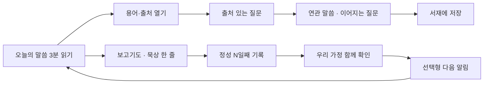

# 훈독(가안) - 가정연합 식구를 위한 말씀 PWA PRD v2

- 문서 ID: `PRD-FFWPU-PWA-001` (v2)
- 최초 작성: 2026-08-31 (PR #218 초안) · v1 재작성: 2026-09-07 (PR #261, close) · **v2: 2026-09-09**
- 상태: **사용자 검토 대기** (S1 PRD v2 + S2 디자인 2안 프로토타입)
- 제품 단계: 독립 운영·비공식 제한 베타 준비
- 앱 이름: **훈독** (가안, `DEC-PWA-017`)
- 함께 볼 문서: [디자인 2안 비교 `DES-PWA-002`](2026-09-09-hoondok-design-directions.md), 프로토타입 [안 A 아침 햇살](prototypes/2026-09-09-hoondok-a.html) · [안 B 한지와 먹](prototypes/2026-09-09-hoondok-b.html)

## 0. 문서 기준

### 0.1 표기

- 별도 라벨이 없는 문장은 사용자 승인 전제 또는 저장소에서 확인한 사실이다.
- `[가정]`: S2 사용자 검증이나 후속 조사로 확인해야 하는 제품 가설이다.
- `[확인 필요]`: 외부 책임자 또는 사용자의 결정 없이는 확정할 수 없는 항목이다.
- `[제안]`: 이번 PRD에서 검토·승인을 요청하는 수치나 정책안이다.

### 0.2 v1(PR #261)에서 달라진 것

PR #261은 2026-09-09 "디자인 시안 완성도 미달"로 닫혔다. 재작업 전 확인한 부족 지점과 v2의 대응이다.

| v1의 부족 지점 | v2의 대응 |
|---|---|
| PRD·디자인 문서 본문에 가정연합 고유 개념(훈독·보고기도·정성·가정예배·교회장·축복가정)이 0건. "말씀/가정/정본"으로 중립화 | §2 **가정연합 현지화 원칙**을 신설하고 용어 사전·초원 대응표·문구 규칙을 요구사항 수준으로 올렸다 |
| 사용자 메모(2026-09-09) 미반영: 추천·북마크 질문, 가정예배 챌린지, 말씀·기도·묵상 루틴, 5분 설교 교회장 섭외, 나의 페이지, 정성 기간, 앱명 "훈독" | `REQ-PWA-016~022` 신설, 5탭 정보구조 채택, 앱명 후보 §6.6 |
| 3안 프로토타입이 IBM Plex + 코발트/테라코타/앰버, 출처 서고 중심으로 초원식 일일 루틴 화면이 없음 | 동일 정보구조 위에 **시각 2안**(아침 햇살 · 한지와 먹)을 iPhone 393×852 기준으로 6화면씩 제작, AI slop 체크리스트 적용 |
| S1 PRD와 S2 프로토타입을 한 PR로 묶어 시안이 반려되면 PRD도 함께 닫힘 | 같은 PR이지만 PRD 승인과 디자인 선택을 별개 결정(`DEC-PWA-018`, `-019`)으로 분리 |

v1의 요구사항 `REQ-PWA-001~015`, 공식성 등급 O1~O5/R, 권리 원장, 권위 층, KPI·이벤트 사전, G0~G5, 외부 결정 `DEC-PWA-001~003`은 그대로 승계했다.

### 0.3 근거 문서

- [`2026-08-30-pwa-app-direction.md`](../research/2026-08-30-pwa-app-direction.md) S0 제품 방향, 승인 전제, 16개 세션 로드맵
- [`2026-08-30-chowon-ai-benchmark.md`](../research/2026-08-30-chowon-ai-benchmark.md) 초원AI 구조·화면·수익화·리스크
- 2026-09-09 사용자 메모와 초원AI 실제 화면 캡처 23장 (매일 QT·AI 질문·성경·5분 설교·전국 교회·나의 초원·설정)
- [`05-rag-pipeline.md`](../architecture/05-rag-pipeline.md), [`07-multi-chatbot-version.md`](../architecture/07-multi-chatbot-version.md), [`09-security-countermeasures.md`](../architecture/09-security-countermeasures.md)
- [`06-terminology-dictionary-structure.md`](../specs/domain/06-terminology-dictionary-structure.md), [`ui-ux.md`](../specs/web/ui-ux.md)

### 0.4 기존 제품과의 관계

| 구분 | 현재 `apps/web` (시연용 사용자 웹) | 이 PRD의 훈독 PWA |
|---|---|---|
| 사용자 | 관리자 계정을 재사용하는 시연·체험단 | AdminUser와 분리된 일반 식구 계정 + 비로그인 공개 범위 |
| 첫 화면 | 챗봇 선택 후 질문 | **오늘의 훈독** (말씀 읽기 · 보고기도 · 묵상 한 줄) |
| 출처 | 답변 뒤 인용 카드·원문 모달 | 모든 말씀 카드 첫 줄에 화자·저작물·판본·공식성 |
| 콘텐츠 | 적재된 615권 전체 | 기능별 권리가 승인된 소규모 정본만 |
| 재사용 | 스트리밍 채팅, 문단 인용, 원문 보기, 대화 기록, 하이브리드 검색, 가드레일, 5모드, `save` 리액션(백엔드), `featured_malssum` 20장 | 위 자산 위에 일일 루틴·정성·가정 단위·권리 원장·권위 층·중립 알림을 추가 |

---

## 1. 문제와 해결

### 1.1 누구의 어떤 문제인가

가정연합 식구님 세 사람의 하루에서 출발한다. 이름과 상황은 예시다.

| 페르소나 | 상황 | 막히는 지점 |
|---|---|---|
| **민준 (27, 2세 청년, 직장인)** | 축복을 앞두고 신앙을 다시 붙잡고 싶다. 아침 훈독회는 어릴 때 가족과 했지만 혼자 살면서 끊겼다 | "무엇부터 읽어야 하지"에서 멈춘다. 말씀선집 615권·천성경·원리강론 중 오늘 읽을 한 문단을 고를 수가 없다. 친구가 쓰는 초원AI를 보며 "우리 것도 있었으면" 한다 |
| **은혜 (44, 축복가정 어머니)** | 아이 둘과 아침에 짧게라도 훈독하고 싶다. 40일 정성을 시작했는데 며칠 빠지면 흐지부지된다 | 가족이 같은 말씀을 같은 날 읽는지 알 수 없다. 아이 눈높이 설명이 필요한데 원문만 있다 |
| **현우 (52, 교회장)** | 교회 식구들에게 매주 5분 말씀을 전하고 싶다. 청년들이 질문을 잘 안 한다 | 유튜브에 올려도 식구들 일상 루틴에 들어가지 않는다. 청년들이 "이거 원리에서 뭐라고 해요?"를 물을 곳이 없다 |

세 사람이 공통으로 겪는 다섯 가지 문제:

1. **시작이 어렵다.** 오늘 읽을 말씀을 고르는 일이 훈독 자체보다 어렵다.
2. **찾기 어렵다.** 기억나는 문구·주제로 말씀을 찾으면 여러 출판물·사이트·판본에 흩어져 있고 출처가 불분명하다.
3. **혼자 하면 이어지지 않는다.** 정성 기간을 세워도 가족·교회와 함께 확인할 방법이 없다.
4. **어려운 용어에서 막힌다.** 사위기대·탕감·심정 같은 말을 원문과 연결해 설명해 주는 곳이 없고, 생성형 AI 설명이 공식 해석처럼 보일 위험이 있다.
5. **기록이 민감하다.** 질문·보고기도·가족 정보는 저장·삭제·알림 노출을 사용자가 통제해야 한다.

### 1.2 왜 초원AI의 구조를 빌리는가, 무엇을 다르게 하는가

초원AI는 개신교 청년에게 "매일 QT + AI 질문 + 성경 + 5분 설교 + 나의 초원"의 일일 루프로 3일 만에 3만 5천, 7개월에 10만 사용자를 모았다. 구조가 검증됐고 우리 식구들도 이미 그 화면 문법에 익숙하다. 그래서 **정보구조는 빌리고, 내용물은 가정연합의 실제 신앙 실천으로 바꾼다.**

| 초원이 푼 것 | 훈독이 같은 자리에 두는 것 |
|---|---|
| 매일 QT (묵상·기도·성경 읽기) | **훈독회**: 말씀 읽기 · 보고기도 · 묵상 한 줄 |
| 성경 66권 | 원리강론 · 천성경 · 평화경 · 참부모경 · 말씀선집 · 참어머님 말씀 |
| 365일 성경통독 챌린지 | **정성 기간** 21일 · 40일 |
| 우리 교회 N명 참여 중 | **우리 가정 함께 훈독** · 우리 교회 |
| 5분 설교 (목사) | **5분 말씀** (교회장) |
| 연속일·달란트 | **정성 N일째** (재화·벌점 없음) |

다르게 하는 것은 S0 승인 원칙 그대로다. 출처 우선, AI 권한 제한, 비감시, 권리 확인 정본만, 중립형 알림, 초원의 녹색 팔레트·씨앗/나무·달란트·공개 리뷰 미복제.

### 1.3 한 문장 가치제안

> **혼자서는 이어지지 않던 훈독을, 오늘 읽을 말씀 한 문단과 정확한 출처, 그리고 가족과 함께 세는 정성 일수로 매일 이어 주는 가정연합 식구의 말씀 PWA.**

AI는 말씀을 찾아 주고 출처로 되돌려 보내는 도구이지, 신앙의 답을 대신하지 않는다.

### 1.4 운영 및 독립 베타 표시 원칙

- 대상 조직은 세계평화통일가정연합(FFWPU, 이하 가정연합)이다.
- 공식 승인 전까지 독립 운영·비공식 제한 베타로만 제공한다. 공식 로고, 공식 앱이라는 주장, 공식 기관과의 제휴를 암시하는 표현을 사용하지 않는다.
- 첫 진입, 로그인, 정보 화면, 공유 화면에 독립 베타임을 일관되게 표시한다.
- 승인되지 않은 콘텐츠는 원문·검색색인·임베딩·AI 근거·오프라인·푸시 인용에 사용하지 않는다.
- `[확인 필요]` 법적 운영 주체와 공식 승인 절차가 확정되기 전에는 외부 공개 모집과 S14 베타 배포를 진행하지 않는다.

독립 베타 기본 고지문:

> 이 서비스는 가정연합 공식 앱이 아닌 독립 운영 제한 베타입니다. AI 설명은 공식 원문이나 공식 해설이 아니며, 각 답변의 출처와 검수 상태를 확인해 주세요.

### 1.5 대상 사용자와 비사용자

| 구분 | 사용자 | 핵심 필요 |
|---|---|---|
| 1순위 | 가정연합 현 식구와 그 가정 | 오늘 읽을 말씀, 정확한 출처, 가족과 함께 세는 정성 |
| 1순위 안의 초점 | 청년·2세 (20~30대) | 어려운 용어의 쉬운 설명, 질문할 곳, 초원과 비슷한 익숙한 화면 |
| 후속 | 축복가정 부모 | 자녀 눈높이 설명, 가정예배 자료, 가족 진행 확인 |
| 후속 | 교회장·교사 | 5분 말씀 게시, 교회 단위 함께 훈독, 질문 경향 |
| 후속 | 입문자·다문화 가정 | 가입 압박 없는 제한 탐색, 판본·번역 차이 |

MVP의 비사용자:

- 가정연합의 공식 입장이나 목회·교리 판정을 요구하는 사용자
- 공개 커뮤니티, 조직 출석, 전도 실적, 헌금·결제를 관리하려는 운영자
- 권리 미확인 전체 615권을 내려받거나 대량 수집하려는 사용자
- `[확인 필요]` 보호자 동의·연령 정책이 정해지기 전의 아동 단독 사용자 (가정 단위 기능 안에서의 자녀 계정은 `DEC-PWA-016`)

### 1.6 JTBD

| ID | 상황 | 과업 | 기대 결과 |
|---|---|---|---|
| `JTBD-PWA-001` | 아침에 훈독을 시작할 때 | 3분 안에 오늘 말씀 한 문단을 읽고 보고기도·묵상 한 줄로 마친다 | 부담 없이 오늘 훈독을 완료하고 정성 일수가 올라간다 |
| `JTBD-PWA-002` | 기억나는 문구·주제·경전으로 말씀을 찾을 때 | 말씀 서고와 검색으로 후보를 좁힌다 | 판본과 원문 출처를 확인한다 |
| `JTBD-PWA-003` | 신앙·원리·가정 관련 질문이 생겼을 때 | 출처 있는 짧은 AI 답변과 연관 말씀을 본다 | AI 설명과 원문을 구분하고 이어지는 질문으로 깊어진다 |
| `JTBD-PWA-004` | 낯선 용어를 만났을 때 | 용어 정의와 관련 원문을 함께 연다 | 시대·판본에 따른 의미 차이를 이해한다 |
| `JTBD-PWA-005` | 가족·교회와 함께 정성을 세울 때 | 정성 기간을 만들고 초대해 진행을 함께 본다 | 며칠 빠져도 다시 이어 갈 수 있다 |
| `JTBD-PWA-006` | 다시 읽고 싶은 말씀·질문이 있을 때 | 비공개로 저장·메모하거나 무기억을 선택한다 | 민감한 기록과 알림 노출을 직접 통제한다 |

---

## 2. 가정연합 현지화 원칙

이 장이 v2의 핵심이다. 화면 문구·기능 이름·데이터 모델이 여기 정의한 용어를 따른다.

### 2.1 용어 사전과 UI 문구 규칙

| 용어 | 뜻 (요약) | UI 규칙 |
|---|---|---|
| 하늘부모님 | 가정연합이 사용하는 신의 호칭 | "하나님" 단독 표기를 기본 문구에 쓰지 않는다. 원문 인용은 원문 표기를 따른다 |
| 참부모님 · 참아버님 · 참어머님 | 문선명·한학자 총재 | 화자 표기는 정본의 표기를 그대로 쓴다 |
| 식구 | 가정연합 구성원 | "회원·유저" 대신 "식구님"을 사용자 호칭으로 쓴다 |
| 축복 · 축복가정 · 2세 | 축복결혼과 그 가정, 자녀 | 페르소나·가정 단위 기능의 기본 어휘 |
| 교회장 · 교구 · 교회 | 지역 교회 책임자와 조직 단위 | "목사·성도·교인"을 쓰지 않는다 |
| 훈독 · 훈독회 | 말씀을 소리 내어 읽고 나누는 일일 실천 | 앱 이름 가안. "QT·큐티·묵상 읽기" 대신 쓴다 |
| 경배 | 아침 경배식 | 오늘 화면의 아침 시간 문구에 사용 가능. 절차는 앱이 정하지 않는다 |
| 보고기도 | 가정연합의 기도 형식. "축복중심가정 OOO 이름으로 보고드립니다. 아주." | 기도 카드 이름. "아멘"을 쓰지 않는다. 기도문 생성은 하지 않고 시간·기록만 돕는다 |
| 정성 · 조건 (21일 · 40일 · 120일) | 기간을 정해 기도·훈독·실천을 쌓는 관습 | "챌린지·스트릭·연속일" 대신 **정성 N일째**, **정성 기간**을 쓴다 |
| 가정맹세 | 8절로 된 가정의 다짐문 | 오늘 화면의 선택 카드로 두되 본문 전재는 권리 확인 후 (`DEC-PWA-002`) |
| 가정예배 | 가정 단위 예배·모임 | 가정 탭의 기능명. 순서·자료는 `[확인 필요]` 담당 부서(사용자 메모의 "가행국") 제공물만 |
| 천일국 · 효정 · 심정 · 참사랑 · 위하는 삶 · 사위기대 · 3대 축복 · 탕감복귀 | 핵심 교리 용어 | 용어 칩·사전의 대표 항목. 정의는 O3 공식 해설과 연결하고 AI 설명은 "공식 해설 아님" 라벨 |
| 천력 | 음력 기반 가정연합 절기 달력 | 절기 표시 여부·날짜 출처 `[확인 필요]` 확정 전 화면에 넣지 않는다 |

하지 않을 것:

- 개신교 관용구(하나님 단독, 아멘, 목사, 성도, 큐티, 구약·신약)를 기본 문구·탭 이름·알림에 쓰지 않는다.
- 성경 66권·장·절 구조를 강제하지 않는다. 경전마다 편·장·절 또는 권·연도·장소 구조를 정본 그대로 따른다.
- 공식 로고, 참부모님 사진·영상, 공식 앱 표현을 쓰지 않는다 (`REQ-PWA-001`).
- 천력 절기·행사 날짜를 임의로 확정해 표시하지 않는다.
- 기도문·설교·교리 판정을 AI가 생성하지 않는다. AI는 말씀을 찾고 설명하며 출처로 보낸다.

### 2.2 초원AI 화면 대 훈독 화면 대응표

2026-09-09 캡처 23장을 기준으로 초원의 요소를 하나씩 대응했다.

| 초원AI 화면·요소 | 훈독 | 근거·비고 |
|---|---|---|
| 매일 QT 탭: 오늘 문구, 요일 표시, 연속일 🌱, 묵상하기·기도하기·말씀 읽기 3카드, "우리 교회 3명 참여 중", 내 성경통독 | **오늘 탭**: 정성 N일째, 오늘의 말씀 1문단, 말씀 읽기·보고기도·묵상 한 줄 3카드, 우리 가정 함께, 정성 기간 진행 | `REQ-PWA-016`, `-017`, `-018` |
| 달란트 재화(+5 달란트) | 없음 | S0 유지. 보상 재화·점수 없음 |
| 상단 퀵 메뉴(성경 해설·오디오·통독·구절 검색·전체 메뉴) | 오늘 탭 상단 퀵 4개: 말씀 검색 · 정성 기간 · 가정맹세 · 용어 사전 | 오디오는 권리 확인 후 (`RSK-PWA-009`) |
| AI 질문 탭: 추천 / 북마크 / 내 질문, + 질문하기 | **질문 탭**: 추천 / 북마크 / 내 질문, + 질문하기, 답변에 연관 말씀·이어지는 질문 | `REQ-PWA-019`, 기존 `suggested_followups`·`save` 재사용 |
| 성경 탭: 구약·신약/가나다순 책 목록, 장 읽기, 본문·AI 해설 요약·노트 탭, 형광펜, 오디오 플레이어, 모든 북마크·모든 노트 | **말씀 탭**: 경전·저작물 서고(원리강론·3대 경전·말씀선집·참어머님 말씀·자서전·통일사상), 읽기 화면 원문 / AI 설명 / 내 메모 세그먼트, 밑줄·메모 | `REQ-PWA-020`, 카테고리 L/M/O/B/N/P/Q와 1:1 |
| AI 검색: 키워드·구절·맥락·목차로 찾기 | 동일 4방식 + 화자·연도 필터 | `REQ-PWA-003` |
| 5분 설교 탭: 목사 프로필 행, 인기 설교, 교회 바로가기 | **가정 탭** 안 5분 말씀: 교회장 카드, 이번 주 5분 말씀, 전체 설교, "교회장 신청" | `REQ-PWA-021`, 운영 주체 `[확인 필요]` |
| 전국 교회 지도, 우리 교회 인증·멤버·추천, 교회 추천 리뷰 | 우리 가정·우리 교회 함께 훈독까지만. 지도·공개 리뷰 없음 | S0 비범위 유지 |
| 나의 초원: 닉네임, 대표 성경구절, 연속일·최대 연속일·누적일, 월 달력 체크 | **나 탭**: 이름, 대표 말씀, 정성 일수(현재·최장·누적), 월 달력, 가족·친구 | `REQ-PWA-022`. "최장"은 비교·순위 없이 본인만 |
| 설정: 알림(묵상 8시·기도 21시·인기 질문·공지), 멤버십·선물권, 친구 초대·초대 코드 | 알림(아침 훈독·저녁 보고기도·추천 질문·공지), 가정·교회 초대 코드. 멤버십·선물권 없음 | `REQ-PWA-010`, 결제 비범위 |
| 인증 마크·"건강한 교회" 문구 | 없음 | 공식성 판정을 앱이 하지 않는다 |

### 2.3 청년·2세를 위한 설계 원칙 `[가정]`

- 첫 화면은 "오늘 할 한 가지"만 요구한다. 말씀 한 문단은 3분 안에 읽히는 길이(약 150~300자)로 편성한다.
- 어려운 용어는 본문에서 칩으로 바로 열리고, 정의는 "공식 해설"과 "AI 설명"을 라벨로 구분한다.
- 질문 탭의 추천 질문은 실제 청년 질문 경향(축복 준비, 정성의 의미, 신앙 회의, 가족 관계, 용어)을 큐레이션한다. 부끄러운 질문도 기본 비공개다.
- 정성 일수는 격려만 한다. 빠진 날에 벌점·경고·순위·비교를 표시하지 않는다.

---

## 3. 정보구조와 화면

### 3.1 하단 5탭

| 탭 | 이름 | 첫 화면 | 담당 JTBD |
|---|---|---|---|
| 1 | **오늘** | 오늘의 훈독 | 001, 005 |
| 2 | **질문** | 추천 질문 | 003, 004 |
| 3 | **말씀** (가운데, 강조) | 말씀 서고 + 검색 | 002 |
| 4 | **가정** | 우리 가정·가정예배·5분 말씀 | 005 |
| 5 | **나** | 나의 훈독 | 006 |

5탭은 S0의 "처음부터 5탭 전체를 열지 않는다"를 뒤집는 결정이다(`DEC-PWA-014`). 근거는 사용자 메모의 다섯 영역이 곧 이 다섯 탭이며, 초원 사용자의 화면 학습 비용을 재사용하기 위해서다. 단, 베타 1차에서는 **가정 탭을 "준비 중" 상태로 노출**하고 2차에서 연다(§6.1).

### 3.2 화면 목록

| ID | 화면 | 담당 과업 | 접근 | 프로토타입 |
|---|---|---|---|---|
| `SCR-PWA-001` | 오늘 | 오늘의 말씀·3카드·정성·가정 함께 | 공개 콘텐츠는 비로그인, 완료 기록은 로그인 | A·B 화면 1 |
| `SCR-PWA-002` | 말씀 서고·검색 | 경전 목록, 키워드·구절·맥락·목차 검색 | 비로그인 | A·B 화면 4 |
| `SCR-PWA-003` | 검색 결과 | 일치 이유·출처·판본·공식성 비교 | 비로그인 | S3 |
| `SCR-PWA-004` | 질문·답변 | 추천/북마크/내 질문, AI 설명·인용·연관 말씀·이어지는 질문 | 비로그인(무기억), 저장·북마크는 로그인 | A·B 화면 3 |
| `SCR-PWA-005` | 말씀 읽기·원문 상세 | 원문 / AI 설명 / 내 메모, 절 번호, 밑줄, 용어 칩, 메타 | 비로그인 | A·B 화면 2 |
| `SCR-PWA-006` | 용어 상세 | 복수 정의, 관련 원문 | 비로그인 | 화면 2 안의 시트 |
| `SCR-PWA-007` | 내 서재 | 북마크·메모·저장 질문·무기억·삭제 | 로그인 | 나 탭 하위 |
| `SCR-PWA-008` | 설치·알림 설정·알림함 | 설치 안내, 시간·조용한 시간·문구 수준 | 로그인 | A·B 화면 6 하단 |
| `SCR-PWA-009` | 로그인·동의·베타 고지 | 일반 식구 인증, 동의 버전, 독립 베타 고지 | 공개 | 첫 화면 상단 고지 |
| `SCR-PWA-010` | 가정 | 우리 가정 함께 훈독, 가정예배 챌린지, 초대 | 로그인 | A·B 화면 5 |
| `SCR-PWA-011` | 정성 기간 | 21·40일 만들기, 말씀 편성 선택, 진행, 참여자 | 로그인 | 화면 1 카드 + S3 |
| `SCR-PWA-012` | 5분 말씀 | 교회장 카드, 이번 주 5분 말씀, 전체 설교, 신청 | 비로그인 시청, 신청은 로그인 | A·B 화면 5 하단 |
| `SCR-PWA-013` | 나의 훈독 | 정성 달력, 일수, 대표 말씀, 가족·친구 | 로그인 | A·B 화면 6 |

### 3.3 핵심 루프

---

## 4. 요구사항

### 4.1 우선순위

- `P0`: 제한 베타 진입을 막는 필수 요구사항
- `P1`: MVP 범위이며 G5에서 명시적으로 제외하지 않는 한 베타 전에 완료
- `P2`: 베타 데이터로 우선순위를 다시 정할 후속 요구사항

### 4.2 승계 요구사항 (v1 `REQ-PWA-001~015`)

### `REQ-PWA-001` 독립 베타 정체성 (`P0`)

공식 승인 전 모든 사용자 접점은 독립 운영·비공식 제한 베타임을 명확히 표시해야 한다.

- `AC-PWA-001-01`: 첫 진입·로그인·정보·공유 화면에서 "가정연합 공식 앱이 아님"과 AI 설명의 비공식성을 확인할 수 있다.
- `AC-PWA-001-02`: 공식 로고·공식 제휴 표현이 없는지 릴리스 체크리스트와 화면 문자열 검사에서 확인한다.
- `AC-PWA-001-03`: 고지문 확인 전 사용자가 공식 앱으로 오인할 수 있는 설치 이름이나 알림 발신자명을 사용하지 않는다. 앱 이름 "훈독"이 공식 훈독회 브랜드로 오인될 위험은 `DEC-PWA-017`에서 다룬다.

### `REQ-PWA-002` 오늘의 말씀 (`P0`)

사용자는 권리가 확인된 오늘의 말씀을 3분 내 읽고 출처·용어·묵상 한 줄로 이동할 수 있어야 한다.

- `AC-PWA-002-01`: 오늘 콘텐츠에는 예상 읽기 시간, 화자, 날짜, 저작물, 판본, 공식성, 검수 상태가 표시된다.
- `AC-PWA-002-02`: 사용자는 로그인하지 않아도 공개 권리가 허용된 오늘 콘텐츠를 읽을 수 있다.
- `AC-PWA-002-03`: 묵상 한 줄은 저장 없이 완료하거나 로그인 후 비공개 저장할 수 있다.
- `AC-PWA-002-04`: 오늘 콘텐츠가 없거나 철회됐으면 대체 콘텐츠를 임의 생성하지 않고 상태와 다음 탐색 행동(서고에서 고르기)을 표시한다.
- `AC-PWA-002-05`: 편성 소스는 `featured_malssum` 큐레이션과 정성 기간 편성이며, 편성 주체·주기는 S3 진입 조건이다(`RSK-PWA-008`).

### `REQ-PWA-003` 통합 검색 (`P0`)

사용자는 정확한 문구와 자연어를 하나의 진입점에서 검색하고 출처 메타데이터로 결과를 좁힐 수 있어야 한다.

- `AC-PWA-003-01`: 키워드·구절·맥락·목차 4방식과 화자·연도·저작물 필터를 지원하고 적용된 필터를 화면에서 확인·해제할 수 있다.
- `AC-PWA-003-02`: 각 결과는 일치 문맥, 출처, 판본, 공식성, 검수·철회 상태를 표시한다.
- `AC-PWA-003-03`: 0건이면 빈 화면 대신 철자·필터 완화·관련 용어 제안을 제공하며 존재하지 않는 원문을 생성하지 않는다.
- `AC-PWA-003-04`: 권리 원장이 허용하지 않은 콘텐츠는 결과·미리보기·검색 제안에 노출되지 않는다.

### `REQ-PWA-004` 출처 있는 질문 (`P0`)

AI 답변은 승인된 근거에 제한되고 모든 핵심 주장과 인용 문단을 연결해야 한다.

- `AC-PWA-004-01`: 답변의 핵심 주장마다 하나 이상의 문단 단위 출처 링크가 있으며 링크는 실제 근거 문단을 연다.
- `AC-PWA-004-02`: AI 설명과 공식 원문은 라벨·영역·스크린리더 이름으로 구분된다.
- `AC-PWA-004-03`: 검색 또는 생성 실패 시 추정 답변을 표시하지 않고 재시도와 원문 검색 행동을 제공한다.
- `AC-PWA-004-04`: 의료·법률·위기·교리 판정 요청은 제품 권한의 한계를 알리고 적절한 공식·전문 경로를 안내한다. 위기 키워드는 기존 pastoral 모드 강제 전환(`persona_overridden`)을 재사용한다.

### `REQ-PWA-005` 원문과 출처 상세 (`P0`)

- `AC-PWA-005-01`: 상세 화면은 화자, 발화일·장소(확인된 경우), 저작물, 판본·언어, 위치 식별자(편·장·절 또는 권·쪽), 공식성, 검수일을 표시한다.
- `AC-PWA-005-02`: 확인되지 않은 메타데이터는 추정값으로 채우지 않고 "확인되지 않음"으로 표시한다.
- `AC-PWA-005-03`: 공유 링크는 현재 권리·철회 상태를 서버에서 다시 확인하고 철회 시 원문 대신 철회 안내를 표시한다.

### `REQ-PWA-006` 용어 탐색 (`P0`)

- `AC-PWA-006-01`: 용어 정의에는 정의 출처, 공식성, 적용 시대·판본, 검수 상태가 표시된다.
- `AC-PWA-006-02`: 용어 사전 결과가 말씀 검색 결과를 대체하거나 원문 인용으로 표시되지 않는다.
- `AC-PWA-006-03`: 정의가 충돌하면 복수 정의를 나란히 표시하고 단일 공식 의미로 합성하지 않는다.
- `AC-PWA-006-04`: 용어 사전 데이터(`D` 카테고리)가 비어 있는 동안은 "정의 준비 중"과 관련 원문 검색만 제공한다.

### `REQ-PWA-007` 내 서재 (`P1`)

- `AC-PWA-007-01`: 저장 항목은 본인 계정에서만 조회되고 `AdminUser` 권한·세션과 분리된다.
- `AC-PWA-007-02`: 사용자는 항목별 삭제와 계정 전체 삭제를 실행하고 처리 상태를 확인할 수 있다.
- `AC-PWA-007-03`: 철회 콘텐츠를 저장한 경우 개인 메모는 보존 여부를 사용자가 선택할 수 있지만 철회 원문은 재노출되지 않는다.
- `AC-PWA-007-04`: 로그아웃·세션 만료·권한 오류에서 개인 기록을 다른 사용자에게 노출하지 않는다.

### `REQ-PWA-008` 일반 식구 인증·동의·무기억 (`P0`)

- `AC-PWA-008-01`: 일반 식구와 `AdminUser`는 별도 엔티티·세션·쿠키 범위·권한 검사를 사용한다.
- `AC-PWA-008-02`: 공개 권리가 허용된 오늘·검색·원문 읽기는 비로그인으로 가능하고, 완료 기록·서재·정성·가정·알림 설정은 로그인이 필요하다.
- `AC-PWA-008-03`: `[제안]` 질문은 기본 무기억이며 사용자가 저장을 선택한 경우에만 질문·답변 원문을 계정에 보관한다. "내 질문" 탭은 저장한 질문만 보여 준다.
- `AC-PWA-008-04`: 동의 거부·철회가 핵심 공개 읽기 기능을 막지 않으며 필요한 기능만 정확히 잠근다.
- `AC-PWA-008-05`: 기존 `session_id` 재사용 경로의 쓰기 소유권 미검증(`SEC-MONO-001`)은 일반 식구 공개 전에 수정한다.

### `REQ-PWA-009` 설치와 제한 오프라인 (`P1`)

- `AC-PWA-009-01`: 지원 브라우저에서 manifest 이름·아이콘·시작 URL·standalone 표시가 검증되고, 미지원 환경에는 일반 웹 이용 경로를 제공한다.
- `AC-PWA-009-02`: 첫 가치 경험(오늘 훈독 1회 완료) 전에 설치 프롬프트를 강제하지 않는다.
- `AC-PWA-009-03`: 앱 셸과 명시적으로 허용된 공개 본문만 캐시하며 질문·답변·메모·가족 정보·인증 토큰은 Service Worker 캐시에 저장하지 않는다.
- `AC-PWA-009-04`: 오프라인에서는 RAG 질문과 최신 권리 확인이 불가능함을 표시하고 마지막 동기화 시각을 보여준다.

### `REQ-PWA-010` 중립형 알림과 알림함 (`P1`)

- `AC-PWA-010-01`: 첫 훈독 완료 뒤 사용자가 "알림 켜기"를 탭한 직후에만 브라우저 권한을 요청한다.
- `AC-PWA-010-02`: 기본 잠금 화면 문구에는 질문·답변·기도·가족 정보·말씀 전문·신앙 맥락이 포함되지 않는다. 기본 문구 예: "오늘 읽을거리가 준비됐어요".
- `AC-PWA-010-03`: 권한 거부·미지원·전달 실패에서도 알림함과 설정 경로를 제공하며 권한을 반복 요청하지 않는다.
- `AC-PWA-010-04`: 사용자는 아침 훈독·저녁 보고기도 시각, 조용한 시간, 문구 수준을 바꾸고 브라우저 구독과 서버 예약을 함께 해지할 수 있다. `[가정]` 기본값 아침 7시, 저녁 21시.

### `REQ-PWA-011` 콘텐츠 권리 원장과 철회 (`P0`)

- `AC-PWA-011-01`: 원장에 권리자, 근거 문서, 유효 기간, 지역, 판본, O1~O5/R, 검수자, 철회 책임자, 기능별 허용값을 기록한다.
- `AC-PWA-011-02`: 본문 전재·검색·임베딩·AI 요약·오프라인·푸시 인용·공유 카드 각각이 `allowed`인 경우에만 해당 파이프라인이 동작한다.
- `AC-PWA-011-03`: 철회 시 서버 원문·검색색인·임베딩·캐시·AI 요약·공유 링크를 함께 차단하고 감사 로그를 남긴다.
- `AC-PWA-011-04`: 오프라인 사본은 다음 온라인 동기화에서 삭제·재제공 차단하며 즉시 원격 삭제를 보장하지 않는다는 한계를 표시한다.

### `REQ-PWA-012` 권위 층·판본 충돌·근거 부족 중단 (`P0`)

- `AC-PWA-012-01`: O1~O5/R 등급과 "공식 원문·공식 해설·AI 설명·내 메모" 유형을 데이터와 화면 모두에서 별도 필드로 유지한다.
- `AC-PWA-012-02`: 핵심 근거가 R뿐이면 기본 AI 답변에서 제외하고 참고 자료임을 별도로 표시한다.
- `AC-PWA-012-03`: 판본·번역·시대별 진술이 충돌하면 차이를 나란히 보여주고 하나의 결론으로 조용히 합치지 않는다.
- `AC-PWA-012-04`: 근거 수·관련도·인용 검증 기준을 충족하지 못하면 "확인할 수 없음"으로 끝내고 원문 검색 또는 교회장 문의 경로를 제공한다.

### `REQ-PWA-013` 오류·빈 결과·오프라인·권한 상태 (`P0`)

- `AC-PWA-013-01`: 네트워크 실패는 입력을 잃지 않고 재시도할 수 있으며 중복 저장·중복 질문 전송·중복 완료 기록을 방지한다.
- `AC-PWA-013-02`: 빈 결과는 "오류"와 구분하고 필터 해제·관련 용어·문의 행동을 제공한다.
- `AC-PWA-013-03`: 오프라인, 인증 만료, 접근 권한 없음, 알림 권한 거부, 콘텐츠 철회 상태를 서로 다른 메시지와 행동으로 표시한다.
- `AC-PWA-013-04`: 서버 내부 정보·토큰·원문 권리 정보가 오류 메시지나 로그에 노출되지 않는다.

### `REQ-PWA-014` 접근성·반응형 품질 (`P0`)

- `AC-PWA-014-01`: 393px 모바일과 데스크톱에서 가로 스크롤 없이 핵심 플로우를 완료한다.
- `AC-PWA-014-02`: 텍스트 200% 확대, 키보드, 명확한 포커스, 스크린리더 이름, reduced-motion에서 정보 손실이 없다. 말씀 본문은 큰 글씨 3단계를 제공한다.
- `AC-PWA-014-03`: 공식성·권위·오류·완료 상태를 색상이나 아이콘 하나만으로 구분하지 않는다.

### `REQ-PWA-015` 개인정보 보호형 측정 (`P0`)

- `AC-PWA-015-01`: 분석 이벤트에 원문 질문, 답변, 메모, 검색어, 기도 내용, 가족 구성, 푸시 endpoint·키를 넣지 않는다.
- `AC-PWA-015-02`: 이벤트 사전에 목적·속성·보존 기간·접근 역할을 기록하고 동의 범위를 벗어난 이벤트를 차단한다.
- `AC-PWA-015-03`: 계정 삭제 시 사용자 식별 이벤트 연결을 끊고 법적 보존 의무가 없는 원본 이벤트를 정책 기한 내 삭제한다.

### 4.3 신규 요구사항 (v2, 사용자 메모 반영)

### `REQ-PWA-016` 오늘의 훈독 3카드 (`P0`)

오늘 화면은 말씀 읽기 · 보고기도 · 묵상 한 줄, 세 카드로 오늘 훈독을 완결해야 한다.

- `AC-PWA-016-01`: 세 카드는 각각 완료 상태를 가지며 순서를 강제하지 않는다. 말씀 읽기 카드는 `REQ-PWA-002`의 오늘 말씀을 연다.
- `AC-PWA-016-02`: 보고기도 카드는 기도문을 생성하지 않는다. 기도 시작·마침 표시, 선택형 타이머, 비공개 한 줄 기록만 제공한다.
- `AC-PWA-016-03`: 묵상 한 줄은 200자 이내 비공개 기록이며 저장 없이 완료할 수 있다.
- `AC-PWA-016-04`: 세 카드 중 하나 이상을 완료하면 그날을 "훈독한 날"로 기록한다. `[제안]` 셋 다 완료해야 정성 일수로 세는지, 하나만 해도 세는지는 `DEC-PWA-015`.
- `AC-PWA-016-05`: 오늘 화면 상단에 "우리 가정 N명 함께" 요약을 두되 누가 안 했는지는 표시하지 않는다.
- 실패 상태: 오늘 편성 없음 → 서고에서 고르기 유도. 오프라인 → 마지막 동기화된 오늘 말씀만 읽기, 완료 기록은 온라인 후 동기화. 비로그인 → 읽기는 가능, 완료·기록은 로그인 안내.

### `REQ-PWA-017` 정성 기간 (`P1`)

사용자는 21일 또는 40일 정성 기간을 만들거나 참여하고, 기간 동안 편성된 말씀을 매일 받을 수 있어야 한다.

- `AC-PWA-017-01`: 기간 길이(21·40·`[제안]` 사용자 지정 7~120일), 시작일, 편성 방식(주제별 큐레이션 / 경전 순서 / 직접 고르기)을 선택한다.
- `AC-PWA-017-02`: 진행률·오늘 N일째·남은 일수를 표시하되 빠진 날에 벌점·경고·초기화를 하지 않는다. 빠진 날은 "건너뜀"으로만 남고 기간은 계속된다.
- `AC-PWA-017-03`: 정성 기간을 가정·교회 단위에 초대할 수 있다(`REQ-PWA-018`). 초대 없이 혼자도 가능하다.
- `AC-PWA-017-04`: 편성 말씀은 권리 원장 `allowed` 콘텐츠에서만 뽑으며 부족하면 기간 생성 시 "편성 가능한 말씀이 N일분"임을 알린다.
- `AC-PWA-017-05`: 기간 종료 시 요약(훈독한 날 수, 저장한 말씀)을 본인에게만 보여 준다. 공유 카드는 공유 권리 확정 후.

### `REQ-PWA-018` 가정 단위 함께 훈독 (`P1`, 베타 2차)

사용자는 가정(가족)·교회·소그룹 단위를 만들어 같은 말씀을 함께 읽고 진행을 볼 수 있어야 한다.

- `AC-PWA-018-01`: 단위 생성자는 초대 코드·링크로 구성원을 초대하고, 구성원은 언제든 나갈 수 있다. 공개 검색·가입 신청은 없다.
- `AC-PWA-018-02`: 구성원에게 보이는 것은 "오늘 훈독한 사람 수"와 본인이 공개로 설정한 항목뿐이다. 개인의 묵상·기도·질문은 단위 안에서도 비공개다.
- `AC-PWA-018-03`: 가정예배 챌린지는 담당 부서 제공 자료(`[확인 필요]` 사용자 메모의 "가행국")를 O3/O5로 등록한 것만 편성한다. 앱이 예배 순서를 만들지 않는다.
- `AC-PWA-018-04`: `[확인 필요]` 미성년 자녀 계정은 보호자 초대로만 생성하고 별도 동의·데이터 최소화 정책을 적용한다(`DEC-PWA-016`). 정책 확정 전에는 성인 구성원만 초대 가능하다.
- `AC-PWA-018-05`: 단위 삭제 시 구성원 진행 요약을 포함한 단위 데이터를 함께 삭제한다.
- 실패 상태: 초대 코드 만료·중복 참여·단위 정원 초과를 구분해 안내한다.

### `REQ-PWA-019` 추천·북마크·내 질문과 이어지는 질문 (`P0`)

질문 탭은 추천 / 북마크 / 내 질문 세 목록과 답변 안의 연관 말씀·이어지는 질문으로 탐구를 이어 가게 해야 한다.

- `AC-PWA-019-01`: 추천 질문은 큐레이션 목록(청년·가정·용어·정성 주제)과 기존 동적 추천(`ADR-56`)을 합쳐 보여 주고, 각 항목에 북마크 토글이 있다.
- `AC-PWA-019-02`: 북마크는 기존 `chat_message_reactions.save`를 재사용하고 조회 API를 신설한다. 북마크 목록은 로그인 사용자 본인만 본다.
- `AC-PWA-019-03`: 답변 아래에 연관 말씀(인용 외 추가 문단 1~3개)과 이어지는 질문 pill(기존 `suggested_followups`)을 표시하고, 이어지는 질문은 같은 세션의 멀티턴으로 연결된다.
- `AC-PWA-019-04`: 내 질문은 사용자가 저장을 선택한 질문만 표시하며 항목별 비공개 표시·삭제가 가능하다(`AC-PWA-008-03`).
- `AC-PWA-019-05`: 답변 모드는 기존 5모드(표준·신학자·목회 상담·초신자·어린이)를 재사용하되 이름은 가정연합 어휘로 바꾼다. `[제안]` 표준 · 원리 깊이 · 상담 · 처음 읽는 분 · 자녀와 함께.

### `REQ-PWA-020` 말씀 서고와 읽기 (`P0`)

말씀 탭은 경전·저작물별 서고와 읽기 화면을 제공해야 한다.

- `AC-PWA-020-01`: 서고는 카테고리 키(L 원리강론, M 3대 경전, O 말씀선집, B 참어머님 말씀, N 자서전, P 참부모론, Q 통일사상요강)와 1:1이며 권리 `allowed`인 권만 노출한다. 카테고리 이름·색은 `data_source_categories`를 재사용한다.
- `AC-PWA-020-02`: 읽기 화면은 원문 / AI 설명 / 내 메모 세그먼트로 나뉘고, AI 설명은 "공식 해설 아님" 라벨과 함께 원문과 다른 형태로 표시한다.
- `AC-PWA-020-03`: 절·문단 단위 밑줄(색 3종 이내)과 메모는 로그인 사용자 비공개 저장이다.
- `AC-PWA-020-04`: 위치 식별자는 정본 구조를 따른다(원리강론: 편·장·절 / 천성경: 편·장·절 / 말씀선집: 권·날짜·장소). 구조 데이터가 없는 권은 문단 번호만 표시한다.
- `AC-PWA-020-05`: 오디오 낭독은 권리 확인 전 제공하지 않으며 "준비 중"으로 표시한다.
- 실패 상태: 서고에 노출 가능한 권이 0이면 "권리 확인 중" 안내와 오늘 말씀·질문 경로를 제공한다.

### `REQ-PWA-021` 5분 말씀 (`P2`, 베타 2차)

교회장이 게시한 5분 말씀·전체 설교를 보고, 교회장은 게시를 신청할 수 있어야 한다.

- `AC-PWA-021-01`: 5분 말씀 카드는 교회장 이름·교회·날짜·길이·한 줄 요지·근거 말씀 위치를 표시한다. 조회수·인기 순위는 표시하지 않는다.
- `AC-PWA-021-02`: 영상은 외부 호스팅(공식 채널) 링크·임베드만 사용하고 앱이 원본을 저장하지 않는다.
- `AC-PWA-021-03`: "교회장 신청"은 이름·교회·연락처·게시 희망 채널을 받아 관리자 승인 대기열에 넣는다. 승인 주체·검수 기준 `[확인 필요]`.
- `AC-PWA-021-04`: 설교 본문 RAG 검색은 초원의 교회용 설교 검색과 달리 이번 범위에 넣지 않는다.

### `REQ-PWA-022` 나의 훈독 (`P1`)

나 탭은 정성 달력과 일수, 대표 말씀, 가족·친구, 설정을 제공해야 한다.

- `AC-PWA-022-01`: 월 달력에 훈독한 날을 표시하고 현재 정성 일수·최장·누적을 본인에게만 보여 준다. 다른 사용자와 비교·순위를 만들지 않는다.
- `AC-PWA-022-02`: 대표 말씀은 서고·오늘 말씀에서 고른 문단 1개이며 출처가 함께 표시된다.
- `AC-PWA-022-03`: 가족·친구 목록은 `REQ-PWA-018` 단위의 구성원만이며 단위 밖 친구 추가는 없다.
- `AC-PWA-022-04`: 설정에 알림(`REQ-PWA-010`), 큰 글씨, 무기억 기본값, 데이터 내려받기·계정 삭제를 둔다.

### 4.4 실패 상태 매트릭스

| 상태 | 사용자 표시 | 허용 행동 | 금지 행동 |
|---|---|---|---|
| 네트워크·서버 실패 | 실패 범위와 입력 보존 여부 | 재시도, 원문 검색 | 추정 답변, 무한 재시도 |
| 검색 0건 | 검색됨·결과 없음 | 필터 해제, 관련 용어, 문의 | 가짜 결과 생성 |
| 오늘 편성 없음 | 편성 없음·서고 안내 | 서고에서 고르기 | 임의 생성 말씀 |
| 오프라인 | 마지막 동기화 시각·기능 제한 | 허용 캐시 읽기, 완료 기록 대기 | RAG 실행, 최신 권리 보장 |
| 인증 만료·권한 없음 | 다시 로그인 또는 공개 범위 안내 | 로그인, 공개 화면 복귀 | 다른 사용자 데이터 표시 |
| 알림 권한 거부 | 알림함과 설정 경로 | 앱 내 확인, OS 설정 안내 | 반복 권한 팝업 |
| 콘텐츠 철회 | 철회 상태·적용 시각 | 다른 승인 판본 탐색 | 원문·캐시·AI 요약 재노출 |
| 판본 충돌 | 충돌 판본과 차이 | 나란히 비교, 교회장 문의 | 단일 결론으로 은폐 |
| 근거 부족 | 확인할 수 없음 | 원문 검색, 교회장 문의 | 근거 없는 합성 답변 |
| 정성 기간 빠진 날 | 건너뜀 표시 | 오늘부터 이어 가기 | 초기화, 경고, 순위 |
| 초대 코드 만료·정원 초과 | 각각 다른 안내 | 새 코드 요청 | 조용한 실패 |

---

## 5. 신뢰·콘텐츠·개인정보

### 5.1 O1~O5/R 공식성

| 등급 | 의미 | 기본 검색·AI 정책 |
|---|---|---|
| O1 | 승인된 정본·공식 판본 (원리강론·3대 경전·말씀선집 등) | 권리 허용 기능에서 우선 사용 |
| O2 | 공식 출처가 게시한 말씀·메시지 | 게시 주체·시점과 함께 사용 |
| O3 | 공식 교육·해설 (용어 정의, 가정예배 자료) | 원문이 아닌 해설 유형을 표시하고 사용 |
| O4 | 역사자료·잡지·회고 | 시대·작성자·한계를 표시하고 보조 사용 |
| O5 | 지역·기관 콘텐츠 (교회장 5분 말씀) | 게시 주체와 적용 범위를 표시하고 제한 사용 |
| R | 참고·미검증 자료 | 기본 AI 답변에서 제외 |

공식성은 권리 허가를 대신하지 않는다. O1이어도 기능별 권리가 `allowed`가 아니면 사용할 수 없다.

### 5.2 콘텐츠 권리 원장 최소 필드

| 영역 | 필수 필드 |
|---|---|
| 식별 | `content_id`, 제목, 판본, 언어, 원본 위치 식별자 |
| 출처 | 화자·저자, 발화·발행일, 장소, 게시 주체 |
| 권리 | 권리자, 증빙 URI, 유효 기간, 지역, 이용 조건 |
| 기능별 권리 | 본문 전재, 검색, 임베딩, AI 요약, 오프라인, 푸시 인용, 공유 카드, 정성 편성 |
| 신뢰 | O1~O5/R, 콘텐츠 유형, 검수자, 검수일 |
| 수명주기 | 상태, 철회 사유, 효력 시각, 철회 책임자, 감사 로그 |

기능별 권리는 `allowed`, `denied`, `pending`, `expired`, `withdrawn` 중 하나로 기록한다. `allowed` 외 상태는 기본 거부한다.

### 5.3 권위 층 (AI 설명과 공식 원문의 분리)

| 층 | 화면 표기 | 규칙 |
|---|---|---|
| 공식 원문 | 라벨 "원문" + 굵은 왼쪽 선 + 판본·위치 식별자 | 수정하지 않는다 |
| 공식 해설 | 라벨 "공식 해설 · O3" + 가는 왼쪽 선 | 원문과 다른 유형으로 표시한다 |
| AI 설명 | 라벨 "AI 설명 · 공식 해설 아님" + 점선 배경 | 핵심 주장마다 원문 링크. 의역은 인용부호 없이 요약으로 표시 |
| 내 메모 | 라벨 "내 메모 · 나만 봄" + 점선 테두리 | 본인만 보는 비공식 기록 |

네 층은 라벨 텍스트와 형태로 구분하며 색만으로 구분하지 않는다(`AC-PWA-014-03`).

### 5.4 판본 충돌과 근거 부족

- 충돌 판본은 최신성만으로 자동 승자 판본을 정하지 않는다.
- 관련 근거가 없는 경우 일반 상식이나 모델 사전 지식으로 종교적 결론을 보충하지 않는다.
- 안전·의료·법률·위기 상황은 말씀 검색과 별개로 적절한 전문 지원 경로를 안내한다.

### 5.5 개인정보 보존·삭제·무기억

| 데이터 | 기본 정책 | `[제안]` 보존·삭제 기준 |
|---|---|---|
| 무기억 질문·답변 | 계정 기록에 저장하지 않음 | 응답 완료 뒤 원문 비보관, 보안 로그는 원문 없이 30일 |
| 저장 질문·답변·북마크 | 명시적 저장 시만 비공개 보관 | 사용자 삭제 즉시 숨김, 운영 DB 24시간 내 삭제, 백업 30일 내 만료 |
| 묵상 한 줄·보고기도 기록·메모·밑줄 | 기본 비공개 | 사용자 삭제 또는 계정 삭제까지 |
| 훈독한 날·정성 일수 | 본인만 조회, 단위 안에서는 집계만 | 계정 삭제 시 함께 삭제 |
| 가정·교회 단위 구성 | 초대 기반, 단위 밖 비공개 | 단위 삭제 또는 탈퇴 시 관계 삭제 |
| 최근 읽기 | 기능별 끄기 제공 | 90일 후 자동 만료 |
| 계정·동의 이력 | 최소 계정 식별·동의 버전 | 계정 삭제 시 24시간 내 비식별·삭제, 법정 보존분 별도 격리 |
| 분석 이벤트 | 원문·민감 내용 금지 | 가명 이벤트 90일 후 집계·원본 삭제 |
| Push 구독 | endpoint·키 암호화 | 해지 또는 404/410 확인 즉시 비활성, 24시간 내 삭제 |

- `[확인 필요]` 실제 보존 기간은 법적 운영 주체·적용 법률·개인정보처리방침 확정 후 G3에서 승인한다.
- 관리자 계정은 일반 식구 기록을 기본 열람할 수 없다.
- JWT, Push payload, Service Worker 캐시, 분석 이벤트에 질문·기도·메모·가족 정보를 복사하지 않는다.

---

## 6. 제품 의사결정

### 6.1 MVP 단계와 비범위

| 베타 1차 (S5~S11) | 베타 2차 (S12 이후) | 비범위 |
|---|---|---|
| 오늘의 훈독 3카드, 정성 일수 | 정성 기간 초대, 가정·교회 단위 | 네이티브 앱 |
| 말씀 서고·검색·읽기·용어 | 가정예배 챌린지 | 권리 확인 전 615권 전체 공개 |
| 질문 추천/북마크/내 질문, 연관 말씀 | 5분 말씀·교회장 신청 | 공개 커뮤니티·댓글·DM·교회 리뷰·지도 |
| 나의 훈독 달력, 대표 말씀 | 중립형 Web Push | 달란트·점수·순위·비교 |
| 일반 식구 인증·동의·삭제 | 오디오 낭독(권리 확정 시) | AdminUser 재사용, 출석·GPS·전도 관리 |
| 독립 베타 고지, 권위 층, 권리 원장 | 공유 카드(공유 권리 확정 시) | 결제·광고·구독 가격, AI 기도문·설교 생성 |

가정 탭은 1차에서 "준비 중" 카드로 노출해 정보구조를 미리 학습시킨다.

### 6.2 KPI와 측정 이벤트

북극성 지표는 **주간 훈독 완료율**(주간 활성 사용자 중 같은 주에 3일 이상 `hoondok_completed`)이다. v1의 출처 확인 지표는 가드레일로 유지한다.

| KPI | 계산식 | `[제안]` 목표 |
|---|---|---|
| 주간 훈독 완료율 | WAU 중 주 3일 이상 훈독한 사용자 비율 | 40% 이상 |
| 정성 기간 완주율 | 시작한 기간 중 종료일까지 70% 이상 훈독한 비율 | 30% 이상 |
| W1 재방문율 | 첫 훈독 완료 코호트 중 7~13일 뒤 다시 훈독한 비율 | 35% 이상 |
| 답변 출처 확인률 (가드레일) | `answer_viewed` 세션 중 `source_opened` 발생 비율 | 40% 이상 |
| 근거 안전 (가드레일) | 평가셋 인용 정확도·근거 부족 중단 재현율 | 각 95% 이상, 치명적 무근거 0건 |
| 개인정보 통제 (가드레일) | 민감 Push payload·교차 노출·삭제 SLA | 노출 0건, 삭제 SLA 100% |

이벤트 사전은 v1 8종(`session_started`, `daily_read_completed`, `answer_viewed`, `source_opened`, `first_value_reached`, `task_completed`, `memory_mode_selected`, `delete_completed`)에 다음을 더한다.

| 이벤트 | 발생 조건 | 허용 속성 |
|---|---|---|
| `hoondok_completed` | 오늘 3카드 중 완료 조건(`DEC-PWA-015`) 충족 | 완료 카드 조합, `surface` |
| `jeongseong_day_marked` | 정성 기간의 하루가 훈독한 날로 기록됨 | 기간 길이 구간, N일째 구간 |
| `jeongseong_period_started` / `_finished` | 기간 생성·종료 | 길이, 편성 방식, 단위 유형(개인/가정/교회) |
| `unit_joined` | 초대로 단위 참여 | 단위 유형 |
| `question_bookmarked` | 북마크 토글 | 출처 목록(추천/답변) |

검색어·질문·답변·메모·기도 원문·가족 구성은 수집하지 않는다. 새 제품이라 내부 기준선이 없으므로 목표는 `[제안]` 초기 Go/No-Go 기준이며 첫 제한 베타 2주 뒤 재승인한다.

### 6.3 G0~G5 게이트

v1과 같다. 세션 번호는 [S0 §6](../research/2026-08-30-pwa-app-direction.md#6-16개-세션-전체-진행-기준)의 S0~S15를 따른다.

| 게이트 | 시점 | 통과 조건 요약 |
|---|---|---|
| G0 제품·정체성 | S1·S2 종료 | PRD v2 승인, 디자인 방향 선택, 앱명 결정 |
| G1 권리·콘텐츠 | S7 진입 전 | 초기 콘텐츠 기능별 `allowed`, 책임자·철회 SLA 확정 |
| G2 RAG 신뢰·안전 | S8 종료 | 평가셋 임계값, P0 결함 0, R 기본 제외 |
| G3 개인정보·보안 | S13 종료 | 운영 주체·정책 승인, 교차 노출·민감 Push 0, 삭제 SLA |
| G4 제품 품질 | S13 종료 | E2E·실기기·WCAG 2.2 AA·성능 |
| G5 제한 베타 Go/No-Go | S14 배포 전 | G0~G4, 약관·정책, 롤백 리허설, 코호트 승인 |

### 6.4 위험과 의존성

| ID | 위험·의존성 | 완화·중단 조건 |
|---|---|---|
| `RSK-PWA-001` | 공식 승인·법적 운영 주체 미정 | 독립 베타 고지 유지, S14 배포 중단 |
| `RSK-PWA-002` | 기능별 콘텐츠 권리 미확정 | 기본 거부 원장, G1 전 S7 적재 중단 |
| `RSK-PWA-003` | 공식성·검수·철회 책임 공백 | 단일 최종 책임 역할 확정 전 G1 중단 |
| `RSK-PWA-004` | 판본 충돌·RAG 환각 | 주장별 인용, 충돌 병기, 근거 부족 중단, 평가셋 |
| `RSK-PWA-005` | 질문·기도·가족 정보 노출 | 기본 무기억·비공개, 중립 Push, 분리 인증, 삭제 테스트 |
| `RSK-PWA-006` | PWA 설치·Push 전달 편차 | 기능 탐지, 첫 가치 후 요청, 알림함 |
| `RSK-PWA-007` | 철회 콘텐츠의 오프라인 잔존 | 짧은 만료, 다음 동기화 삭제 |
| `RSK-PWA-008` | 오늘의 말씀·정성 편성 운영 부담 | 편성 주체·주기·대체 상태를 S3 진입 조건에 포함. 초기 편성 소스는 `featured_malssum` 20장과 정본 순서 읽기 |
| `RSK-PWA-009` | 오디오·5분 말씀 영상·가정예배 자료의 권리와 제공 주체 미정 | 준비 중 표시, 외부 링크만, 원본 미저장 |
| `RSK-PWA-010` | 가정 단위 기능의 아동 보호·가족 갈등(누가 안 했는지 보이는 문제) | 집계만 표시, 자녀 계정 정책 확정 전 성인만 |
| `RSK-PWA-011` | 앱명 "훈독"이 공식 훈독회 브랜드로 오인 | 독립 베타 고지, 상표·사용 가능 여부 `[확인 필요]` |

### 6.5 사용자 승인이 필요한 외부 결정

`DEC-PWA-001`(법적 운영 주체·승인 절차), `DEC-PWA-002`(초기 정본과 기능별 권리), `DEC-PWA-003`(공식성·검수·철회 책임자)의 선택지·추천안·잠금 범위는 v1과 같다. S1·S2를 막지 않지만 G1/S7 적재와 G5/S14 배포를 막는다. 추천안은 각각 A(현 주체가 별도 약관으로 운영·승인 병행), A(서면 허가 최소 세트), A(단일 거버넌스 책임자 + 분야 검수자)다.

### 6.6 앱 이름 후보 (`DEC-PWA-017`)

| 후보 | 추천 | 이유 | 위험 |
|---|---|---|---|
| **훈독** | ★★★★★ | 두 글자, 가정연합 고유, 매일 하는 실천 그 자체가 이름. 아이콘·알림 발신자명으로 짧다 | 공식 "훈독회" 브랜드와 혼동, 상표 `[확인 필요]`. 독립 베타 고지로 완화 |
| 아침훈독 | ★★★★☆ | 시간대까지 담아 루틴 앱임이 분명 | 저녁 보고기도·가정예배까지 담기엔 좁다 |
| 효정말씀 | ★★★☆☆ | 참어머님 강조 개념, 청년 세대 친숙 | 공식 기관·행사명("효정")과 겹칠 가능성 |
| 말씀함께 | ★★☆☆☆ | 가정 단위 가치 | 평범, 검색·기억 약함 |

### 6.7 Decision Log

| ID | 날짜 | 상태 | 결정 |
|---|---|---|---|
| `DEC-PWA-004~010` | 2026-08-31 | 승인 | 대상 FFWPU / 독립 비공식 제한 베타 / 현 식구와 가정 우선 / 권리 승인 소규모 정본 / 중립형 알림 / PWA + 기존 RAG 코어 / 소비자 인증 분리 |
| `DEC-PWA-011` | 2026-08-31 | `[가정]` 16개 유지 | 로드맵 16 vs 14 세션 충돌. v2는 main의 S0~S15를 따른다 |
| `DEC-PWA-012` | 2026-09-07 | 종결 | PRD와 디자인을 한 PR로 검토. #261 close로 종결. v2는 같은 PR이되 결정을 분리한다 |
| `DEC-PWA-013` | 2026-09-07 | 폐기 | v1 방향 3안(A 오늘 루틴 / B 출처 서고 / C 가족 실천) 선택. #261 close로 폐기, `DEC-PWA-019`로 대체 |
| `DEC-PWA-014` | 2026-09-09 | `[제안]` | **5탭 정보구조 채택** (오늘·질문·말씀·가정·나). S0의 "5탭 전체 미복제"를 사용자 메모 근거로 뒤집는다. 가정 탭은 1차 "준비 중" |
| `DEC-PWA-015` | 2026-09-09 | `[제안]` | **정성 일수 도입**. S0의 "연속 기록 없음"을 뒤집되 벌점·경고·초기화·순위·재화 없음. 완료 조건은 3카드 중 1개 이상 `[제안]` |
| `DEC-PWA-016` | 2026-09-09 | `[확인 필요]` | **가정 단위 함께 훈독** 도입(S0 비범위 "가족 초대" 반전). 미성년 자녀 계정 정책 확정 전 성인만 |
| `DEC-PWA-017` | 2026-09-09 | `[확인 필요]` | 앱 이름. 추천 "훈독". 상표·공식 브랜드 사용 가능 여부 확인 후 확정 |
| `DEC-PWA-018` | 2026-09-09 | 검토 대기 | PRD v2 승인 여부 (디자인 선택과 별개) |
| `DEC-PWA-019` | 2026-09-09 | `[확인 필요]` | 디자인 방향: A 아침 햇살 / B 한지와 먹 / B 골격 + A 오늘 카드. 상세 [DES-PWA-002](2026-09-09-hoondok-design-directions.md) |
| `DEC-PWA-001~003` | 미정 | `[확인 필요]` | 법적 운영 주체·권리 정본·최종 콘텐츠 책임자 |

---

## 7. S2 디자인 2안과 S3 진입 조건

### 7.1 검증 가설

| ID | `[가정]` 가설 | 검증 신호 |
|---|---|---|
| `HYP-PWA-001` | "오늘의 훈독 3카드"가 첫 행동 선택 부담을 가장 낮춘다 | 첫 과업 시작 시간, 오늘 훈독 완료율 |
| `HYP-PWA-002` | 출처 메타데이터가 전면에 있으면 AI 공식성 오인은 줄고 원문 확인은 는다 | AI/원문 구분 정답률, 출처 열기율 |
| `HYP-PWA-003` | 정성 일수·가정 함께가 단순 북마크보다 재방문 의도를 높인다 | 7일 재사용 의향, 정성 기간 생성률 |
| `HYP-PWA-004` | 공개 콘텐츠의 로그인 전 체험이 가입 강제보다 첫 가치 도달을 높인다 | 로그인 전 과업 성공, 이탈 지점 |
| `HYP-PWA-005` | 첫 훈독 뒤 설치·중립 알림 제안은 거부감 없이 이해된다 | 설치·알림 설명 이해도 |
| `HYP-PWA-006` | 가정연합 어휘(훈독·보고기도·정성·식구님)가 그대로 쓰일 때 "우리 것"이라는 소속감이 생긴다 | 인터뷰: 어색한 문구 지적 수, 선호 이유 |

### 7.2 디자인 2안 요약

| | A 아침 햇살 | B 한지와 먹 |
|---|---|---|
| 컨셉 | 아침 훈독회의 밝은 창가. 초원 사용자에게 익숙한 카드 루틴을 iOS 문법으로 | 서책과 먹선. 말씀을 "읽는 책"으로 대하는 차분한 편집 디자인 |
| 팔레트 | 따뜻한 흰 바탕 + 감(persimmon) 1색 | 종이 바탕 + 쪽빛 1색, 오늘 섹션 살구 틴트 |
| 서체 | Pretendard(UI) + Noto Serif KR(말씀 본문) | Noto Serif KR(제목·본문) + Pretendard(UI) |
| 추천 | ★★★★☆ | ★★★★★ `[제안]` |

같은 6화면(오늘·말씀 읽기·질문·말씀 서고·가정·나의 훈독)을 같은 예시 데이터로 만들어 시각 언어만 비교한다. 상세와 AI slop 체크는 [DES-PWA-002](2026-09-09-hoondok-design-directions.md).

### 7.3 S2 사용자 과업

1. 오늘의 훈독 3카드 중 말씀 읽기를 3분 안에 마치고 출처를 확인한 뒤 묵상 한 줄을 저장 또는 저장 안 함으로 마친다.
2. "정성"이 무슨 뜻인지 질문하고 AI 설명과 원문을 구분한 뒤 이어지는 질문으로 한 번 더 들어간다.
3. 말씀 서고에서 원리강론 창조원리 제3절을 찾아 열고 낯선 용어 칩을 연다.
4. 40일 정성 기간을 만들고 가족 한 명을 초대하는 흐름을 설명한다.
5. 설치·알림 제안의 시점과 중립형 잠금 화면 문구를 설명하고 허용 또는 거부한다.

### 7.4 S3 진입 조건

- [ ] 사용자가 PRD v2의 문제 정의, 현지화 원칙, 5탭, 요구사항 016~022, KPI 제안을 승인했다 (`DEC-PWA-018`).
- [ ] 사용자가 디자인 방향(A / B / B+A)을 선택했다 (`DEC-PWA-019`).
- [ ] 앱 이름 확정 또는 가안 유지 결정 (`DEC-PWA-017`).
- [x] 외부 미결 `DEC-PWA-001~003`에 선택지·추천안·결정 시점·잠금 기능이 기록됐다.
- [x] 프로토타입은 `featured_malssum` 큐레이션 카드와 원리강론 목차만 사용하고 그 외 본문은 예시로 표시했다. 실제 개인정보를 사용하지 않았다.

**현재 판정: S3 진입 불가. PRD v2 승인과 방향 선택 대기.**

---

## 8. S1·S2 완료 판정

- 핵심 요구사항은 `REQ-PWA-001~022`와 검증 가능한 `AC-PWA-*`를 가진다.
- 화면 목록 `SCR-PWA-001~013`이 요구사항·JTBD·프로토타입 화면과 연결된다.
- 가정연합 용어 사전과 초원 대응표가 요구사항 수준으로 기록됐다.
- 확인 사실, `[가정]`, `[확인 필요]`, `[제안]`을 구분했다.
- S2 검증 가설·사용자 과업·디자인 2안·추천안·S3 진입 조건을 명시했다.
- 외부 미결 3건은 S7 콘텐츠 적재와 S14 베타 배포 게이트로 남겼다.

**PRD 상태: 사용자 검토 대기 (v2)**
