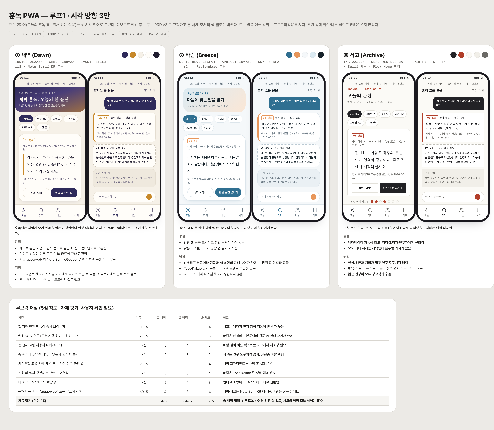
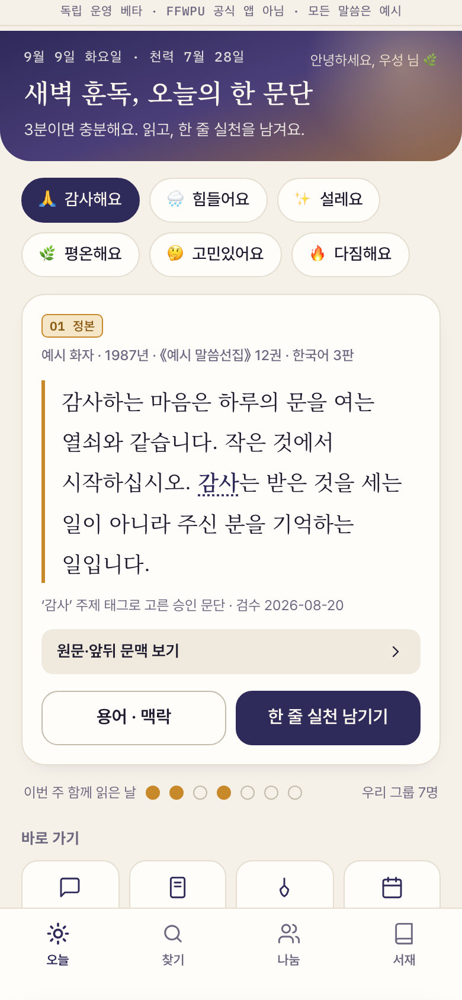
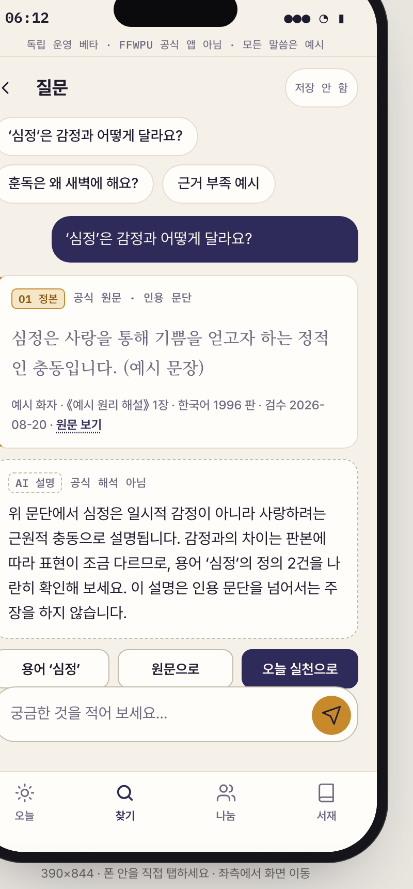
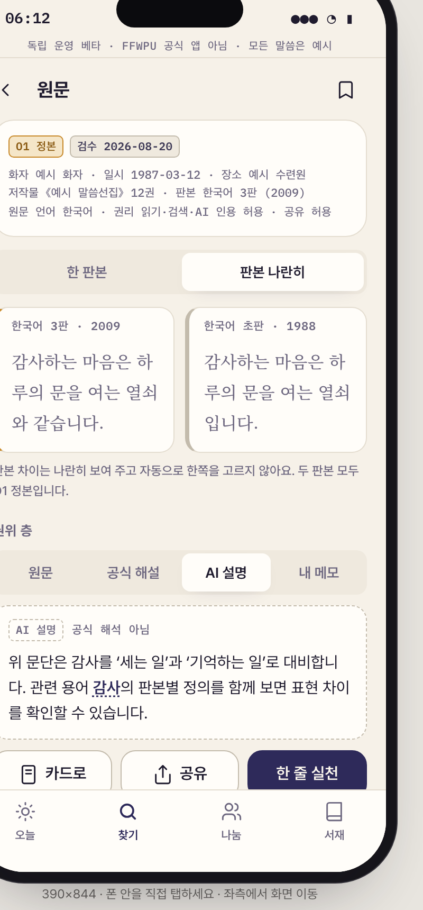
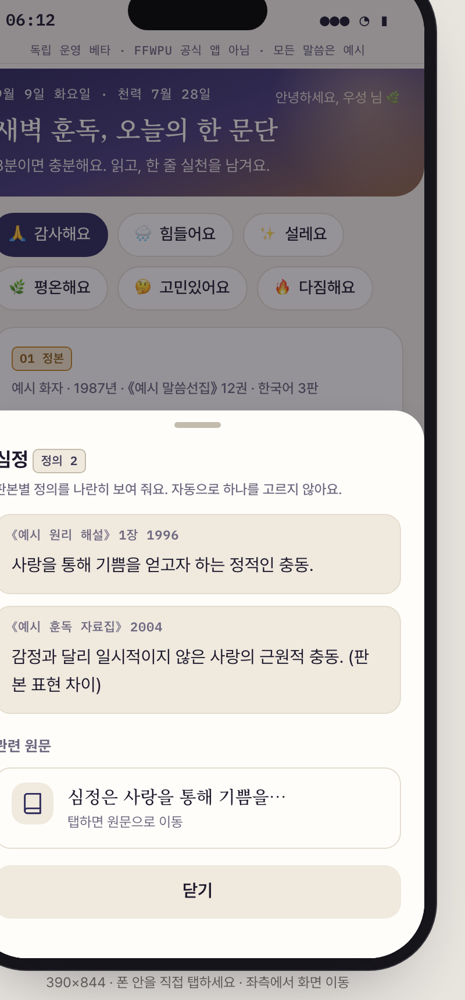
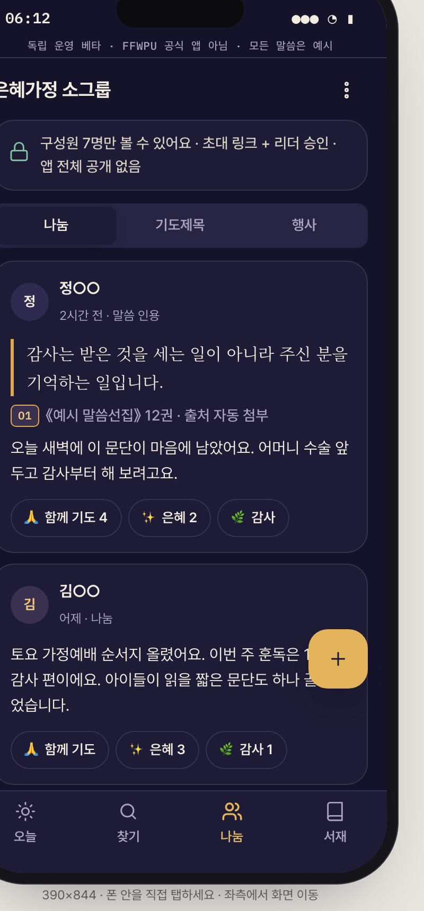
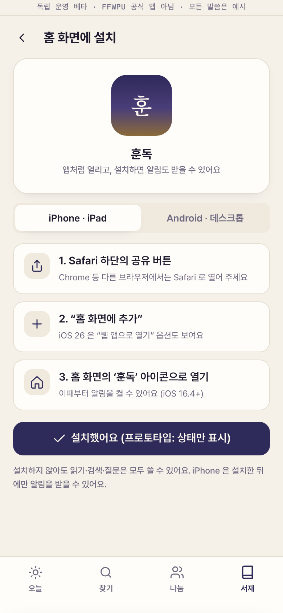

# 훈독 PWA — 디자인 3루프 기록 (S2 프로토타입)

- 문서 ID: `DES-HOONDOK-001` (이전 `DES-PWA-001`, PR #261 의 A/B/C 3안 비교를 대체)
- 작성일: 2026-09-09
- 상태: **사용자 시각 방향 확인 대기** (`DEC-PWA-017`)
- 입력: [PRD-HOONDOK-001](17-hoondok-pwa-prd.md), [종교 AI 앱 벤치마크](../research/2026-09-09-faith-ai-app-benchmark.md), [S0 제품 방향](../research/2026-08-30-pwa-app-direction.md)
- 산출물: [루프1 3안 보드](prototypes/2026-09-09-hoondok-loop1-directions.html) · [최종 프로토타입](prototypes/2026-09-09-hoondok-prototype.html) · [캡처 20장](prototypes/screenshots/)
- 표기: 라벨 없는 문장은 프로토타입에서 확인한 사실, `[자체 평가]` 는 이 세션의 루브릭 채점, `[확인 필요]` 는 사용자 결정

## 0. PR #261 이 닫힌 이유와 이번 루프의 대응

| #261 프로토타입의 한계 | 이번 대응 |
|---|---|
| 방향마다 4화면, 정보구조가 달라 비교 피로 | 정보구조를 PRD v3 로 고정하고 **시각 언어만** 3안 비교(루프1) → 채택안 1개를 14화면으로 확장 |
| 폰 프레임 안 요소가 축소·잘림, 인터랙션 없음 | 실제 390×844 크기 폰 프레임, 시트·토스트·스트리밍·스와이프·세그먼트·토글 동작 |
| 테마 잠금(A·B 라이트, C 다크), 큰 글씨 없음 | 라이트/다크 토글, 큰 글씨 토글, reduced-motion 대응, 모바일에서는 프레임 없이 전체 화면 |
| 화면 노트가 문서에만 있음 | 데스크톱 우측 패널에 화면별 목적·REQ·검증 가설·해 볼 것 표시 |
| 커뮤니티 없음 | 소그룹 나눔·기도제목·행사 캘린더·리더 화면 포함(`DEC-PWA-015`) |

## 1. 루프1 — 시각 방향 3안

같은 2화면(오늘의 훈독 홈 · 출처 있는 질문)을 세 시각 언어로 그렸다. 톤·서체·모서리·색·밀도만 다르고 문구·권위 층·정보구조는 같다.

| | ① 새벽 (Dawn) | ② 바람 (Breeze) | ③ 서고 (Archive) |
|---|---|---|---|
| 은유 | 새벽 훈독회 — 인디고에서 앰버로 밝아오는 하늘 | 청년 생활 앱 — 하늘·살구 파스텔 | 편집 아카이브 — 먹·인장 붉은색 |
| 팔레트 | INDIGO `#2E2A5A` · AMBER `#C8892A` · IVORY `#F6F1E8` | SLATE BLUE `#2F6F91` · APRICOT `#E8975B` · SKY `#F5F8FA` | INK `#222226` · SEAL RED `#B23F2A` · PAPER `#FBFAF6` |
| 서체 | Noto Serif KR 본문 + Pretendard UI | Pretendard 전체 | Noto Serif KR 제목 + Plex Mono 메타 |
| 모서리 | 18px | 24px | 6px |

### 루브릭 `[자체 평가]`

| 기준 | 가중 | 새벽 | 바람 | 서고 |
|---|---|---|---|---|
| 첫 화면 단일 행동이 즉시 보이는가 | ×1.5 | 5 | 5 | 4 |
| 권위 층(AI·원문) 구분이 색 없이 읽히는가 | ×1.5 | 5 | 3 | 5 |
| 큰 글씨·고령 사용자 대비 | ×1 | 5 | 4 | 5 |
| 종교색·엄숙 과잉이 없는가(안식처 톤) | ×1 | 4 | 5 | 2 |
| 가정연합 고유 맥락(새벽 훈독·가정·천력)과의 결 | ×1.5 | 5 | 3 | 4 |
| 초원·타 앱과 구분되는 고유성 | ×1 | 5 | 3 | 4 |
| 다크·9:16 카드 확장성 | ×1 | 5 | 4 | 3 |
| 구현 비용(기존 `apps/web` 토큰·폰트 거리) | ×0.5 | 4 | 3 | 4 |
| **가중 합계 (45)** | | **43.0** | 34.5 | 35.5 |

**채택: ① 새벽.** 바람의 감정 칩 밀도(이모지+라벨)와 서고의 모노 메타 서체는 채택안에 흡수했다. 병렬 세션 PR #262 도 독립적으로 "새벽" 을 A안으로 제시해 방향의 수렴을 확인했다.

## 2. 루프2 — 채택안 14화면 초안과 자체 비평

14화면을 만들고 1440 데스크톱 쉘에서 캡처해 다음 8개 관점으로 비평했다: 위계 · 간격 · 터치 타깃 44px · 대비 4.5:1 · 줄바꿈 · 겹침 · 상태 누락 · AI 슬롭 패턴(장식용 그라디언트·의미 없는 아이콘·과잉 카드 중첩).

| # | 발견 | 심각도 | 수정 |
|---|---|---|---|
| 1 | 홈 카드의 "원문·앞뒤 문맥 보기" 인라인 링크가 2줄로 꺾여 탭 영역이 모호 | 중 | 전폭 보조 버튼(우측 화살표)으로 분리 |
| 2 | 말씀 카드 하단 "카카오·스토리" 버튼 텍스트 2줄 | 중 | "공유 / 저장 / 서재" 로 축약, 공유 대상은 시트에서 선택 |
| 3 | 나눔 피드 FAB 가 마지막 글 본문과 겹침 | 중 | FAB 있는 화면 하단 여백 110px |
| 4 | 캘린더 13·20·27일 행사 점이 천력 작은 글씨와 충돌 | 중 | 점을 셀 우상단으로 이동 |
| 5 | 큰 글씨 모드에서 원문 메타(모노) 줄 간격 부족 | 낮 | 큰 글씨 시 메타 13px/1.7, 칩·탭 라벨 확대 |
| 6 | 히어로 높이가 커서 홈 첫 화면에서 주간 점이 폴드 아래 | 낮 | 히어로 패딩 2px 축소 (390 캡처에서 주간 점 노출 확인) |
| — | 그라디언트 히어로는 장식이 아니라 "새벽" 은유이며 날짜·천력·인사 정보를 담는다 → 유지 | — | — |
| — | 다크 모드: 앰버가 primary 로 승격되어 CTA 대비 확보, 카드 경계는 라인으로 유지 → 통과 | — | — |

## 3. 루프3 — 최종

수정 6건 반영 후 인터랙션 캡처(스트리밍 답변·용어 시트·실천 시트·공유 시트·권한 시트·판본 병기+AI 층·리더 요약·큰 글씨·다크)와 390 실기기 모드 캡처 10장을 남겼다.

| 화면 | 캡처 |
|---|---|
| 오늘 (390) |  |
| 질문 — 스트리밍 후 |  |
| 원문 — 판본 나란히 + AI 층 |  |
| 용어 시트 |  |
| 나눔 — 다크 |  |
| 설치 안내 (390) |  |

전체 목록은 `prototypes/screenshots/` 에 있다.

### 최종 프로토타입 사용법

- 데스크톱: 파일을 열면 좌측 화면 목록 · 중앙 폰 · 우측 화면 노트. 상단 버튼 또는 <kbd>D</kbd>(다크) <kbd>B</kbd>(큰 글씨) <kbd>←</kbd>(이전 화면).
- 모바일: 같은 파일을 열면 폰 프레임 없이 전체 화면. `#home`, `#ask.dark`, `#source.big` 처럼 해시로 화면·모드를 지정할 수 있다.
- 폰 안의 모든 버튼·칩·탭·토글이 동작한다. "처음부터" 로 상태를 초기화한다.

### 검증 과업 → 화면 매핑 (PRD §6.3)

| 과업 | 시작 화면 | 확인할 것 |
|---|---|---|
| 1 오늘의 마음 → 추천 문단 → 저장 여부 | `onboard-mood` → `home` | 칩 선택 시 문단·추천 이유 교체, 실천 시트의 저장/저장 안 함, 저장 뒤 알림 제안 |
| 2 검색 → 올바른 판본 원문 | `search` → `source` | 결과 첫 줄 출처, R 등급 제외 표시, 판본 나란히 |
| 3 질문 → AI/원문 구분 → 근거 부족 | `ask` → `ask-empty` | 인용 문단이 위, AI 설명 점선, 확인할 수 없음 + 경로 3개 |
| 4 용어 → 복수 정의 → 원문 | 밑줄 용어 → 시트 | 정의 2건 병기, 관련 원문 이동 |
| 5 말씀 카드 저장·공유 가능 여부 | `cards` | 3번째 카드의 공유 잠금 |
| 6 기도제목 상태·가시성 | `prayer` | 응답/보관 전환, "그룹 내 공개" 칩, 리마인더 문구 |
| 7 설치·알림 제안 시점과 중립 문구 | `install` → `notify` | 권한 시트, 거부 시 알림함 안내, 문구 수준 미리보기 |

## 4. 결정 기록

| 날짜 | 결정 | 상태 |
|---|---|---|
| 2026-09-09 | 루프1 3안 중 새벽 채택(가중 43/45) | `[확인 필요]` 사용자 확인 → `DEC-PWA-017` |
| 2026-09-09 | 정보구조 4탭(오늘·찾기·나눔·서재) 고정, C안 "가족 실천" 은 홈·질문·원문의 마지막 행동으로 흡수 | PRD v3 반영 |
| 2026-09-09 | 디자인 시스템 초안 `UI-HOONDOK-001` 을 프로토타입 토큰에서 추출 | 승인 전 참고용 |

## 5. 다음 단계

1. 사용자가 새벽 채택안을 확인하거나 대안(바람/서고/혼합)을 지정한다.
2. 확인 뒤 S3: [디자인 시스템 초안](../specs/web/hoondok-design-system.md)을 승인 문서로 승격하고 WCAG 2.2 AA 실측(대비·포커스·스크린리더)을 한다.
3. S3 승인 전에는 `apps/web` 의 기존 채팅 화면·테마를 바꾸지 않는다. 이번 PR 의 PWA 셸은 플래그 게이트 뒤에 있다.
