# DES-PWA-002 — 훈독 PWA 디자인 방향 2안 (A 새벽 / B 등불)

- 문서 ID: `DES-PWA-002` (v1 `DES-PWA-001`의 3안은 PR #261 close로 폐기)
- 일자: 2026-09-09
- 상위 문서: [PRD-FFWPU-PWA-001 v2](17-ffwpu-pwa-prd.md)
- 프로토타입: [prototypes/2026-09-09-hundok-directions.html](prototypes/2026-09-09-hundok-directions.html) (단일 HTML, 외부 의존은 Google Fonts 1개뿐, 사진·아이콘 인라인)
- 스크린샷: [prototypes/screenshots/2026-09-09/](prototypes/screenshots/2026-09-09/) 12 화면 + 보드 2장
- 결정 대상: `DEC-PWA-015` (방향 선택)

---

## 1. 디자인 리드

> Reading this as: consumer daily-devotion mobile PWA for 가정연합 현 구성원과 가정(30~60대 + 2세대). Trust-first 와 warm 의 결합. iOS HIG 문법(라지 타이틀, 그룹 카드, 하단 탭 5). 단일 액센트, 사진 주도. 세리프 없음.

다이얼 (taste-skill §1): `DESIGN_VARIANCE 4` / `MOTION_INTENSITY 2`(정적 프로토, `:active` 축소만) / `VISUAL_DENSITY 5`.

### 1.1 하지 않기로 한 것

| 금지 | 이유 |
|---|---|
| 기존 web의 paper·brass·Cormorant | taste-skill이 premium-consumer 기본값으로 명시 금지한 beige+brass+serif 그 자체. v1도 승계하지 않기로 했음(UI-WEB-001) |
| 초원의 브라운/골드 카드, 씨앗·나무, 달란트 | 벤치마크 문서 §6 복제 금지 목록 |
| 세리프 디스플레이 | "종교 = 세리프" 반사를 피함. 따뜻함은 색·사진·여백으로 낸다 |
| Lucide·이모지·손그림 SVG | Phosphor 아이콘 1계열(regular + 활성 탭만 fill) |
| em-dash, 섹션 번호 라벨, 버전 배지 | AI 티(taste-skill §9) |

---

## 2. 2안 비교

| | **A 새벽 (Dawn)** | **B 등불 (Lamp)** |
|---|---|---|
| 테마 | 라이트 잠금 | 다크 잠금 + 상단 앰버 라디얼 글로우 |
| 바탕 / 표면 | `#F5F4F1` / `#FFFFFF` (웜 스톤, 크림 아님) | `#1E3329` / `#274437` (딥 포레스트) |
| 잉크 / 보조 | `#292524` / `#6E6761` | `#EFE9DF` / `#A8B7AC` |
| 액센트 1색 | 테라코타 `#C2553B`, 위 글자 흰색 | 앰버 `#D9A441`, 위 글자 `#1E3329` |
| 액센트 소프트 | `#F7E7E1` / 글자 `#8E3A27` | `#3C4E35` / 글자 `#F0CF88` |
| 팔레트 계열 (taste-skill §4.2 로테이션) | Terracotta + warm neutral | Forest (deep green + bone + amber) |
| 라디우스 | 16 (전부 소프트) | 12 (전부 소프트) |
| 타이포 | Noto Sans KR 400/500/700, 본문 16px, 라지 타이틀 28px | 동일 계열, 본문 17px, 말씀 본문 19px / 1.9 |
| 첫 화면 | 오늘의 말씀 사진 카드 → 주간 스트립·연속일 → 루틴 3종(말씀·기도·묵상) → 오늘 마치기 | 오늘의 말씀 → 스트립 → 루틴 3종(가정예배 준비·말씀·감사 나누기) → 가정예배 시작 |
| 가설 | `HYP-PWA-006` 아침 3분 개인 루틴이 재방문을 만든다 | `HYP-PWA-007` 가족 단위 저녁 예배가 개인 루틴보다 오래 간다 |
| 사진 | 역광 새벽 들판, 바닷가 벤치의 두 사람 | 저녁 전구 골목, 손에 든 불꽃 |
| 어울리는 사용자 | 개인 훈독 중심, 출퇴근·아침형 | 가족이 같이 쓰는 저녁 시간, 큰 글씨가 필요한 부모 세대 |

두 안은 같은 정보구조·같은 컴포넌트를 쓴다. 다른 것은 토큰(색·라디우스·크기), 첫 화면의 루틴 구성, 사진, 인사말뿐이다.

---

## 3. 화면별 스크린샷

| 화면 | A 새벽 | B 등불 |
|---|---|---|
| 오늘 (매일 훈독) | 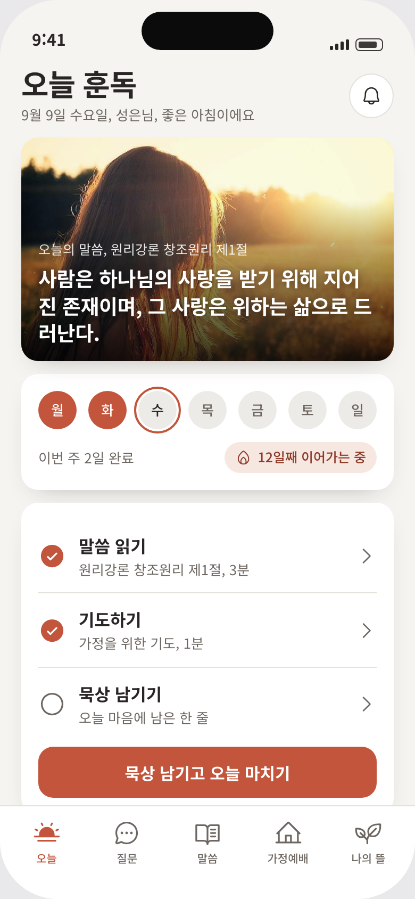 | 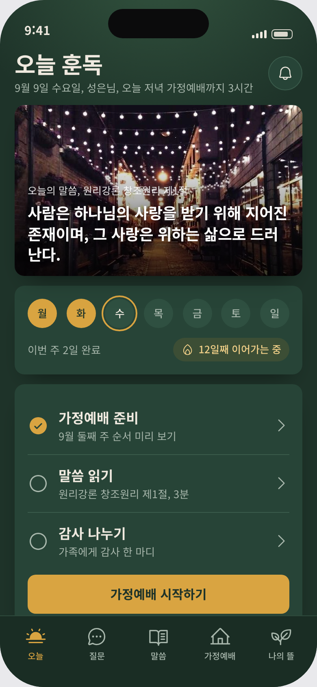 |
| 질문 | 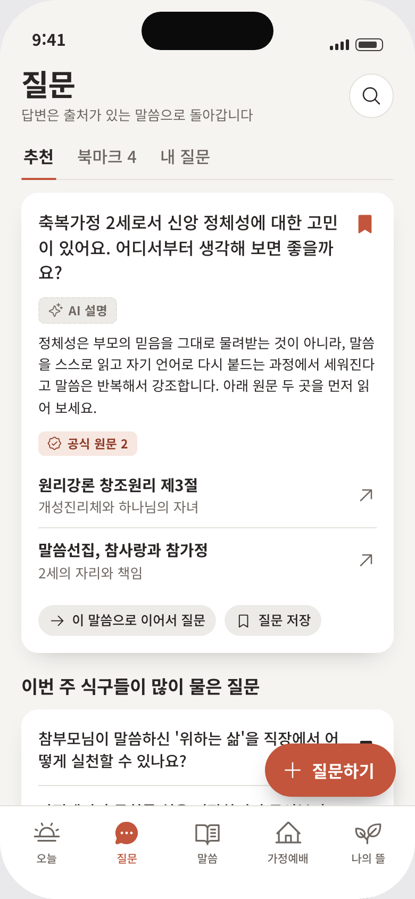 | 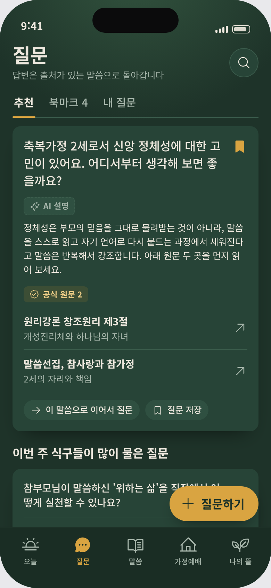 |
| 말씀 서고 | 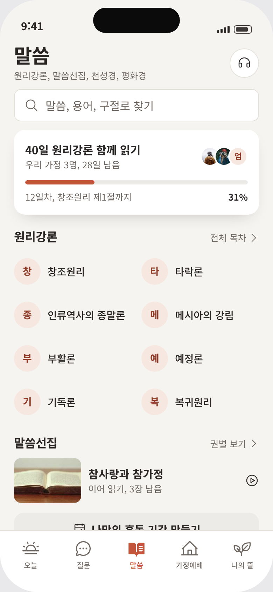 | 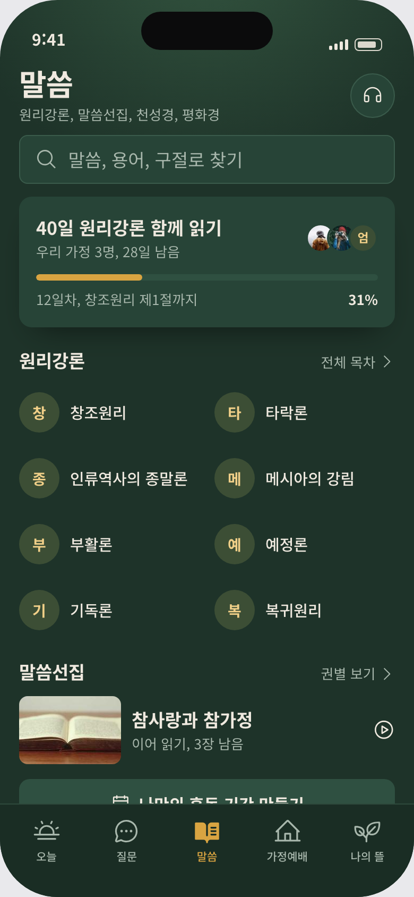 |
| 가정예배 | 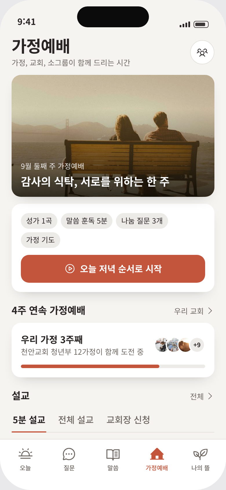 | 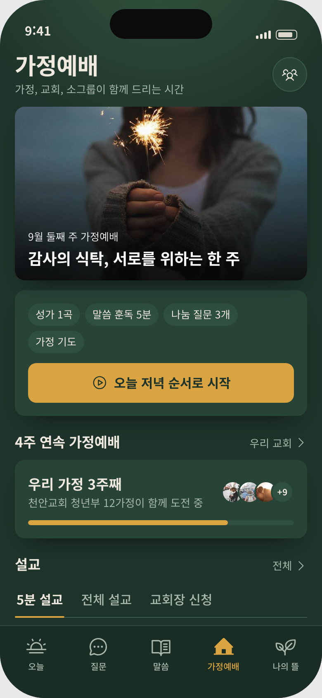 |
| 나의 뜰 | 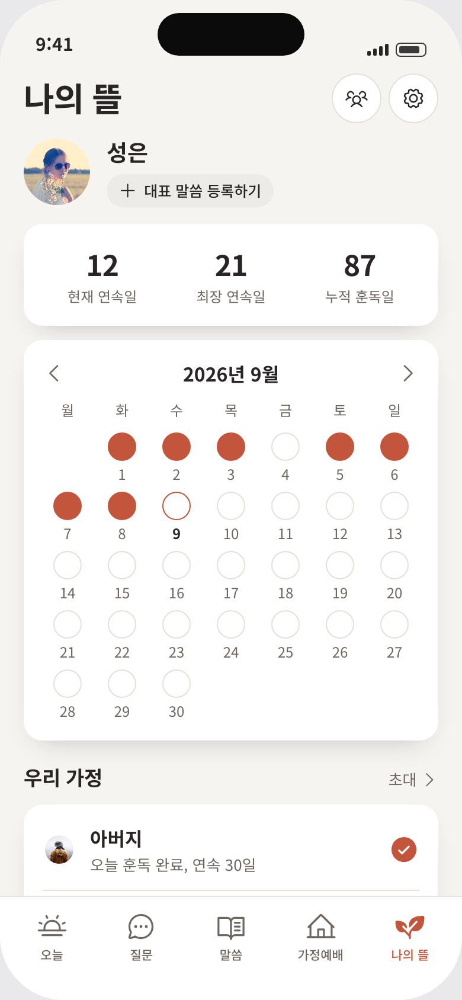 | 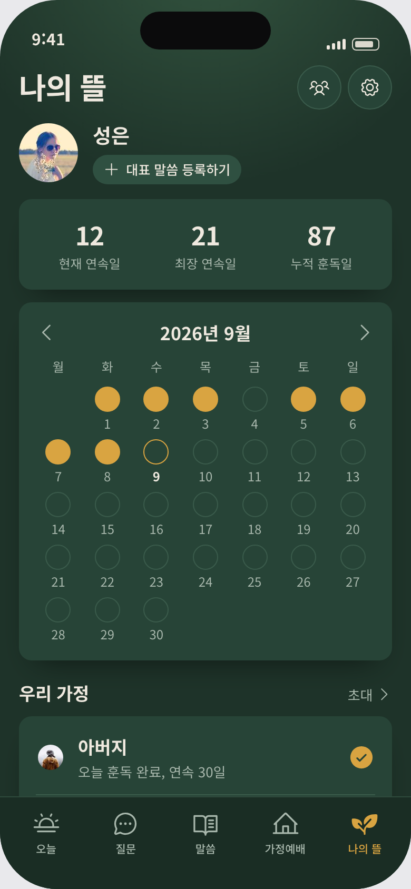 |
| 원문·출처 상세 | 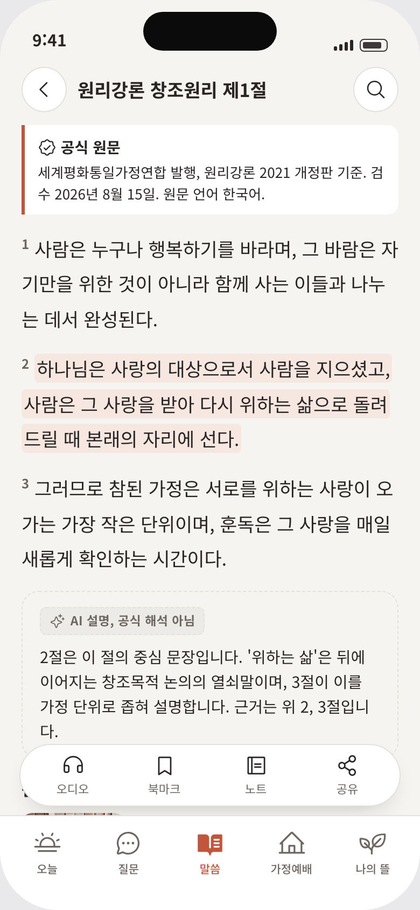 | 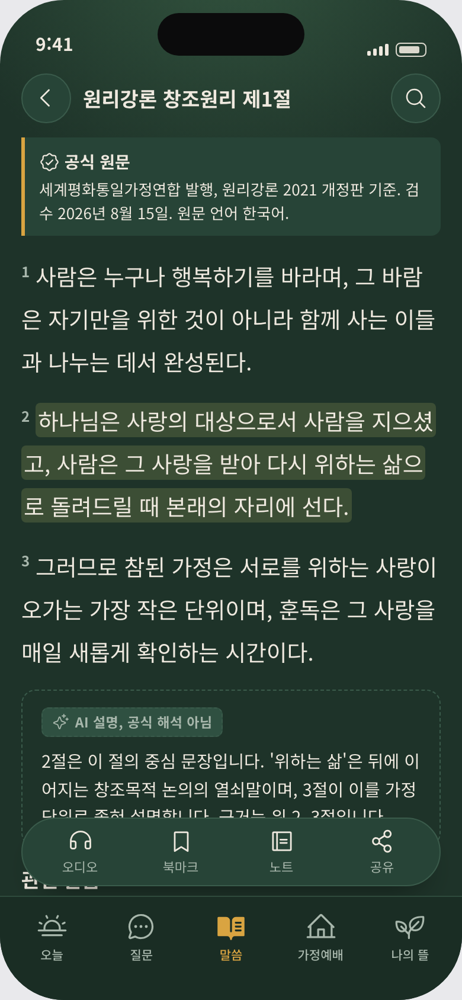 |

전체 보드: [board-A.png](prototypes/screenshots/2026-09-09/board-A.png) · [board-B.png](prototypes/screenshots/2026-09-09/board-B.png)

---

## 4. 3렌즈 리뷰 기록 (Playwright 실측)

리뷰는 라운드 1 렌더 → 지적 → 수정 → 라운드 2 재촬영 순서로 진행했다. 메인 렌즈는 taste-skill, 보조는 ui-ux-pro-max와 gpt-tasteskill이다.

### 4.1 라운드 1에서 고친 것

| 렌즈 | 지적 | 수정 |
|---|---|---|
| taste-skill §4.8 | picsum seed 랜덤 사진이 A 홈에 공구 창고를 뽑아 "따뜻함"과 충돌 | 230장 컨택트시트에서 12장을 직접 골라 데이터 URI로 인라인. 아티팩트 샌드박스(외부 이미지 차단)에서도 렌더 |
| taste-skill §9.D | 나의 뜰 "대표 말씀 등록"의 quotes 글리프가 숫자 99로 읽힘 | plus 아이콘으로 교체 |
| taste-skill §4.8 | 프로필 사진 크롭이 어둡고 얼굴이 안 보임 | 따뜻한 역광 인물로 교체 |
| gpt-tasteskill §7 | 사진이 스톡 티가 남 | `saturate(.92) contrast(1.04)` + 하단 그라디언트 강화 |
| gpt-tasteskill §7 | B 다크 표면이 평면적 | 상단 앰버 라디얼 글로우(등불) 추가 |
| ui-ux-pro-max §2 | 아이콘 버튼 38px, 뒤로가기 36px (44pt 미달) | 42px로 상향, 요일 칩 36px |
| ui-ux-pro-max §5 | A 본문 15px (모바일 최소 16 미달) | A 16px, B 17px |
| 실측 | B의 `.content` 패딩 오버라이드가 하단 여백을 0으로 만들어 탭바 뒤에 내용이 숨음 | `padding-bottom:120px` 복원 |
| 실측 | 9월 달력이 월요일 시작으로 잘못 정렬 (2026-09-01은 화요일) | 선행 빈 칸 1개 |

### 4.2 라운드 2 통과 항목 (taste-skill §14 Pre-Flight, 프로토타입 적용분)

- [x] 디자인 리드 1줄 선언, 다이얼 명시
- [x] em-dash 0 (`—`·`–` 검색 0건), 이모지 0
- [x] 액센트 1색 잠금(A 테라코타, B 앰버). 다른 채도색 없음
- [x] 라디우스 1체계(A 16, B 12). 버튼은 라디우스 -2, 칩·아바타는 pill
- [x] 버튼 대비: 흰/테라코타 4.51:1, 딥그린/앰버 5.98:1 (WCAG AA, 계산값)
- [x] 보조 텍스트 대비: A 5.06:1 (라운드 1의 `#78716C`는 4.36:1로 미달이라 `#6E6761`로 교체), B 6.43:1
- [x] 세리프 0, Inter 0 (Noto Sans KR + 시스템 폴백)
- [x] premium-consumer 금지 팔레트(beige+brass+espresso) 미사용
- [x] 실사진 사용, div 가짜 스크린샷 0, 손그림 SVG 0, 아이콘은 Phosphor 1계열
- [x] 이미지 위 pill 라벨 없음, 사진 크레딧 장식 없음, 섹션 번호 라벨 없음, 버전 배지 없음
- [x] 장식 상태 점 0 (체크 원은 실제 완료 상태)
- [x] 카피 감사: "12일째 이어가는 중", "이번 주 식구들이 많이 물은 질문" 등 한국어 자연문. 가짜 정밀 숫자 없음(31%, 12일 등은 샘플로 문서에 명시)
- [x] 하단 탭 5개 이하, 라벨+아이콘, 활성 상태 색·fill 이중 표시
- [x] 터치 타겟 42px+ (아이콘 버튼), 48px(주 버튼), 88px 탭바
- [x] 콘솔 에러 0, 가로 오버플로 0 (`scrollWidth == clientWidth` 12/12)

적용 제외(프로토타입 성격상 해당 없음): 모션·GSAP·reduced-motion(정적), 다크/라이트 듀얼(각 안이 단일 테마 잠금이며 두 안이 곧 두 모드), 로고 월, 히어로 카피 20단어.

### 4.3 남은 지적 (S3에서 처리)

- 원문 상세의 액션바가 AI 설명 상자 하단과 겹친다. 실제 앱에서는 스크롤 여백으로 해결되지만, S3에서는 액션바를 본문 흐름 안에 두는 안도 검토.
- B 하이라이트(`#3C4E35`)가 다크 바탕에서 약하다. 앰버 20% 틴트로 대비 재검토.
- 질문 탭 FAB이 목록 마지막 카드를 가린다. 목록 하단 여백 또는 FAB 축소.
- ui-ux-pro-max가 제안한 기본 팔레트(블루 + Inter)는 taste-skill 규칙과 충돌해 채택하지 않았다. 체크리스트 항목(대비·타겟·글자 크기)만 반영.

---

## 5. 추천

| 안 | 추천도 | 이유 |
|---|---|---|
| **A 새벽** | ★★★★☆ | 라이트 기본은 낮에 쓰는 개인 루틴과 스크린샷 공유에 유리. 테라코타는 초원의 브라운과 확실히 구분되고 세대 불문 읽기 쉬움 |
| **B 등불** | ★★★☆☆ | 저녁 가정예배 컨셉이 가장 선명하고 큰 글씨가 부모 세대에 맞음. 다크 잠금은 아침 사용·야외 가독성에서 불리 |
| **A 골격 + B의 가정예배 화면** | ★★★★★ | A를 기본 테마로 두고, "오늘 저녁 순서로 시작" 진행 모드만 B의 다크·큰 글씨 톤으로 전환(예배 중 화면). 두 가설을 한 앱에서 검증 |

결정은 `DEC-PWA-015`로 PRD §7.1에 기록한다. 선택 뒤 S3(`docs/specs/web/` 디자인 시스템)로 간다.

---

## 6. 프로토타입 사용법

```bash
cd docs/prd/prototypes && python3 -m http.server 8765
# http://127.0.0.1:8765/2026-09-09-hundok-directions.html?dir=both
# ?dir=A|B|both  ?screen=all|home|ask|library|worship|garden|source  ?solo=1 (프레임만)
```

폰 안의 하단 탭을 누르면 화면이 바뀐다. 사진 12장과 Phosphor 아이콘 43개는 파일 안에 인라인되어 있어 오프라인에서도 열린다(글꼴만 Google Fonts, 없으면 시스템 한글 폰트).
