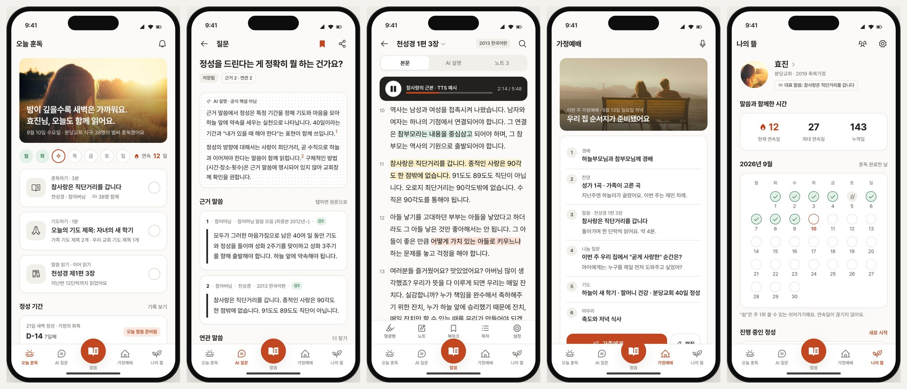
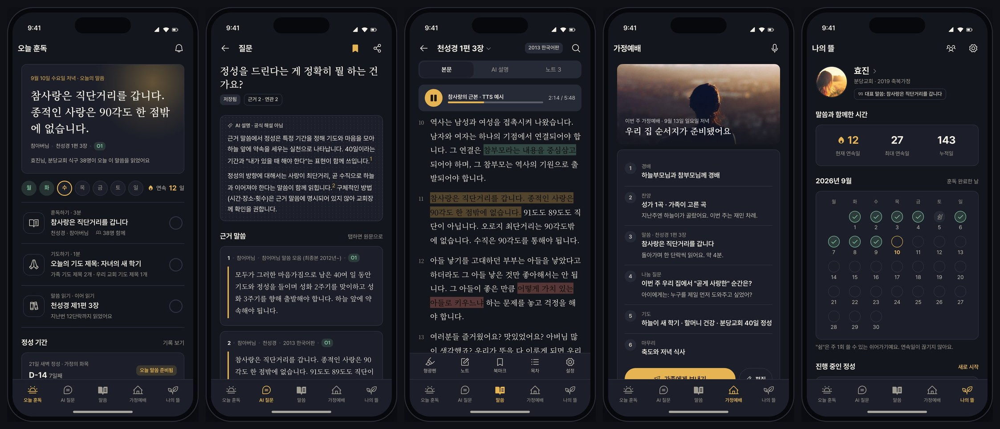

# 훈독 앱 디자인 2안 비교 — A 아침 햇살 · B 저녁 등불

- 문서 ID: `DES-PWA-002` (v1 `DES-PWA-001`은 PR #261과 함께 폐기)
- 작성일: 2026-09-10
- 상태: **사용자 방향 선택 대기** (`DEC-PWA-017`)
- 입력: [PRD v2](17-ffwpu-pwa-prd.md), 초원AI 실기기 스크린샷 23장(2026-09-09), 사용자 피드백("완성도·콘텐츠·디자인 불만족", 2026-09-09)
- 산출물: 클릭형 단일 PWA 목업 2개. 의존성 없이 브라우저에서 파일을 열면 된다.
  - [A 아침 햇살](prototypes/2026-09-10-hundok-a.html)
  - [B 저녁 등불](prototypes/2026-09-10-hundok-b.html)
  - 스크린샷 38장: [`prototypes/screenshots/2026-09-10/`](prototypes/screenshots/2026-09-10/)
- 표기: 별도 라벨이 없으면 확인 사실, `[가정]`은 검증 필요 가설, `[제안]`은 이번 문서의 추천이다.

## 1. 이 문서가 답하는 질문

"초원AI처럼, 그러나 가정연합 식구에게 맞게" 만든 5탭 앱이 실제로 어떻게 보이는가. #261의 3안 비교 보드는 카드 나열이라 실제 앱 같지 않았고 콘텐츠가 비어 있었다. 이번엔 **같은 16화면·같은 콘텐츠**를 두 가지 시각 언어로 완성해, 사용자가 폰 프레임 안에서 탭을 눌러 보며 고르게 했다.

두 안은 정보구조·기능·콘텐츠가 같다. 다른 것은 **시간대의 정서(아침 / 저녁)**, **테마(라이트 / 다크)**, **서체(산세리프 단일 / 세리프 디스플레이)**, **첫 화면의 첫 요소(사진 / 말씀 본문)** 네 가지다.

## 2. 디자인 읽기와 다이얼

- **Design Read**: 가정연합 식구(30~60대 축복가정 + 청년·2세)를 위한 일상 신앙 앱. 초원AI가 검증한 "매일 QT + AI 질문 + 읽기 + 공동체 + 나" 구조를 따르되, 따뜻하고 조용한 소비자 앱 언어. AI 슬롭(보라 그라데이션·3등분 카드·Inter·이모지)을 피하고, 사진과 말씀 본문이 화면의 주인공.
- **다이얼**: `DESIGN_VARIANCE 5 / MOTION_INTENSITY 3 / VISUAL_DENSITY 5`. 랜딩 페이지 기본값(8/6/4)이 아니라 모바일 제품 UI 기준이다. 리스트·카드·시트가 많아 밀도 5, 모션은 시트 등장과 체크 상태 전환만(3), 레이아웃은 홈 히어로만 비대칭(5).
- **아이콘**: Phosphor 단일 패밀리(regular·fill·bold). 이모지 0.
- **이미지**: 프로토타입은 `picsum.photos/id/*` 예시 사진. 운영에서는 권리 확인된 사진·일러스트로 교체한다. div로 만든 가짜 스크린샷은 없다.
- **금지 준수**: em-dash 0(가시 문자열), 액센트 1색 lock, 모서리 1체계 lock, 순흑·순백 없음, 크림+브라스 팔레트 없음, Inter·Fraunces 없음, 초원 팔레트(탄·브라운·새싹)·달란트 없음.

## 3. 두 안 비교

| 항목 | **A 아침 햇살** | **B 저녁 등불** |
|---|---|---|
| 정서 | 아침에 앱을 열고 3분 훈독으로 하루를 시작 | 하루 끝에 말씀 한 등불을 켜고 정리 |
| 테마 | 라이트 고정 | 다크 고정 |
| 바탕·표면 | `#fbfaf8` 웜 오프화이트 / `#ffffff` / `#f1efea` | `#14161d` 밤하늘 인디고 / `#1c1f29` / `#262a37` |
| 잉크 | `#23211f` 차콜 (순흑 아님) | `#f3efe6` 웜 오프화이트 (순백 아님) |
| 액센트 1색 | `#d4562e` 감귤 | `#e6b453` 따뜻한 금 |
| 완료 시맨틱 | `#2f7a4f` 초록 (액센트와 분리) | `#86c9a0` 연초록 |
| 서체 | Pretendard 단일. 강조는 같은 서체 bold | 디스플레이·말씀 인용 Noto Serif KR + UI Pretendard. 세리프 사유: 훈독은 "책을 읽는" 행위라 말씀만 책의 서체로 |
| 모서리 | 16px 단일 (카드·버튼·입력) | 12px 단일, 버튼만 pill(999px) 규칙 명문화 |
| 홈 첫 요소 | 아침 햇살 사진 + 인사 문장 | 오늘의 말씀 본문(세리프 24px) + 금빛 글로우 |
| 미션 표현 | 카드 3장 | 카드 없이 헤어라인 체크리스트 |
| 하단 탭 | 가운데 "말씀" 돌출 버블(초원과 같은 구조, 다른 색·형태) | 5등분 평면 탭, 활성 금색 |
| 사진 | 65 햇살 들판 · 129 벤치 가족 · 112 황금 들 · 289 노을 나무 | 505 노을 실루엣 · 550 저녁 도시 · 289 · 569 |
| 강점 | 밝고 접근 쉬움. 장년층 가독성. 초원 사용자에게 익숙한 구조 | 말씀이 주인공. 저녁 가정예배·기도 정서와 맞음. 차별화 인상 강함 |
| 위험 | 초원과 구조가 비슷해 "따라 했다"는 인상 `[가정]` | 다크 고정은 아침 사용·야외에서 불리. 세리프 본문 장년층 가독성 확인 필요 `[가정]` |
| 운영 부담 | 사진 큐레이션 필요 | 사진 의존 낮음 (홈은 텍스트) |
| 추천도 | ★★★★☆ | ★★★★☆ |

## 4. 추천 `[제안]`

**A를 골격으로 채택하고, B의 두 요소를 흡수한다.**

1. A의 라이트 테마·16px·Pretendard·사진 히어로를 기본으로 둔다. 1순위 사용자(30~60대 축복가정)의 아침 사용과 가독성에 유리하고, 초원 사용자에게 학습 비용이 없다.
2. B의 **"말씀 본문이 첫 요소"** 홈은 시간대별로 전환한다: 오전에는 A 사진 히어로, 오후 6시 이후에는 B 등불 카드 `[제안]`. 하루에 두 번 앱을 여는 이유가 된다.
3. B의 **세리프 말씀 인용**은 원문 뷰와 근거 말씀 카드에만 적용한다. UI는 산세리프로 유지해 장년층 가독성을 지킨다.
4. 다크 모드는 B 팔레트를 그대로 시스템 설정 연동 다크 모드로 쓴다. 따라서 B를 버리는 것이 아니라 A의 다크 테마로 흡수한다.

사용자가 B를 고르면 라이트 변형(아침용)을 S3에서 추가 정의하고, 세리프 본문 가독성 검증(60대 3명 `[가정]`)을 S3 진입 조건에 넣는다.

## 5. 화면 대응표

두 안 모두 아래 16화면을 갖고, 데스크톱에서는 왼쪽 인덱스로, 폰 안에서는 탭·버튼으로 이동한다. 파일명은 `{a|b}-NN-*.jpg`.

| NN | 화면 | `SCR-PWA` | 클릭 동작 |
|---|---|---|---|
| 01 | 온보딩 · 베타 고지 · 교회 선택 | 001 | 교회 라디오 선택, 시작하기 → 홈 |
| 02 | 오늘 훈독 (홈) | 002 | 미션 카드 → 훈독하기 / 원문, 기도하기 체크 토글, 정성 카드 → 시트 |
| 03 | 훈독하기 | 003 | 용어 칩 → 용어 시트, 훈독 완료 → 체크·연속일 13·홈 복귀 |
| 04 | 정성 기간 만들기 (시트) | 004 | 기간 7/21/40 · 주제 · 가족 챌린지 토글 · 시작 → 토스트 |
| 05 | AI 질문 목록 | 005 | 추천 / 북마크 / 내 질문 세그먼트 전환, 질문하기 FAB |
| 06 | 질문·답변 상세 | 006 | 근거 말씀 카드 → 원문, 이어서 물어보기 칩 → 토스트, 저장 토글, 정성 시작 → 시트 |
| 07 | 말씀 서고 | 007 | 바로가기 4종, 이어 읽기, 저작물 목록(권리 상태 배지) |
| 08 | 말씀 검색 | 008 | "정성" 결과 3건, 4분류 예시 칩 |
| 09 | 원문 뷰 | 009 | 본문 / AI 설명 / 노트 3탭, 형광펜 3색, 오디오 바, 판본 나란히 토글 |
| 10 | 가정예배 홈 | 010 | 순서지 6단계, 가족에게 보내기 → 토스트, 챌린지 3개, 5분 설교 히어로 |
| 11 | 챌린지 상세 | 011 | 가족 4명 오늘 완료 여부, 응원 문구 3종 → 토스트, 13일 달력 |
| 12 | 5분 설교 · 전체 설교 | 012 | 교회장 행, 이번 주, 많이 본 설교, 요청 버튼 |
| 13 | 설교 섭외·신청 | 013 | 교회장 선택, 5분/전체, 주제·시기·메모, 보내기 → 토스트 |
| 14 | 나의 뜰 | 014 | 프로필·대표 말씀, 연속일 3종, 9월 달력(쉼 포함), 정성, 가족, 친구 |
| 15 | 알림·설치 설정 | 015 | 설치 안내, 알림 4종 토글·시간, 잠금 문구 중립/노출 선택, 조용한 시간, 데이터 삭제 |
| 16 | 가족·친구 | 016 | 가족 3명 관계·공개 범위, 친구 4명, 내가 보여주는 범위 토글 |

`00-desktop`은 인덱스 포함 데스크톱 전체, `00-mobile-viewport`는 430px에서 프레임 없이 렌더한 상태, `00-montage`는 5탭 대표 화면 한 줄이다.

## 6. 대표 화면

### A 아침 햇살

### B 저녁 등불

## 7. 두 안 공통 규칙 (PRD §7 화면 규칙)

- 권위 층 4종을 라벨 + 형태로 구분한다: **공식 원문**(굵은 왼쪽 선), **AI 설명 · 공식 해설 아님**(점 패턴 배경), **내 메모 · 나만 봄**(점선 테두리), **용어 사전 · O3**(시트 배지). 색만으로 구분하지 않는다.
- 모든 말씀 카드 첫 줄에 화자 · 저작물 · 판본 · 공식성(O1/O2/O5) 을 표시한다. 권리 확인 중인 저작물은 "일부"·"확인 중" 배지.
- 독립 베타 고지를 온보딩·홈·질문·서고·설정 하단에 반복한다.
- 미션 완료·연속일·정성 진행률·챌린지 진행률은 표시하되 달란트·랭킹·씨앗 성장은 없다.
- 알림 잠금 문구는 중립형 기본, 노출형은 사용자 선택. 설치 안내는 설정 안에서만.
- 응원은 정해진 문구 3종만. 자유 댓글·DM 입력창이 없다.
- 접근성 최소선: 탭은 아이콘 + 텍스트, 토글·라디오는 상태 시각 + aria-label, 본문 15px 이상, 대비는 A 본문 12.6:1 / B 본문 13.1:1, 액센트 버튼 A 4.6:1 / B 9.8:1 (계산값, S3에서 실측).
- `prefers-reduced-motion`에서 시트 애니메이션·전환을 끈다.

## 8. 프로토타입 제작 기준

- 말씀 발췌는 저장소의 `apps/api/app/modules/malssum/featured_malssum.json` 20건에서만 가져왔다(천성경·참어머님 말씀 모음·자서전). 판본·검수일·단락 번호는 예시이며, 원문 뷰의 단락 12·13은 발췌를 이어 붙인 것임을 화면에 표기했다.
- 인물(효진·재민·하늘·어머니·수아·민재·지훈·예린)·교회장(김효정·박성호·이나래·최동현·정수빈)·교회(성남 분당교회·수원 영통교회·용인교회·광주교회)·수치(연속 12일, 누적 143일, 87명 등)는 모두 가상이다. 실제 개인·교회를 가리키지 않는다.
- 서체·아이콘·사진은 CDN(Pretendard jsdelivr, Google Fonts Noto Serif KR, Phosphor jsdelivr, picsum)에서 불러온다. 프로토타입 한정이며 운영에서는 self-host 한다.
- 렌더 검증: Playwright(Chromium)로 16화면 × 2안 캡처, 콘솔 오류 0(favicon 404 제외). 1280px 데스크톱(인덱스 + 프레임)과 430px(프레임 제거) 확인.
- 클릭 동작은 vanilla JS 해시 라우팅이다. 데이터는 저장되지 않으며 새로고침하면 초기 상태로 돌아간다.

## 9. 다음 단계

1. 사용자가 A / B / A+B 흡수안(§4) 중 하나를 고른다 (`DEC-PWA-017`). 바꾸고 싶은 점을 §10에 기록한다.
2. 탭 명칭·보상 정책·가행국 명칭·설교 운영 주체(`DEC-PWA-015·019·020·021`)에 답한다.
3. S3 디자인 시스템: 채택안의 토큰·컴포넌트(미션 카드·말씀 카드·권위 층·순서지·챌린지·달력·시트)·다크/라이트·큰 글씨·WCAG 2.2 AA 상태를 `docs/specs/web/`에 정의한다.
4. S3 승인 전에는 `apps/web` 화면·테마를 바꾸지 않는다(UI-WEB-001 경계).

## 10. 결정 기록

| 날짜 | 결정 | 상태 |
|---|---|---|
| 2026-09-09 | #261 close. 초원식 전면 + 가정연합 현지화, 2안 × 클릭형 목업으로 재작업 | 승인 |
| 2026-09-10 | PRD v2 + 2안 목업을 한 PR로 검토 요청 | 검토 대기 |
| | 방향 선택 (A / B / A+B 흡수) | `[확인 필요]` |
