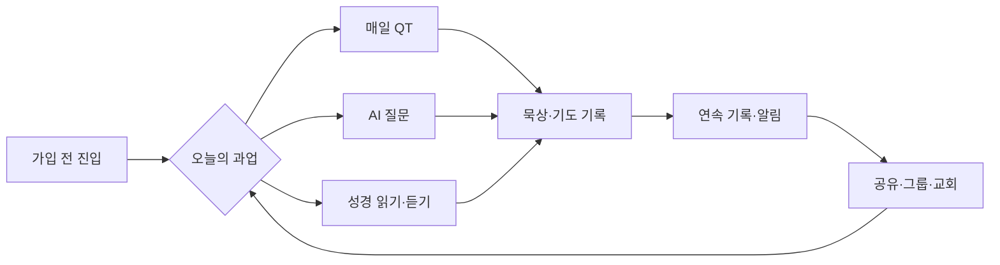

# 초원AI 벤치마크 — 실제 공개 화면·제품 구조·사업 모델

- 조사 기준일: 2026-08-31
- 조사 범위: 공식 홈페이지·공식 블로그·App Store·Google Play·공개 스크린샷·언론·제3자 리뷰 집계
- 조사 방식: Luna 조사 에이전트 1개와 메인 에이전트가 독립적으로 확인한 뒤 교차 검증
- 한계: 로그인 후 최신 앱을 실기기에서 조작하지 못했다. 공개 스토어 화면과 문서로 확인하지 못한 동작은 `[미확인]`으로 남긴다.
- 표기: `[확인]` 공개 출처에서 직접 확인 · `[추론]` 둘 이상의 확인 사실을 종합 · `[가정]` 후속 검증이 필요한 제품 가설
- 후속 결정: 2026-08-31 세션 0에서 FFWPU 대상 독립 베타와 출처·원문·가족 실천 중심 방향을 승인했다.

---

## 1. 결론

`[추론]` 초원AI는 더 이상 “성경에 질문하는 AI 챗봇”만으로 설명하기 어렵다. 현재 제품은 **성경 읽기·오디오·AI 질문·매일 QT·개인 기록·그룹 활동·교회 연결을 하나로 묶은 한국 기독교 생활 플랫폼**에 가깝다.

따라서 TrueWords 신규 PWA가 초원의 탭과 기능을 그대로 따라가면 늦게 출발한 축소판이 된다. 벤치마킹할 것은 기능 목록이 아니라 다음 구조다.

1. 가입 전에도 핵심 가치를 빠르게 체험하게 하는 진입
2. 짧은 일일 콘텐츠와 알림으로 만드는 재방문 루프
3. 라이선스·신학 검수·인용을 제품 화면에 드러내는 신뢰 장치
4. 개인 기록에서 그룹·교회로 확장되는 단계형 네트워크
5. 무료 기대와 유료 지속 가능성 사이의 명확한 계약

`[승인된 방향]` TrueWords가 차별화할 지점은 **공식 말씀의 판본·발화 맥락·공식성·권리를 추적하고, 사용자가 원문으로 돌아가 오늘의 가족 실천으로 연결하도록 돕는 것**이다.

---

## 2. 현재 서비스 스냅샷

| 항목 | 공개 확인 내용 | 해석 시 주의 |
|---|---|---|
| 포지셔닝 | `[확인]` 공식 홈페이지는 “읽고, 듣고, 묻고, 묵상하는” 올인원 성경 앱으로 소개한다. | AI Q&A만 비교하면 현재 제품을 과소평가한다. |
| 규모 | `[확인]` 공식 홈페이지는 누적 다운로드 80만+, 평점 4.9, 리뷰 1.3만+를 표시한다. | Google Play의 `100K+`는 Android 설치 구간값이다. 서로 같은 집계가 아니다. |
| 현재 버전 | `[확인]` App Store는 2026-07-24 버전 2.22.0, Google Play는 2026-07-23 업데이트를 표시했다. | 조사일 이후 변경될 수 있다. |
| 콘텐츠 | `[확인]` 6개 성경 번역, 오디오, 읽기 플랜, 31,102절 해설, 매일 QT를 홍보한다. | 역본별 실제 무료·유료 범위는 공개 설명만으로 완전히 확인되지 않았다. |
| 신뢰 | `[확인]` 대한성서공회 협약, 한국어 신학 지식베이스, 신학 검수위원회를 전면에 둔다. | 2023년의 “99.92%”는 자체 표본·오류 정의 기반 마케팅 주장이다. 독립 정확도로 취급하지 않는다. |
| 확장 | `[확인]` 그룹 QT·통독, 교회 지도, 교회 단체 구독, 교회별 설교 RAG를 운영 또는 소개한다. | “우리 조직 자료만 답하는 RAG” 자체도 더 이상 고유한 차별점이 아니다. |

주요 1차 출처:

- [초원 공식 홈페이지](https://chowon.in/)
- [Apple App Store](https://apps.apple.com/kr/app/id6450424532)
- [Google Play](https://play.google.com/store/apps/details?id=com.chowon.app&hl=ko)
- [초원AI 공식 구조 설명](https://blog.chowon.in/%EC%B4%88%EC%9B%90-ai%EB%A5%BC-%EC%86%8C%EA%B0%9C%ED%95%A9%EB%8B%88%EB%8B%A4/)
- [교회용 서비스](https://church.chowon.in/)

---

## 3. 실제 공개 화면에서 확인한 정보구조

최신 공개 스토어 화면의 하단 내비게이션은 다음 5개 영역으로 구성된다.

`매일 QT` · `AI 질문` · `성경` · `공동체` · `나의 초원`

### 3.1 화면 인벤토리

| 화면 | 실제 화면에서 보이는 요소 | 담당하는 사용자 과업 | 상태·근거 |
|---|---|---|---|
| 성경 홈 | 주석·오디오·통독·구절 찾기 바로가기, 오늘의 질문, 연속 기록, 달란트 | 읽기와 관련 기능으로 진입 | `[확인]` Google Play 현재 스크린샷 |
| 역본 비교 | 개역개정·새번역·NIV·KJV·ESV·WEB 선택과 병렬 읽기 | 선호 역본 선택·비교 | `[확인]` Google Play 및 공개 캐시 스크린샷 |
| 읽기 플랜 | 목표 범위, 일정, 진행률, 리마인더 | 장기 통독 계획 실행 | `[확인]` Google Play 현재 스크린샷 |
| 매일 QT | 마음·3분·15분·교회 제공 등 여러 트랙의 카드 | 그날의 짧은 묵상 선택 | `[확인]` Google Play 현재 스크린샷 |
| AI 답변 | 질문, 요약형 답변, 관련 성경 인용 | 개인 고민·성경·교리 질문 | `[확인]` Google Play 및 공식 기능 가이드 |
| 공동체 | 그룹 통독 진행률, 구성원별 성취·순위 | 함께 읽기와 상호 자극 | `[확인]` Google Play 현재 스크린샷 |
| 읽기 설정 | 글꼴·글자 크기·라이트/다크 모드·번역 설정 | 개인별 읽기 환경 조정 | `[확인]` Google Play 및 공개 캐시 스크린샷 |
| 오디오 성경 | 재생 화면, 0.5~3배속, 백그라운드 재생 | 이동·취침 중 듣기 | `[확인]` Google Play 현재 스크린샷·스토어 설명 |

현재 화면은 [Google Play 스토어](https://play.google.com/store/apps/details?id=com.chowon.app&hl=ko)와 [App Store 미리보기](https://apps.apple.com/kr/app/id6450424532)에서 확인한다. 아래 링크는 제3자가 보관한 공개 스크린샷 원본이므로 현재 버전과 차이가 날 수 있다.

- [AI 질문 목록 화면](https://fastly.mwm-storage.mwmcdn.com/raw_files/50fc3b43-60af-480f-903f-1d857df6d2aa?format=webp&height=1280)
- [성경 읽기 설정 화면](https://fastly.mwm-storage.mwmcdn.com/raw_files/3b7e54c1-63cf-4eef-a40b-8dec36b3de05)
- [번역·원문·AI 해설·노트 화면](https://fastly.mwm-storage.mwmcdn.com/raw_files/a7d678d6-3970-4a34-8417-f91c11a5e9df?format=webp&height=1280)
- [매일 QT 화면](https://fastly.mwm-storage.mwmcdn.com/raw_files/e02b00e1-9912-43fe-80f3-784da96d1d72?format=webp&height=1280)

### 3.2 핵심 사용자 루프

`[추론]` 이 루프에서 AI는 진입점 하나일 뿐이다. 장기 사용을 만드는 것은 매일 편성, 개인 기록, 알림, 그룹 진행, 교회 콘텐츠가 연결되는 구조다.

---

## 4. 기능·콘텐츠·신뢰 구조

### 4.1 AI 질문

- `[확인]` 성경·교리뿐 아니라 연애, 술·담배, 투자, 교회 상처 같은 개인 고민도 질문 사례로 안내한다.
- `[확인]` 공식 가이드는 답변이 하나님의 뜻을 완전히 대변하지 않으며 틀릴 수 있다고 고지한다.
- `[확인]` 질문 기록은 저장·비공개·삭제 설정을 지원한다고 안내한다.
- `[확인]` 답변 근거 체계는 성경 데이터베이스, 한국어 신학 지식베이스, 생성 AI, 신학 검수위원회 네 요소로 설명한다.
- `[추론]` “AI 목회자” 오해를 피하려면 면책 문구만이 아니라 답변의 근거·검수 상태·불확실성을 화면 구조로 보여줘야 한다.

### 4.2 읽기·오디오·QT

- `[확인]` 6개 번역, 구절 해설, 하이라이트·즐겨찾기·노트·공유·큰 글씨를 제공한다고 설명한다.
- `[확인]` 오디오 성경은 0.5~3배속과 백그라운드 재생을 지원한다.
- `[확인]` 기본 66권·주제별·사용자 정의 읽기 플랜과 진행률을 제공한다.
- `[확인]` 여러 목회자의 영상 QT와 짧은/깊은 트랙을 편성한다.
- `[추론]` 선택지를 넓히되 홈에서는 “오늘 할 한 가지”를 압축하는 방식이다.

### 4.3 그룹·교회

- `[확인]` 그룹 QT·성경 읽기 챌린지와 구성원별 진행 상황을 제공한다.
- `[확인]` 교회 지도는 교회 프로필·예배 정보·인증·검토를 결합한다고 홍보한다.
- `[확인]` 교회 단체 구독과 교회별 QT를 제공한다.
- `[확인]` 교회용 설교 검색은 해당 교회의 설교만 근거로 답하고 날짜·설교·타임스탬프를 표시하며, 사람의 승인과 상담 연결을 강조한다.
- `[추론]` B2C 습관 제품에서 B2B 교회 운영·콘텐츠 유통망으로 확장 중이다.

---

## 5. 수익화와 브랜드 계약

App Store 공개 인앱 상품에는 조사일 기준 30일 6,900원, 365일 49,000원, 월 9,900원, 연 59,000원·69,000원 등 여러 상품이 표시된다. 실제 노출 가격과 포함 기능은 계정·시점·프로모션에 따라 다를 수 있다.

추가로 공식 광고 안내는 홈·Q&A·QT·성경 배너, 실행 화면, YouTube PPL 상품을 소개한다. 교회 단체 구독과 선물권도 별도 수익 경로다.

사용자 리뷰에서 반복되는 긴장은 **초기 무료 선교 도구에 대한 기대와 현재 유료 구독 제품 사이의 불명확한 경계**다. 무료였던 질문·해설·검색의 유료화, 학생 가격, 무료 체험, 유료 가치 설명에 대한 불만이 확인된다.

TrueWords 시사점:

1. 공식 원문 탐색과 출처 확인은 신뢰를 만드는 무료 코어로 우선 검토한다.
2. 유료화한다면 고급 개인화·대규모 AI 사용·기관 관리처럼 원가와 가치가 설명되는 층에 둔다.
3. 베타 단계에서 유료 기능을 확정하지 않고 비용·권리·사용 빈도를 먼저 측정한다.
4. 기존 무료 기능을 나중에 잠그는 정책은 별도 사용자 동의 없이 채택하지 않는다.

---

## 6. 강점, 약점, 복제하면 안 되는 것

### 강점

| 강점 | 왜 강한가 |
|---|---|
| 한국어 현지화와 역본 협약 | 모델 성능이 아니라 콘텐츠 사용 권리와 신뢰를 함께 확보한다. |
| 일일 루틴 | 짧은 QT·알림·진행 상태가 질문이 없는 날에도 재방문 이유를 만든다. |
| 신학 검수의 가시성 | 사용자가 AI를 영적 권위로 오해할 위험을 낮춘다. |
| 읽기부터 교회까지의 연결 | 개인 도구에서 그룹·기관 유통망으로 확장한다. |
| 높은 기능 완성도 | 질문, 읽기, 듣기, 기록, 설정이 단일 앱 안에서 이어진다. |

### 약점·리스크

| 약점·리스크 | 확인·해석 |
|---|---|
| 유료화 반발 | `[확인]` 스토어 리뷰에서 무료→유료 전환과 기본 기능 잠금에 대한 불만이 반복된다. |
| 기능 밀도 | `[확인]` 탐색·설정·뒤로가기·가독성에 관한 불만이 있다. `[추론]` 다섯 탭과 많은 기능이 신규 사용자에게 선택 부담을 줄 수 있다. |
| AI 권위 오인 | `[확인]` 서비스명을 “주님AI”에서 “초원”으로 바꾼 이유에도 이 문제가 포함됐다. |
| 민감 정보 | `[확인]` 개인 고민·묵상·기도·공개 나눔을 다룬다. 잠금 화면·공유·보관 정책이 잘못되면 종교·가족·건강 정보가 노출된다. |
| 검증의 독립성 | `[확인]` 정확도 주장은 자체 표본과 기준이다. 외부·적대적 평가로 일반화할 수 없다. |

복제하지 않을 것:

- 초원의 녹색 팔레트·카드 배치·씨앗/나무·달란트 보상
- 처음부터 5개 탭 전체와 공개 커뮤니티를 여는 방식
- AI 답변을 제품 정체성의 최상위에 두는 방식
- 정확도 한 숫자로 신뢰를 표현하는 방식
- 콘텐츠 권리와 원가가 정리되기 전 구독 가격부터 확정하는 방식

---

## 7. TrueWords 신규 PWA에 적용할 제안

| 초원에서 배울 것 | 가정연합 PWA에서 다르게 적용할 것 |
|---|---|
| 가입 전 핵심 가치 체험 | 공개가 허용된 오늘의 말씀과 검색은 로그인 없이 시작하는 가설을 검증한다. |
| 짧은 일일 루틴 | `말씀 읽기 → 용어·맥락 확인 → 한 줄 실천 → 저장`으로 구성한다. |
| 근거·검수 장치 | 출처명만이 아니라 발화자·날짜·판본·원문 언어·공식성·검수 상태를 문단 단위로 표시한다. |
| 개인 기록과 그룹 확장 | MVP는 비공개 서재까지만 제공하고, 가족·소그룹은 권한·아동 보호·운영 책임 확정 뒤 연다. |
| 알림과 진행 상태 | 설치·권한을 강요하지 않고 첫 가치 경험 뒤 사용자가 시간·표시 문구·조용한 시간을 선택한다. |

`[제안]` 제품 차별화 문장:

> **AI가 신앙의 답을 대신하는 앱이 아니라, 공식 말씀의 정확한 출처와 맥락으로 사용자를 되돌려 보내고 오늘의 가족 실천까지 연결하는 말씀 PWA.**

---

## 8. 개인정보·신뢰 체크리스트

- 질문·메모·기도·가족 관계 데이터는 기본 비공개 및 최소 보관으로 설계한다.
- 저장 전 선택, 즉시 삭제, 대화 무기억 모드를 별도 기능으로 정의한다.
- 잠금 화면 푸시에는 실제 질문·답변·민감한 말씀 전문을 넣지 않는다.
- AI 답변에 출처·판본·검수 상태·불확실성·전문가 연결 기준을 함께 표시한다.
- 공식 콘텐츠 철회 시 서버 원문·검색색인·임베딩·캐시·요약·공유 링크를 비활성화하고, 오프라인 기기 캐시는 다음 온라인 동기화에서 삭제·재제공 차단해야 한다.

---

## 9. 출처 목록

### 공식·스토어

- [초원 공식 홈페이지](https://chowon.in/)
- [초원 다운로드 페이지](https://download.chowon.in/)
- [Apple App Store](https://apps.apple.com/kr/app/id6450424532)
- [Google Play](https://play.google.com/store/apps/details?id=com.chowon.app&hl=ko)
- [초원AI 공식 소개](https://blog.chowon.in/%EC%B4%88%EC%9B%90-ai%EB%A5%BC-%EC%86%8C%EA%B0%9C%ED%95%A9%EB%8B%88%EB%8B%A4/)
- [온보딩·기능 가이드](https://blog.chowon.in/news/guide/onboarding/)
- [AI 질문 가이드](https://blog.chowon.in/news/guide/3-uvp/)
- [AI 신뢰·검수 가이드](https://blog.chowon.in/news/guide/2-uvp/)
- [AI 성경 찾기 출시](https://blog.chowon.in/news/update/%EC%84%B1%EA%B2%BD-%EC%B0%BE%EA%B8%B0-%EC%B6%9C%EC%8B%9C-%EB%82%B4%EA%B0%80-%EC%B0%BE%EB%8D%98-%EC%84%B1%EA%B2%BD-%EA%B5%AC%EC%A0%88-ai%EA%B0%80/)
- [교회용 초원](https://church.chowon.in/)
- [교회 설교 검색](https://church.chowon.in/sermon)
- [초원 광고 상품](https://blog.chowon.in/ad/)

### 보조 출처

- [MWM 앱 정보·공개 스크린샷·리뷰 집계](https://mwm.ai/apps/coweon-seonggyeong-gaeyeoggaejeong-saebeonyeog-odio-kyuti-jilmun/6450424532)
- [초기 화면과 창업자 인터뷰 — CaseNews](https://www.casenews.co.kr/news/articleView.html?idxno=15005)

제3자 리뷰 집계는 불만 유형을 찾는 보조 증거로만 사용했다. 현재 기능·가격·개인정보 판단은 공식 홈페이지와 앱스토어 표시를 우선한다.
