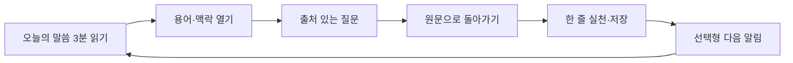
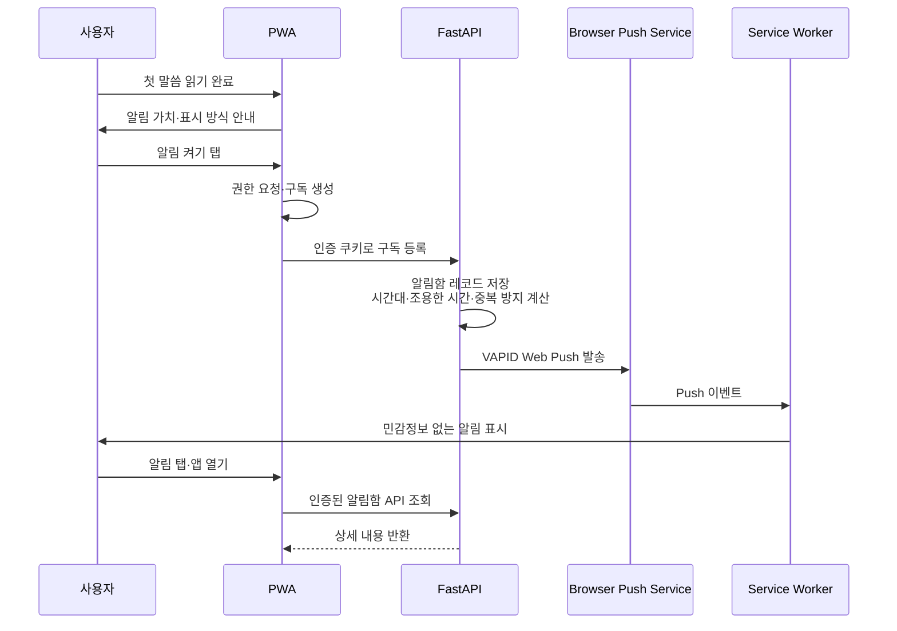
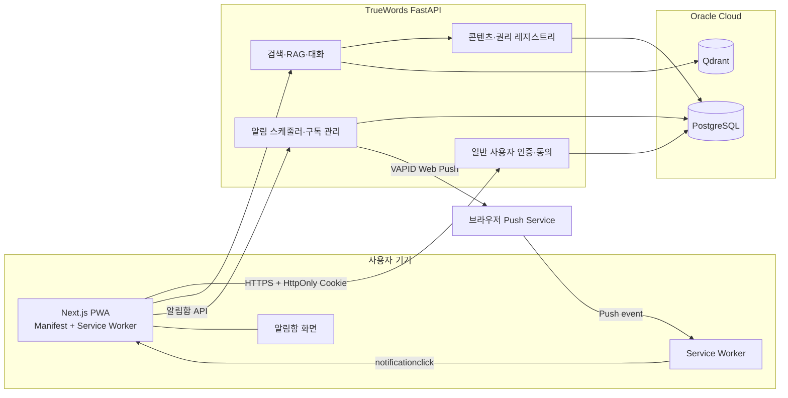

# 가정연합 사용자용 PWA — 제품 방향 및 세션 로드맵

- 작성일: 2026-08-30
- 최종 갱신: 2026-08-31
- 상태: **세션 0 완료 · 제품 방향 승인**
- 경쟁 조사: [`2026-08-30-chowon-ai-benchmark.md`](./2026-08-30-chowon-ai-benchmark.md)
- 이번 작업 범위: 세션 0의 조사·제품 방향·PWA 타당성·16개 세션 실행 기준 확정. PRD·프로토타입·디자인 시스템·구현은 후속 세션에서 진행한다.

## 0. 확인 사실과 가정

### 확인 사실

- 별개 신규 제품이며 기존 `faith-union-app` 프로토타입은 레퍼런스로 사용하지 않는다.
- 네이티브 앱을 만들지 않고 모바일 우선 웹앱과 PWA로 제공한다.
- 기존 TrueWords FastAPI·Qdrant·PostgreSQL·RAG 코어를 재사용한다.
- 현재 사용자용 인증은 없고 Admin JWT 중심이다. 공개 `/chat` 경로와 일반 사용자 세션 모델은 분리 설계가 필요하다.
- PWA Web Push는 가능하지만 플랫폼별 설치·권한 조건과 전달 보장 한계가 있다.

### 사용자 승인 결정 (2026-08-31)

- 제품 대상은 **세계평화통일가정연합(FFWPU, 이하 가정연합)**이다.
- 공식 승인 전 운영 기준은 **독립 운영·비공식 제한 베타**다. 공식 로고·공식 앱 주장·승인되지 않은 콘텐츠 전재는 잠근다.
- 1순위 사용자는 **현 구성원과 그 가정**이다.
- 초기 corpus는 **기능별 권리 승인이 완료된 소규모 정본**으로 제한한다. 기존 615권 전체를 공개 가능하다고 간주하지 않는다.
- 잠금 화면 알림의 기본 문구는 **중립형**이다. 신앙 맥락 노출형은 사용자가 명시적으로 선택할 때만 허용한다.

### 남은 확인 사항

- `[확인 필요]` 독립 베타의 법적 운영 주체와 FFWPU 공식 승인 요청·검수 절차
- `[확인 필요]` 초기 소규모 정본의 정확한 목록과 본문 전재·검색·임베딩·AI 요약·오프라인·푸시 인용별 권리 범위
- `[확인 필요]` 콘텐츠 공식성·검수·철회에 대한 최종 책임자

### 외부 확인 기준

- [FFWPU 국제본부 자기소개](https://familyfedihq.org/about-us/)는 가족·타인을 위한 삶·평화를 조직의 가치로 설명한다. 이는 **공식 자기 서술**이며 독립 평가가 아니다.
- [FFWPU 국제본부 리소스](https://familyfedihq.org/resources/)는 국제본부·국가 조직·PeaceTV·출판·교육 자원이 여러 서비스로 나뉘어 있음을 보여준다.
- [천원사](https://truebooks.net/kr/)는 출판·전자도서관·말씀 콘텐츠를 제공하면서 콘텐츠의 저작권 보호를 명시한다. 공개 열람을 앱 재사용 허가로 간주하지 않는다.
- [한국 가정연합](https://www.ffwp.org/main.php)은 지역·교회·뉴스·교육 접근점을 제공한다. 지역 정보의 재사용 범위와 갱신 책임은 별도로 확인한다.

---

## 1. 제품 방향

### 1.1 권장 포지셔닝

> **AI가 신앙의 답을 대신하는 앱이 아니라, 공식 말씀의 정확한 출처와 맥락으로 사용자를 되돌려 보내고 오늘의 가족 실천까지 연결하는 말씀 PWA.**

초원AI와 같은 “종교 AI 질문 앱”으로 포지셔닝하지 않는다. 초원은 이미 성경·AI·QT·오디오·커뮤니티·교회용 설교 RAG까지 확장했다. TrueWords의 방어 가능한 강점은 다음 조합이다.

1. **출처 우선** — 발화자·날짜·장소·저작물·판본·원문 언어·공식성·검수 상태를 문단 단위로 표시
2. **가정연합 고유 용어와 맥락** — 어려운 용어를 원문·관련 말씀과 연결하되 AI 설명과 공식 텍스트를 시각적으로 분리
3. **가족·생활 실천** — 지식형 답변에서 끝내지 않고 오늘 가능한 한 줄 실천으로 연결
4. **AI의 권한 제한** — 근거 부족 시 멈추고, 교리·목회·의료·법률 판단을 대체하지 않음
5. **비감시성** — 출석·GPS·전도 실적·신앙 점수 없이 개인 기록을 기본 비공개로 유지

### 1.2 확정 1순위 사용자

첫 사용자는 **가정연합 현 구성원과 그 가정**으로 확정한다.

핵심 JTBD:

> “오늘 읽을 말씀을 짧게 찾고, 어려운 용어와 맥락을 확인한 뒤, 정확한 출처를 가족과 나누고 싶다.”

후속 사용자:

- 청년·2세대·다문화 가정: 낯선 용어와 번역 차이를 이해
- 입문자: 가입 압박 없이 믿음·역사·현재 활동을 출처와 함께 탐색
- 목회자·교사·연구자: 화자·연도·판본별 말씀을 감사 가능한 방식으로 검색

### 1.3 핵심 경험



AI 답변은 루프의 목적지가 아니라 **원문으로 돌아가는 연결부**다.

---

## 2. 권장 MVP

### 사용자 기능

1. **오늘** — 권리가 확인된 오늘의 말씀, 3분 읽기, 한 줄 성찰·실천
2. **말씀 찾기** — 제목·화자·연도·주제·정확한 문구·자연어 통합 검색
3. **질문** — 짧은 답변, 인용 문단, 판본·공식성·검수 상태, 근거 부족 시 명시적 중단
4. **출처·용어** — 원문 상세, 판본·번역 차이, 핵심 용어 사전, 관련 말씀
5. **내 서재** — 북마크·최근 읽기·개인 메모·저장/삭제/무기억 선택

PWA 설치와 알림은 별도 탭이 아니라 첫 가치 경험 뒤 노출하는 보조 흐름으로 둔다.

### 운영 기반

- 콘텐츠 레지스트리: 권리자, 허용 범위, 공식성, 판본, 검수·철회 상태
- 일반 사용자 인증: AdminUser와 분리된 사용자·세션·동의 모델
- 평가셋: 정상·모호·판본 충돌·민감·악의적 질문
- 감사 로그: 콘텐츠와 AI 정책의 승인·수정·철회 이력
- 알림함: Web Push가 늦거나 누락될 때 동일 내용을 앱 안에서 확인

### 초기 비범위

- 권리 확인 전 615권 전체 공개와 전체 오프라인 다운로드
- 공개 커뮤니티·댓글·DM·실시간 그룹 피드
- 출석·GPS·전도 관리·신앙 점수·달란트형 보상
- 축복 매칭·헌금·결제·광고·구독 가격 확정
- 네이티브 앱, 완전 오프라인 RAG, 자동 번역을 공식 번역처럼 표시하는 기능

---

## 3. 신뢰·콘텐츠 거버넌스

콘텐츠는 하나의 “공식” 라벨로 뭉치지 않는다.

| 등급 | 의미 | AI 기본 근거 |
|---|---|---|
| O1 | 승인된 정본·공식 판본 | 사용 |
| O2 | 공식 출처가 게시한 말씀·메시지 | 사용 |
| O3 | 공식 교육·해설 | 유형 표시 후 사용 |
| O4 | 역사자료·잡지·회고 | 맥락과 한계 표시 |
| O5 | 지역·기관 콘텐츠 | 게시 주체와 범위 표시 |
| R | 참고·미검증 자료 | 기본 답변에서 제외 |

필수 정책:

- 답변의 모든 핵심 주장에 문단 단위 근거를 붙인다.
- AI 요약, 공식 원문, 공식 해설, 사용자 메모를 시각적으로 구분한다.
- 판본·번역·시대별 충돌을 조용히 합치지 않고 나란히 보여준다.
- 근거가 없으면 “확인할 수 없음”으로 끝내고 관련 공식 문의 경로를 제시한다.
- 콘텐츠 철회 시 서버 원문·검색색인·임베딩·캐시·요약·공유 링크를 함께 비활성화한다. 기기 오프라인 캐시는 다음 온라인 동기화 때 삭제하며 즉시 원격 회수를 보장하지 않는다.

---

## 4. PWA·알림 타당성

### 4.1 결론

PWA와 Web Push는 구현 가능하다. 다만 “매일 정확한 시각에 반드시 도착”을 약속하면 안 된다. **서버가 시간대와 TTL에 맞춰 발송을 시도하고, 앱 내 알림함을 최종 전달 수단으로 제공**하는 것이 정확한 제품 계약이다.

### 4.2 플랫폼 조건

| 플랫폼 | 설치·푸시 지원 | 제품에 반영할 제약 |
|---|---|---|
| iOS/iPadOS | iOS/iPadOS 16.4+에서 홈 화면에 추가된 웹앱이 Web Push 지원 | Safari 탭만 연 사용자는 푸시 대상이 아니다. 권한 요청은 사용자 탭 직후에만 실행한다. |
| iOS/iPadOS 26 | 홈 화면 추가 시 모든 사이트를 웹앱으로 열 수 있고 `Open as Web App` 옵션을 제공 | manifest·아이콘은 설치 필수 조건은 아니지만 일관된 이름·아이콘·시작 URL·standalone UX를 위해 사용한다. |
| Android Chromium | Web Push 지원. Push 자체는 설치가 필수는 아니다. | 기능 탐지 후 안내하고 브라우저별 차이를 숨기지 않는다. |
| 데스크톱 Chrome/Edge·macOS Safari | Web Push 지원 | 브라우저·OS 종료 상태에 따른 전달 차이를 실기기로 검증한다. |

공식 근거:

- [Next.js PWA 가이드](https://nextjs.org/docs/app/guides/progressive-web-apps)
- [WebKit — iOS/iPadOS 16.4 Web Push](https://webkit.org/blog/13878/web-push-for-web-apps-on-ios-and-ipados/)
- [WebKit — Safari 26 웹앱 변경](https://webkit.org/blog/17333/webkit-features-in-safari-26-0/)
- [MDN Push API](https://developer.mozilla.org/en-US/docs/Web/API/Push_API)
- [MDN Periodic Background Sync](https://developer.mozilla.org/en-US/docs/Web/API/Web_Periodic_Background_Synchronization_API)

### 4.3 권장 알림 흐름



권한은 첫 화면에서 요청하지 않는다. 사용자가 첫 읽기나 저장을 완료해 가치를 경험한 뒤 다음 순서로 제안한다.

1. iOS라면 홈 화면 설치 안내
2. “매일 말씀을 다시 찾도록 알려드릴까요?” 맥락 설명
3. 시간대·희망 시각·조용한 시간 설정
4. 앱이 발송할 알림 문구 수준 선택
5. 사용자의 버튼 탭 직후 브라우저 권한 요청

실제 잠금 화면 미리보기·표시 방식은 앱이 제어하지 않으며 사용자가 OS 알림 설정에서 관리한다.

### 4.4 알림 개인정보 기본값

기본 문구는 질문·기도·가족 상황·말씀 전문을 포함하지 않는 중립형으로 둔다.

```json
{
  "type": "daily_reminder",
  "notification_id": "opaque-random-id",
  "url": "/notifications/opaque-random-id"
}
```

- 잠금 화면: `오늘의 읽을거리가 준비됐어요`
- 알림 클릭 후: HttpOnly 인증 쿠키로 보호된 화면에서 상세 조회
- 사용자가 원할 때만: `오늘의 말씀이 준비됐어요` 같은 신앙 맥락 노출형 선택
- 금지: 사용자의 실제 질문·AI 답변·기도 내용·가족 관계·말씀 전문

구독 등록은 동일 출처 구성을 우선한다. HttpOnly 쿠키가 인증한 `/push/subscribe` POST에서 서버가 현재 사용자와 구독을 결합하고 `Origin` 검증과 CSRF 방어를 적용한다. API가 다른 출처라면 `credentials: "include"`, 정확한 CORS 허용 출처, Cookie `SameSite` 정책을 함께 설계한다. 클라이언트가 보낸 `user_id`는 신뢰하지 않는다.

### 4.5 오프라인 범위

- 캐시 허용: 앱 셸, 아이콘, 공개가 허용된 최근 오늘의 말씀, 사용자가 명시적으로 저장한 공개 본문
- 기본 캐시 금지: 질문·답변·개인 메모·기도·가족 정보·JWT
- 온라인 필수: RAG 질문, 최신 검색, 권리·철회 상태 확인
- 철회 콘텐츠: 짧은 캐시 만료시간을 적용하고 다음 온라인 동기화에서 삭제·재제공 차단. 오프라인 기기의 즉시 삭제는 보장하지 않음
- Periodic Background Sync: 정확한 알림 예약에 사용하지 않고 선택적 공개 콘텐츠 갱신에만 검토

---

## 5. 기술 아키텍처 방향



### 기존 자산과 신규 범위

| 영역 | 재사용 | 신규·변경 필요 |
|---|---|---|
| RAG | 하이브리드 검색·리랭킹·멀티턴·캐시·가드레일 | 소비자용 응답 길이, 출처 메타데이터, 근거 부족 중단, 민감 질문 평가 |
| 데이터 | 적재된 Qdrant 데이터와 문서 처리 파이프라인 | 권리 확인된 초기 정본 세트, 판본·화자·날짜·공식성·철회 메타데이터 |
| 인증 | HttpOnly Cookie 패턴 일부 | AdminUser와 분리된 일반 사용자·익명 세션·동의·삭제 모델 |
| 기록 | 기존 채팅 세션 구조 일부 | 저장/무기억 선택, 개인 서재, 데이터 삭제, 기기·구독 귀속 |
| 운영 | FastAPI·PostgreSQL·Oracle 운영 기반 | Push 구독 암호화 저장, 서버 스케줄러, 알림함, 404/410 구독 정리 |

Push endpoint와 `p256dh`·`auth` 키는 capability 정보로 취급해 암호화 저장하고 로그에 남기지 않는다. JWT는 localStorage·Push payload·Service Worker 캐시에 복사하지 않는다.

구독 수명은 앱 진입 시 `getSubscription()`으로 서버 상태와 재동기화하고, `expirationTime`의 `null`을 허용한다. `pushsubscriptionchange`는 보조 신호로만 사용하며, 발송 응답이 404/410이면 서버 구독을 비활성화한다. 사용자가 해지하면 브라우저 `unsubscribe()`와 서버 구독·향후 예약을 함께 취소한다.

---

## 6. 16개 세션 전체 진행 기준

**승인: 총 16개 세션(S0~S15)으로 진행한다.** S0~S4는 제품 정의와 구현 착수 게이트이고, S5~S15는 승인 산출물을 기준으로 한 구현·검증·독립 베타 단계다. 각 세션은 앞 세션의 승인 결과만 입력으로 사용한다.

### Phase A — 조사와 제품 정의

| 세션 | 이번 세션에서 끝낼 것 | 다음 세션 진입 조건 |
|---|---|---|
| S0 | 초원AI 조사, 제품 방향, PWA 타당성, 승인 전제, 전체 로드맵 | **완료** — 제품 방향과 16개 세션 기준 승인 |
| S1 | PRD, 사용자·JTBD, MVP/비범위, 지표, 권리·신뢰 게이트 | PRD 사용자 승인 |
| S2 | A/B/C 비교형 모바일 우선 프로토타입 | 제품 방향 1개 선택 |
| S3 | 채택안 디자인 시스템과 접근성 상태 | 디자인·접근성 승인 |

### Phase B — 구현 설계와 기반

| 세션 | 이번 세션에서 끝낼 것 | 다음 세션 진입 조건 |
|---|---|---|
| S4 | 아키텍처·API·도메인·작업 분해·제한 베타 계획과 S5~S15 실행 프롬프트 | 구현 착수 승인 |
| S5 | Next.js 모바일 웹/PWA 셸, manifest, Service Worker, CI 기준선 | 설치·오프라인 셸·기본 테스트 통과 |
| S6 | 일반 사용자 인증, 익명 범위, 동의·삭제·무기억 정책 | 인증·권한·삭제 시나리오 통과 |
| S7 | 콘텐츠 권리 원장과 권리 승인 소규모 정본 적재 경로 | 승인 콘텐츠만 노출되는 게이트 통과 |

### Phase C — 핵심 사용자 경험

| 세션 | 이번 세션에서 끝낼 것 | 다음 세션 진입 조건 |
|---|---|---|
| S8 | 소비자용 RAG API, 출처 스키마, 근거 부족 중단, 평가셋 | 품질·안전 기준 통과 |
| S9 | 오늘의 말씀과 통합 검색 | 핵심 과업 사용성·반응형 검증 통과 |
| S10 | 출처 있는 질문, 원문 상세, 용어 탐색 | 인용·판본·권위 층 검증 통과 |
| S11 | 내 서재, 개인 메모, 허용 콘텐츠 오프라인 | 개인정보·캐시·철회 경계 검증 통과 |

### Phase D — 전달·통합·독립 베타

| 세션 | 이번 세션에서 끝낼 것 | 다음 세션 진입 조건 |
|---|---|---|
| S12 | 중립형 Web Push, 구독 관리, 조용한 시간, 앱 내 알림함 | iOS·Android 실기기 전달·해지 검증 통과 |
| S13 | 전체 통합, 보안, WCAG 2.2 AA, 성능, E2E 회귀 | 제한 베타 출시 게이트 통과 |
| S14 | 독립 베타 배포, 온보딩, 운영 대시보드, 소규모 코호트 시작 | 권리·운영·지원 체크리스트 승인 |
| S15 | 베타 결과, 성공·가드레일 지표, 이슈 우선순위, 공식 승인 이후 결정 | 다음 버전·중단·공식화 중 하나 결정 |

S1~S3은 회당 60~120분 작업과 10~20분 검토, S4는 90~150분, S5~S13은 회당 120~240분 구현·검증을 예상한다. S14는 90~180분의 배포 준비 뒤 별도 관찰 기간이 필요하고, S15는 데이터 확보 후 60~120분을 예상한다.

S5~S15의 세부 프롬프트는 지금 고정하지 않는다. S4에서 승인된 PRD·프로토타입·디자인 시스템과 실제 저장소 상태를 반영해 `docs/guides/ffwpu-pwa-session-runbook.md`로 확정한다.

---

## 7. 후속 세션 프롬프트

### 세션 1 — PRD와 의사결정 게이트

```text
TrueWords의 기존 RAG 코어를 활용해 세계평화통일가정연합(FFWPU) 사용자용 모바일 우선 웹/PWA 제품의 PRD를 작성해줘.

가장 먼저 다음 문서를 읽어:
- AGENTS.md
- docs/README.md
- docs/research/2026-08-30-chowon-ai-benchmark.md
- docs/research/2026-08-30-pwa-app-direction.md
- docs/architecture/05-rag-pipeline.md
- docs/architecture/07-multi-chatbot-version.md
- docs/architecture/09-security-countermeasures.md
- docs/specs/domain/06-terminology-dictionary-structure.md

목표:
- PRD를 docs/01_requirements/17-ffwpu-pwa-prd.md에 작성
- 확인 사실, [가정], [확인 필요]를 분리
- 미결 항목은 임의 확정하지 말고 2~3개 선택지와 추천안을 제시
- 공식 로고·공식 앱 주장·승인되지 않은 콘텐츠 전재는 잠금
- 나머지 질문은 문서의 Decision Log와 docs/TODO.md에 모아 마지막에 한 번만 요청

확정 전제 — 재질문하거나 [가정]으로 되돌리지 말 것:
- 대상 조직: FFWPU
- 운영: 공식 승인 전까지 독립 운영·비공식 제한 베타
- 1순위 사용자: 현 구성원과 그 가정
- 콘텐츠: 기능별 권리가 승인된 소규모 정본만 사용
- 알림: 잠금 화면 중립형 문구가 기본
- 전체 진행: S0~S15의 16개 세션이며, 이번 작업은 S1

반드시 포함:
1. 한 문장 가치제안, 운영 주체·공식 제휴 전제, 1순위 사용자와 JTBD
2. 세 개 핵심 플로우: 오늘의 말씀, 출처 있는 질문, 원문·용어 탐색
3. MVP와 비범위, 일반 사용자 인증·익명 범위·저장/무기억 정책
4. O1~O5/R 공식성, 콘텐츠 권리 원장, AI·교리·민감질문·개인정보 거버넌스
5. PWA 설치·오프라인·Web Push acceptance criteria, 성공 지표, G0~G5 출시 게이트
6. S2 진입 조건과 사용자가 승인해야 할 PRD 결정 목록

제약:
- 기존 faith-union-app 프로토타입을 레퍼런스로 사용하지 말 것
- 초원의 화면·색상·게이미피케이션을 복제하지 말 것
- 615권 전체 공개 권리가 있다고 가정하지 말 것
- 네이티브 앱, 공개 커뮤니티, 결제, 완전 오프라인 RAG는 MVP에 넣지 말 것
- 문서 리뷰 전 구현하지 말 것
```

### 세션 2 — 비교형 PWA 프로토타입

```text
승인된 docs/01_requirements/17-ffwpu-pwa-prd.md를 기준으로 모바일 우선 클릭형 PWA 프로토타입을 만들어줘.

먼저 PRD와 docs/research/2026-08-30-pwa-app-direction.md를 읽고, 다음 세 방향을 한 프로토타입 안에서 전환해 비교할 수 있게 해:
- A: 오늘의 말씀 루틴 중심
- B: 출처 중심 말씀 아카이브
- C: 가족 실천 연결 중심

세 방향 모두에서 검증할 과업:
1. 오늘의 말씀을 3분 안에 읽고 저장
2. 질문 후 인용 문단·판본·화자·날짜·공식성·검수 상태 확인
3. 낯선 용어를 열고 관련 원문으로 이동

산출물:
- standalone HTML 프로토타입 1개
- 모바일 390px 기본, 데스크톱 반응형
- 방향 전환 스위치와 테스트용 예시 데이터
- 각 방향의 가설·장점·위험·추천안을 함께 기록

제약:
- 모든 콘텐츠를 ‘프로토타입용 예시’로 표시
- AI 답변과 공식 원문을 명확히 구분
- 초원의 팔레트·카드·씨앗/나무·달란트를 복제하지 않음
- 기존 prototypes/faith-union-app을 열거나 참고하지 않음
- 디자인 시스템을 확정하지 않고 최소 토큰만 사용
```

### 세션 3 — 채택안 디자인 시스템

```text
사용자가 채택한 프로토타입 방향과 승인 PRD를 기반으로 가정연합 말씀 PWA의 디자인 시스템을 정의해줘.

입력:
- docs/01_requirements/17-ffwpu-pwa-prd.md
- 채택된 프로토타입 파일과 사용자 피드백
- docs/research/2026-08-30-pwa-app-direction.md

먼저 2~3개 시각 방향을 무드·접근성·제품 포지셔닝 기준으로 비교하고 추천안을 제시해. 사용자가 선택한 방향을 기준으로 최종 문서를 작성해.

필수 산출물:
1. 색상·타이포·간격·모서리·그림자·아이콘·모션 토큰
2. 모바일 우선 그리드와 데스크톱·PWA standalone·safe-area 규칙
3. 오늘 카드, 검색 결과, AI 답변, 인용, 출처 상세, 용어, 서재, 설치·알림 컴포넌트
4. O1~O5/R, 원문·공식 해설·AI 요약·사용자 메모의 권위 층 표현
5. WCAG 2.2 AA, 큰 글씨, 고대비, 키보드, 스크린리더, reduced-motion 상태

제약:
- 종교적 권위를 과장하거나 AI가 공식기관·목회자를 대체하는 인상을 금지
- 고령 사용자에게 작은 본문·낮은 대비·아이콘 단독 액션을 사용하지 않음
- 다국어 확장을 고려해 고정 높이 텍스트 컨테이너를 피함
- 승인된 프로토타입의 정보구조를 임의로 재설계하지 않음
```

### 세션 4 — 구현 계획과 제한 베타

```text
승인된 PRD·프로토타입·디자인 시스템을 구현 가능한 엔지니어링 계획으로 변환해줘. 아직 코드는 작성하지 마.

반드시 저장소 코드를 확인해 기존 구현과 신규 범위를 구분하고, 다음을 산출해:
1. 일반 사용자 인증·익명 세션·동의·삭제 모델과 AdminUser 분리 방안
2. 콘텐츠·권리 레지스트리, 출처 메타데이터, RAG 응답 스키마와 API 변경
3. Next.js PWA manifest·Service Worker·오프라인 캐시·Web Push·알림함 설계
4. FastAPI 스케줄러, 구독 암호화 저장, 시간대·조용한 시간·TTL·404/410 정리
5. 단위·통합·E2E·실기기 테스트, 30개 이상 평가셋, 단계별 PR과 제한 베타 게이트

다음 파일을 함께 작성해:
- docs/04_architecture/ffwpu-pwa-architecture.md
- docs/03_api/ffwpu-pwa-api.md
- docs/02_domain/ffwpu-pwa-domain.md
- docs/guides/ffwpu-pwa-session-runbook.md
- docs/TODO.md

runbook에는 S5~S15 각각의 복사 가능한 실행 프롬프트를 작성해. 각 프롬프트는 선행 입력, 이번 세션 범위, 필수 산출물, 완료 조건, 검증 명령, 중단 조건을 포함하고 다음 세션 범위를 미리 구현하지 않게 해.

각 작업은 파일 경로, 완료 조건, 검증 명령, 예상 위험이 있어야 해. main에 직접 커밋하거나 배포하지 마.
```

---

## 8. 세션 0 승인 기록과 세션 1 진입 조건

### 승인 기록

| 결정 | 승인값 | 적용 범위 |
|---|---|---|
| 전체 작업 | S0~S15, 총 16개 세션 | 모든 후속 계획 |
| 대상 조직 | FFWPU | PRD의 도메인·용어·사용자 정의 |
| 운영 모델 | 공식 승인 전 독립 운영·비공식 제한 베타 | 명칭·브랜드·출시 표현 |
| 1순위 사용자 | 현 구성원과 그 가정 | JTBD·핵심 플로우·사용성 기준 |
| 초기 콘텐츠 | 권리 승인 소규모 정본 | 검색·RAG·오프라인·알림 인용 |
| 알림 기본값 | 중립형 잠금 화면 문구 | Web Push·알림함·개인정보 기준 |

### 남은 외부 게이트

- 공식 승인 요청·검수 절차와 승인 전 사용할 수 있는 명칭·브랜드 범위
- 초기 소규모 정본의 정확한 목록과 기능별 권리 증빙
- 콘텐츠 공식성·검수·철회 최종 책임자

위 항목은 S1 PRD 작성을 막지 않는다. 다만 S7 콘텐츠 적재와 S14 독립 베타 시작 전에는 증빙 가능한 상태로 확정해야 한다. **S1 진입 조건은 충족됐다.**
