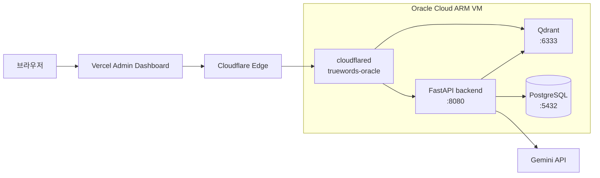

# GCP에서 Oracle Cloud ARM VM으로 이전 운영 가이드

GCP Cloud Run 백엔드와 GCP VM Qdrant를 Oracle Cloud Always Free ARM VM 한 대로 이전하는 실행 절차를 기록한다.

> ✅ **이전 완료 (2026-07-29).** GCP Cloud Run 과 Qdrant VM 은 삭제됐고 월 $42 → **$0**, 채팅 응답 34초 → 23.7초가 됐다. 본 문서는 그 실행 기록이다.
> **일상 운영·배포·백업·복구는 [`infra/oracle-vm/README.md`](../../infra/oracle-vm/README.md) 를 본다.**
>
> 이전 이후 두 가지가 본문과 달라졌다.
> 1. **PostgreSQL 도 VM 으로 들어왔다** (Neon 이탈, §1 참조). Neon us-east-1 은 도쿄 VM 에서 왕복 172ms 였고 채팅 1회에 DB 쿼리가 5~10회라 순수 대기만 1~2초였다. 근거: [Postgres VM 이전 ADR](../adr/2026-07-29-postgres-vm-relocation-and-backup.md)
> 2. §10 GCP 자원 폐기는 **완료**됐다.
>
> 결정 근거는 [`docs/adr/2026-07-25-gcp-to-oracle-migration.md`](../adr/2026-07-25-gcp-to-oracle-migration.md)를 참고한다.
>
> `<zone>`은 Cloudflare에 등록한 도메인이다. 예를 들어 도메인이 `example.com`이면 `api.<zone>`은 `api.example.com`이다. 소스 Qdrant hostname은 `qdrant.<zone>`이고 Oracle 타깃 hostname은 `vdb.<zone>`과 `api.<zone>`이다.

---

## 1. 목표와 범위

- 1차 이전 대상은 FastAPI backend와 Qdrant다.
- Vercel Admin Dashboard는 유지한다.
- **PostgreSQL 은 1차 범위에서 제외했다가 이전 직후 VM 으로 들여왔다.** 소킹 중 측정한 Neon 왕복 172ms 가 채팅 응답의 지배적 병목이었다. `postgres:17-alpine` 컨테이너 + `/opt/postgres/data` bind mount + 일일 pg_dump 백업으로 대체했다.
- Oracle VM은 `VM.Standard.A1.Flex` 2 OCPU / 12GB RAM / 부트 볼륨 100GB를 사용한다.
- 서비스 공개 경로는 Cloudflare Tunnel뿐이다. 애플리케이션용 공인 IP, 인바운드 방화벽, TLS 인증서는 만들지 않는다.
- SSH 관리 경로만 Oracle Security List의 TCP 22를 사용한다.

이전 완료 후 최종 구조는 다음과 같다.



Admin의 Next.js rewrite가 Vercel 서버에서 backend로 프록시한다. 브라우저가 `api.<zone>` 또는 `vdb.<zone>`을 직접 호출하지 않는다. 이전 완료 시점의 외부 의존은 Gemini API 하나뿐이다.

## 2. 사전 확인

아래 항목을 모두 확인한 뒤 VM을 만든다.

| 확인 항목 | 통과 기준 |
|---|---|
| Oracle 홈 리전 | **Japan East (Tokyo)**. Always Free A1과 Block Volume은 홈 리전에서만 할당하므로 이 홈 리전에서 작업한다. |
| A1 잔여 한도 | `VM.Standard.A1.Flex` 2 OCPU / 12GB를 만들 수 있다. |
| Block Volume 잔여 한도 | 부트 볼륨 100GB를 포함해 Always Free 200GB 한도 안이다. |
| 계정 상태 | PAYG 업그레이드를 완료해야 한다. 현재 계정은 무료 체험 중이며 PAYG 업그레이드 전이다. Always Free 사용량 안이면 청구액은 `$0`이고 idle reclaim 대상에서는 제외된다. |
| 로컬 업로드 대역폭 | 1.02GB backend 이미지를 전송할 수 있다. 실제 업로드 속도가 배포 시간을 좌우한다. |
| Cloudflare Bot Fight Mode | 활성 여부를 확인한다. snapshot과 Qdrant API 호출을 차단하면 이전 창 동안 해당 hostname 정책을 조정한다. |
| Neon IP allowlist | 활성 상태라면 Oracle VM의 실제 outbound IP를 등록한다. |

Always Free ARM 한도는 2026-06-15부터 4 OCPU / 24GB에서 2 OCPU / 12GB로 축소된 값이다. 본 가이드는 축소 후 한도를 기준으로 한다.

Japan East (Tokyo)는 서울·춘천 리전 대비 레이턴시가 25~35ms 늘지만 Cloudflare 엣지를 경유하는 구조라 체감 차이는 그보다 작다.

## 3. Oracle VM 프로비저닝

Oracle Console의 홈 리전 Japan East (Tokyo)에서 다음 값으로 인스턴스를 만든다.

| 항목 | 값 |
|---|---|
| Shape | `VM.Standard.A1.Flex` |
| Shape configuration | 2 OCPU / 12GB RAM |
| Image | Ubuntu 22.04 aarch64 |
| Boot volume | 100GB |
| Security List inbound | TCP 22만 허용 |
| 애플리케이션 포트 | 80, 443, 6333, 6334를 허용하지 않음 |

SSH는 관리자 IP로만 제한한다. Qdrant는 Compose에서 `127.0.0.1:6333`으로만 바인딩된다.

### `Out of host capacity` 대응

콘솔에서 실패하면 Availability Domain을 바꿔 재시도한다. 반복 실패할 때는 OCI CLI로 모든 AD를 순회한다.

```bash
export COMPARTMENT_ID=<oracle-compartment-ocid>
export SUBNET_ID=<oracle-subnet-ocid>
export IMAGE_ID=<ubuntu-22-04-aarch64-image-ocid>

for AD in $(oci iam availability-domain list \
  --compartment-id "$COMPARTMENT_ID" \
  --query 'data[].name' \
  --raw-output); do
  echo "==> Trying ${AD}"
  if oci compute instance launch \
    --compartment-id "$COMPARTMENT_ID" \
    --availability-domain "$AD" \
    --display-name truewords-oracle \
    --shape VM.Standard.A1.Flex \
    --shape-config '{"ocpus":2,"memoryInGBs":12}' \
    --image-id "$IMAGE_ID" \
    --subnet-id "$SUBNET_ID" \
    --boot-volume-size-in-gbs 100 \
    --assign-public-ip true \
    --wait-for-state RUNNING \
    --max-wait-seconds 300; then
    break
  fi
done
```

`<oracle-compartment-ocid>`, `<oracle-subnet-ocid>`, `<ubuntu-22-04-aarch64-image-ocid>`에는 Japan East (Tokyo) 홈 리전에서 선택한 실제 OCID를 넣는다. SSH 관리용 public IP는 허용하지만 서비스 hostname은 Cloudflare Tunnel만 사용한다.

### 3.1 로컬 SSH 별칭 설정

인스턴스 생성 직후 로컬 Mac의 `~/.ssh/config`에 다음 블록을 추가한다.

```
Host truewords-oracle
  HostName <VM 공인 IP>
  User ubuntu
  IdentityFile ~/.ssh/oracle_truewords
```

`Makefile`의 `ORACLE` 기본값은 이 별칭이므로 이후 `make deploy-backend`와 `make rollback-backend`는 그대로 사용한다. 별칭을 만들지 않을 경우 `make deploy-backend ORACLE=<user>@<host>`로 덮어쓴다.

## 4. Cloudflare Tunnel 생성

1. Cloudflare Zero Trust에서 새 tunnel `truewords-oracle`을 만든다.
2. 새 token을 복사한다. 기존 GCP tunnel token은 사용하지 않는다.
3. Public Hostname 두 개를 등록한다.

| Public Hostname | Service |
|---|---|
| `api.<zone>` | `http://backend:8080` |
| `vdb.<zone>` | `http://qdrant:6333` |

기존 token을 재사용하면 GCP와 Oracle 커넥터 두 대가 같은 tunnel에 연결되어 요청이 임의 분산된다. 이는 backend와 Qdrant 상태가 갈리는 split-brain이므로 신규 tunnel이 필수다.

## 5. VM 부트스트랩

로컬 저장소 루트에서 Oracle VM으로 `infra/oracle-vm`만 전송한다.

```bash
ssh truewords-oracle 'mkdir -p ~/truewords'
scp -r ./infra/oracle-vm/. truewords-oracle:~/truewords/
ssh truewords-oracle
```

위 명령은 §3.1에서 만든 `truewords-oracle` 별칭을 사용한다. VM에서 `.env`를 만든다.

```bash
cd ~/truewords
cp .env.example .env
chmod 600 .env
nano .env
```

`.env`에는 새 `QDRANT_API_KEY`, 새 `CLOUDFLARE_TUNNEL_TOKEN`, 기존 Neon·Gemini·Admin 운영 값을 채운다. `BACKEND_TAG`는 비어 있지 않은 임시값 `bootstrap`으로 두면 된다. `make deploy-backend`가 실제 이미지 태그로 갱신한다.

```bash
bash ~/truewords/setup-vm.sh
cd ~/truewords
sudo docker compose --env-file .env up -d qdrant cloudflared
sudo docker compose ps
```

**backend 이미지를 전달하기 전에는 반드시 `docker compose up -d qdrant cloudflared`로 `qdrant`와 `cloudflared` 두 서비스만 기동한다.** 현재 Compose는 `cloudflared`가 backend에 의존하지 않으므로 이 명령이 backend 이미지를 만들거나 pull하지 않는다.

## 6. Qdrant snapshot 이전

`malssum_poc_v5`와 `semantic_cache`를 Qdrant Snapshot API로 옮긴다. snapshot 생성은 소스를 정지하거나 변경하지 않는다. `malssum_poc_v5`는 417,579 points와 dense 1536 dimension을 가지며 snapshot은 HNSW 인덱스와 컬렉션 config를 포함한다.

re-upsert는 2 OCPU VM에서 HNSW 재구축에 2~4시간과 후속 인덱싱이 더 필요하다. snapshot 복구는 30~60분을 기준으로 한다.

### 6.1 소스에서 snapshot 생성과 다운로드

로컬 Mac에서 현재 GCP Qdrant의 Cloudflare hostname을 넣고 실행한다.

```bash
export SOURCE_QDRANT_URL=https://qdrant.<zone>
export SOURCE_QDRANT_API_KEY=<gcp-qdrant-api-key>

for COLLECTION in malssum_poc_v5 semantic_cache; do
  SNAPSHOT_NAME="$(curl -fsS -X POST \
    -H "api-key: ${SOURCE_QDRANT_API_KEY}" \
    "${SOURCE_QDRANT_URL}/collections/${COLLECTION}/snapshots" | \
    python3 -c 'import json, sys; print(json.load(sys.stdin)["result"]["name"])')"

  curl -fsSL \
    -H "api-key: ${SOURCE_QDRANT_API_KEY}" \
    -o "${SNAPSHOT_NAME}" \
    "${SOURCE_QDRANT_URL}/collections/${COLLECTION}/snapshots/${SNAPSHOT_NAME}"
  scp "${SNAPSHOT_NAME}" "truewords-oracle:/opt/qdrant/snapshots/${SNAPSHOT_NAME}"
done
```

소스는 기존 GCP Qdrant의 `qdrant.<zone>`이고 타깃은 Oracle Qdrant의 `vdb.<zone>`이다. 이 단계 이후 구 스택에 추가되는 `semantic_cache` 엔트리는 이전하지 않는다. 캐시 TTL은 7일이고 miss는 정상 RAG 경로로 처리되므로 사용자 영향은 없다.

### 6.2 Oracle Qdrant에서 snapshot 복구

VM에서 snapshot 이름을 확인하고 각 컬렉션을 복구한다.

```bash
cd ~/truewords
set -a
. ./.env
set +a
sudo ls -lh /opt/qdrant/snapshots

export MAIN_SNAPSHOT=<malssum_poc_v5-snapshot-name>
export CACHE_SNAPSHOT=<semantic_cache-snapshot-name>

curl -fsS -X PUT \
  -H "api-key: ${QDRANT_API_KEY}" \
  -H 'Content-Type: application/json' \
  --data "{\"location\":\"file:///qdrant/snapshots/${MAIN_SNAPSHOT}\"}" \
  "http://127.0.0.1:6333/collections/malssum_poc_v5/snapshots/recover"

curl -fsS -X PUT \
  -H "api-key: ${QDRANT_API_KEY}" \
  -H 'Content-Type: application/json' \
  --data "{\"location\":\"file:///qdrant/snapshots/${CACHE_SNAPSHOT}\"}" \
  "http://127.0.0.1:6333/collections/semantic_cache/snapshots/recover"
```

`<malssum_poc_v5-snapshot-name>`과 `<semantic_cache-snapshot-name>`에는 앞 단계에서 받은 파일명을 넣는다. snapshot이 컬렉션 config까지 복구하므로 수동 컬렉션 생성이나 `ensure_main_collection()` 호출은 필요하지 않다.

### 6.3 검증

로컬 Mac에서 기존 검증 스크립트를 실행한다. 변수명은 과거 GCP Cloud에서 GCP VM으로 옮기던 시점의 이름을 유지한다. 이번 이전에서는 `QDRANT_CLOUD_*`가 GCP 소스, `QDRANT_VM_*`가 Oracle 타깃을 뜻한다.

```bash
cd backend
QDRANT_CLOUD_URL="${SOURCE_QDRANT_URL}" \
QDRANT_CLOUD_API_KEY="${SOURCE_QDRANT_API_KEY}" \
QDRANT_VM_URL="https://vdb.<zone>" \
QDRANT_VM_API_KEY="<oracle-qdrant-api-key>" \
  uv run python scripts/verify_migration.py \
    --sample 30 \
    --collections malssum_poc_v5
```

`points_count`는 segment-level approximate 값이므로 사용하지 않는다. source와 target 모두 `POST /collections/<c>/points/count`에 `{"exact":true}`를 보내야 한다. `malssum_poc_v5`의 exact count는 양쪽 모두 417,579여야 한다. `semantic_cache`는 snapshot 이후 소스에 새 엔트리가 추가되므로 count 차이가 정상이며 이 검증 게이트 대상이 아니다. 캐시를 확인할 때는 source와 target에 컬렉션이 존재하고 collection config의 vector dimension이 같은지만 확인한다.

```bash
curl -fsS -X POST \
  -H "api-key: ${SOURCE_QDRANT_API_KEY}" \
  -H 'Content-Type: application/json' \
  -d '{"exact":true}' \
  "${SOURCE_QDRANT_URL}/collections/malssum_poc_v5/points/count"

curl -fsS -X POST \
  -H 'api-key: <oracle-qdrant-api-key>' \
  -H 'Content-Type: application/json' \
  -d '{"exact":true}' \
  "https://vdb.<zone>/collections/malssum_poc_v5/points/count"
```

## 7. backend 배포

로컬 Mac에서 Apple Silicon native arm64 이미지를 빌드하고 전송한다.

```bash
make deploy-backend
```

이 target은 `docker buildx build --platform linux/arm64 --load`, 기동 가능 여부 확인, `docker save | gzip -1 | ssh ... sudo docker load`, `BACKEND_TAG` 갱신, `docker compose up -d --wait backend`를 순서대로 수행한다. QEMU를 사용하지 않는다.

### backend 롤백

새 backend가 healthcheck를 통과하지 못하면 직전 배포 태그로 즉시 되돌린다.

```bash
make rollback-backend TAG=<직전 배포 sha>
```

`TAG`를 생략하면 Makefile 가드에 막혀 실패한다. 이 가드는 현재 HEAD로 조용히 no-op 롤백하는 것을 막기 위한 것이다. VM에는 이전 태그 이미지가 남아 있으며 `docker load`는 기존 이미지를 지우지 않으므로 빌드와 전송 없이 초 단위로 복구한다.

## 8. Cutover와 단계별 되돌리기

Vercel의 `NEXT_PUBLIC_API_URL` 하나만 전환한다. `admin/next.config.ts`의 `BACKEND_URL`은 모듈 최상단에서 계산되므로 환경변수를 바꾼 뒤 Vercel Redeploy가 필수다.

| 순서 | 작업 | 통과 기준 | 실패 시 되돌리기 |
|---:|---|---|---|
| 1 | 현재 Vercel Production의 `NEXT_PUBLIC_API_URL` 값을 기록한다. | 이전 GCP URL을 확보한다. | 변경 없음. |
| 2 | Vercel Production 환경변수를 `https://api.<zone>`으로 바꾼다. | 변경값이 저장된다. | 이전 GCP URL로 복원한다. |
| 3 | Vercel Production을 Redeploy한다. | 새 deployment가 Ready가 된다. | Vercel Instant Rollback과 `make rollback-backend TAG=<직전 배포 sha>`를 실행한다. |
| 4 | Admin 로그인, 채팅, 관리자 API를 실제로 확인한다. | backend `/health`와 정상 채팅이 통과한다. | Vercel Instant Rollback과 `make rollback-backend TAG=<직전 배포 sha>`를 실행한다. |
| 5 | GitHub Secrets `QDRANT_URL`과 `QDRANT_API_KEY`를 Oracle 값으로 갱신한다. | 후속 GitHub workflow가 `https://vdb.<zone>`과 새 key를 사용한다. | 기존 GCP Qdrant URL과 key로 복원한다. |

GitHub CLI를 쓸 경우 마지막 단계는 다음과 같다.

```bash
gh secret set QDRANT_URL --body 'https://vdb.<zone>'
gh secret set QDRANT_API_KEY --body '<oracle-qdrant-api-key>'
```

Vercel Instant Rollback은 약 30초다. backend는 VM에 남은 이전 태그 이미지로 `make rollback-backend TAG=<직전 배포 sha>`를 실행해 초 단위로 복구한다. 구 Cloud Run과 구 GCP Qdrant에는 cutover 중 변경을 가하지 않으므로 rollback 시 데이터 무결성은 유지된다.

## 9. 48시간 소킹

소킹 시작부터 48시간 동안 `backend/**`를 건드리는 main 머지를 금지한다. 두 backend가 같은 Neon DB에서 `alembic upgrade head`를 실행할 수 있기 때문이다.

```bash
make oracle-logs

ssh truewords-oracle 'cd ~/truewords && sudo docker compose ps && sudo docker stats --no-stream'

curl -fsS https://api.<zone>/health
curl -fsS -H 'api-key: <oracle-qdrant-api-key>' https://vdb.<zone>/collections
```

아래 중 하나라도 발생하면 즉시 Vercel Instant Rollback과 `make rollback-backend TAG=<직전 배포 sha>`를 실행하고 구 GCP 스택에서 원인을 분리한다.

- Admin의 실제 채팅 또는 backend `/health`가 실패한다.
- `malssum_poc_v5` exact count가 417,579과 다르거나 검증 스크립트가 실패한다.
- backend 또는 Qdrant가 반복 재시작하거나 Neon 연결 오류가 발생한다.
- 메모리 부족, 지속 swap 증가, Qdrant 오류로 정상 검색을 제공하지 못한다.

## 10. GCP 자원 폐기 — ✅ 완료 (2026-07-29)

Cloud Run 서비스 `truewords-backend` 와 Qdrant VM 을 삭제했다. 레포 쪽 잔재(`.github/workflows/deploy.yml`, `infra/qdrant-vm/`, GitHub Secrets `GCP_*` 3종)도 정리 PR 에서 제거했다. 아래는 실행 당시의 절차 기록이다.

48시간 소킹을 통과한 뒤 GCP Qdrant VM의 부트 디스크 snapshot을 만들고 1주일 보관한다. 그 기간에 GCP Cloud Run과 VM을 제거한다.

```bash
export GCP_PROJECT_ID=<gcp-project-id>
export GCP_QDRANT_VM=<gcp-qdrant-vm-name>
export GCP_ZONE=asia-northeast3-a
export GCP_REGION=asia-northeast3

gcloud config set project "$GCP_PROJECT_ID"
export GCP_BOOT_DISK="$(gcloud compute instances describe "$GCP_QDRANT_VM" \
  --zone "$GCP_ZONE" \
  --format='value(disks[0].source)' | awk -F/ '{print $NF}')"

gcloud compute disks snapshot "$GCP_BOOT_DISK" \
  --zone "$GCP_ZONE" \
  --snapshot-names="truewords-qdrant-pre-oracle-$(date +%Y%m%d)"
gcloud compute instances delete "$GCP_QDRANT_VM" --zone "$GCP_ZONE" --quiet
gcloud run services delete truewords-backend --region "$GCP_REGION" --quiet
```

`<gcp-project-id>`는 이전 GCP 프로젝트 ID이고 `<gcp-qdrant-vm-name>`은 기존 Qdrant VM 이름이다. snapshot 생성일로부터 1주일 후 아래 명령으로 snapshot을 삭제한다.

```bash
gcloud compute snapshots list --filter='name~truewords-qdrant-pre-oracle'
gcloud compute snapshots delete <gcp-boot-snapshot-name> --quiet
```

## 11. 검증 게이트

| 게이트 | 다음 단계로 가는 조건 |
|---|---|
| 계정과 용량 | Japan East (Tokyo) 홈 리전의 A1 2 OCPU / 12GB와 100GB 부트 볼륨을 확보했고 PAYG 업그레이드가 완료됐다. |
| VM과 tunnel | TCP 22 외 인바운드가 없고 `truewords-oracle` connector가 Healthy다. |
| Qdrant 기동 | backend 이미지 없이 `qdrant`와 `cloudflared`만 Up 상태다. |
| 데이터 복구 | `verify_migration.py`가 `malssum_poc_v5`에서 통과하고 main collection의 exact count가 양쪽 417,579이다. `semantic_cache`의 count 차이는 정상이며 게이트가 아니다. |
| backend 배포 | `make deploy-backend`가 성공하고 backend healthcheck가 Healthy다. |
| Cutover | Vercel Redeploy 후 Admin의 실제 요청이 Oracle backend에서 정상 처리된다. |
| 소킹 종료 | 48시간 동안 중단 기준이 없고 backend 관련 main 머지가 없었다. |
| 폐기 | GCP 부트 디스크 snapshot을 1주 보관한 뒤 삭제한다. |
